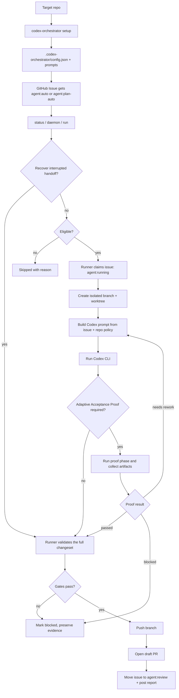

# codex-orchestrator

`codex-orchestrator` turns GitHub Issues into controlled Codex work.

Instead of starting a new Codex chat for every issue, you label the work you
want automated. The runner creates an isolated workspace, gives Codex the issue
and your repo rules, checks the result, and hands it back as a draft pull
request.

For bigger features, it can start from one parent issue, ask Codex to plan the
work, create or update child issues, run the safe children in order, and open
one integration draft PR.

The package is installed into any repository. The reusable runner lives in this
npm package; each target repository keeps its own rules in
`.codex-orchestrator/`.

For a technical walkthrough of the runner lifecycle, policy model, review
gates, and recovery behavior, see [docs/deep-dive.md](docs/deep-dive.md).

## Why This Exists

Codex can write useful code, but running it manually gets messy fast:

- every small issue needs a new chat and repeated context;
- large features need planning, child issues, triage, execution, and final
  integration;
- parallel agent work can conflict when tasks touch the same files;
- someone still needs to decide what is allowed, what is blocked, and what needs
  review;
- branches, commits, checks, PRs, and labels should follow one project policy.

`codex-orchestrator` is the coordination layer.

GitHub Issues become the work queue. Labels decide what Codex may run. Isolated
worktrees keep runs separate. Review gates check the result. Draft PRs return
control to humans before anything is merged.

## What You Get

- A repeatable way to send selected GitHub Issues to Codex.
- One-off autonomous runs for scoped implementation tasks.
- Parent planning for larger features, with child issues executed in safe waves.
- Project-owned rules for what Codex may run, how results are checked, and when
  a human must step in.
- Adaptive Acceptance Proof for runner-owned verification of UI, API, worker,
  CLI, browser, mobile, and live-smoke behavior before draft PR handoff.
- Logs, summaries, and proof artifacts when available.
- Recovery for interrupted runner handoff when Codex finished locally but the
  draft PR was not created yet.
- Draft PR handoff by default. No auto-merge.

## How It Works

At a high level, GitHub Issues are the queue, labels authorize work, isolated
worktrees keep runs separate, and the runner owns validation and publication.



The important boundary is simple: Codex writes code, but the runner decides
whether that code can be handed to humans. The runner owns checks, acceptance
proof, labels, comments, branch pushes, and draft PR creation.

### Adaptive Acceptance Proof

Adaptive Acceptance Proof is the runner-owned verification phase for work that
needs observable product proof. After implementation, the runner can start a
separate proof phase that inspects the issue, changed files, and acceptance
criteria; runs focused browser, mobile, API, worker, CLI, or live-smoke checks;
and writes a machine-readable proof report with artifact links.

A result can reach draft PR handoff only when every required criterion maps to
high-confidence artifact evidence. If proof finds missing behavior, it returns a
concrete rework request and the runner loops back through implementation within
the configured iteration limit. If proof is malformed, low-confidence, lacks
artifacts, or changes product code during verification, the runner blocks
publication and preserves the evidence.

There are two main ways to run work.

### `agent:auto`

Use `agent:auto` for one clear standalone implementation issue.

The runner:

1. Checks that the issue is allowed to run.
2. Claims the issue so another runner does not start it too.
3. Creates a branch and isolated git worktree.
4. Runs Codex with the issue context and repo policy.
5. Validates the full local change set.
6. Pushes the branch and opens a draft PR only after the gates pass.
7. Moves the issue to review and posts the run report.

When the daemon runs more than one `agent:auto` issue at once, it only batches
issues whose declared ownership does not overlap. Issues without ownership
metadata still run, but conservatively.

### `agent:plan-auto`

Use `agent:plan-auto` for larger work that should be planned before
implementation.

The runner asks Codex to plan the parent issue, break it into child issues,
run safe children in dependency order, merge successful child branches into one
integration branch, validate that integration branch, and then open one draft
PR.

Child issues created by this flow use `agent:child`, not `agent:auto`. They are
owned by the parent run and are not picked up as standalone daemon work.

If a runner stops after Codex finished locally but before draft PR handoff, the
runner can recover from its local state and completed report without rerunning
Codex. See [docs/deep-dive.md](docs/deep-dive.md) for the recovery rules.

## Basic Workflow

1. Install the package.
2. Run `setup` in the repository you want to automate.
3. Commit the generated `.codex-orchestrator/` policy.
4. Add `agent:auto` or `agent:plan-auto` to a GitHub Issue.
5. Run `status` to see what is eligible or blocked.
6. Run one selected issue with `run`, or let `daemon` poll for eligible work.
7. Review the draft PR created by the runner.

The runner never auto-merges.

## Agent Memory

Repo-local Dreaming-lite memory lives in `docs/agents/memory/`. It is a small
curated lessons cache for repeated runner/debug/agent-workflow patterns, not a
replacement for `AGENTS.md`, ADRs, `docs/deep-dive.md`, or package prompts.

## Install

Requirements:

- Node.js 18 or newer;
- `git`;
- GitHub CLI `gh`, authenticated for the target repository;
- Codex CLI, installed and authenticated;
- write access to the target GitHub repository.

Install globally:

```sh
npm install -g codex-orchestrator
```

Check the CLI:

```sh
codex-orchestrator --version
codex-orchestrator health
```

You can also run it with `npx`:

```sh
npx codex-orchestrator --help
```

## Set Up A Repository

Open the repository that should receive autonomous Codex work:

```sh
cd /path/to/your/repo
```

Run setup and create missing labels:

```sh
codex-orchestrator setup --prepare-labels
```

Commit the generated `.codex-orchestrator/` directory to your repository. It is
the repository-owned policy for how autonomous work should run.

By default, setup reads the GitHub owner and repo from `git remote origin`. Use
`--target`, `--github-owner`, or `--github-repo` only when you need to override
that.

## Run Work

Check what the runner can see:

```sh
codex-orchestrator status --target .
codex-orchestrator doctor --target .
```

Run one issue:

```sh
codex-orchestrator run --target . --issue 123
```

Run the daemon:

```sh
codex-orchestrator daemon --target .
```

Run up to three independent scoped issues at once:

```sh
codex-orchestrator daemon --target . --concurrency 3
```

`status` and `doctor` are read-only. `run` executes one selected issue.
`daemon` polls for eligible work and starts safe runs according to the policy in
`.codex-orchestrator/config.json`.

## Agent-Assisted Setup

You do not need a long prompt. You can ask an agent:

```text
Set up codex-orchestrator for this repo.
```

The agent should inspect the repository, confirm it has a GitHub `origin`
remote, and run:

```sh
codex-orchestrator setup --prepare-labels
```

If needed, the agent can discover the exact setup behavior from:

```sh
codex-orchestrator --help
```

The package also ships a setup prompt in `prompts/setup-skill.md`. Setup copies
that prompt into `.codex-orchestrator/prompts/setup-skill.md`, so future agents
working in the repository can find repository-local setup guidance.

Use `--dry-run` only when you want a preview without writing files or creating
labels.

## What The Runner Checks

Before a result becomes a draft PR, the runner checks the whole local result:

- committed changes;
- staged changes;
- unstaged changes;
- untracked files;
- the completion report Codex was required to write;
- configured commands such as tests or type checks;
- review gates such as TDD evidence, changed tests, cleanup review, code review,
  or acceptance proof when enabled;
- blocked paths and unsafe actions.

If the result passes, the runner pushes the branch and opens a draft PR. If it
does not pass, the runner marks the issue blocked, keeps the useful local
evidence, and explains what needs attention.

Acceptance proof is runner-owned. Codex can change product behavior, but the
runner runs proof afterwards and attaches screenshots, UI dumps, logs, smoke
outputs, or other artifacts to the PR and issue report. The proof phase must
produce a structured report that maps each required criterion to high-confidence
evidence. Legacy visual proof config still works as a compatibility adapter for
UI/mobile repositories.

## Repository Policy

Every installed repository owns its automation policy in:

```sh
.codex-orchestrator/config.json
```

That config controls labels, branch names, checks, review gates, blocked paths,
prompt files, child concurrency, and PR titles. The package provides defaults;
the target repository decides how strict they should be.

For the full config surface and technical behavior, see
[docs/deep-dive.md](docs/deep-dive.md).

## Safety Model

The package is PR-first and human-reviewed. The important guardrails are:

- no automatic merge;
- draft PRs only;
- Codex may change files, but the runner owns remote publication and GitHub
  state changes;
- only explicitly authorized issues run;
- child issues are never inferred from ordinary links or references;
- committed and uncommitted changes are checked;
- missing or malformed completion reports block publication;
- secret files, destructive data/cache actions, and production deploy or release
  actions are blocked by default.

## Labels

Default labels:

- `agent:auto` - run one scoped issue;
- `agent:plan-auto` - plan and run a parent issue tree;
- `agent:child` - child issue in an autonomous tree; this is not a standalone
  authorization label;
- `agent:running` - runner is working;
- `agent:blocked` - maintainer input needed;
- `agent:manual` - reserved for human work;
- `agent:review` - ready for human review.

`setup --prepare-labels` creates missing labels through `gh`.

## CLI Reference

```sh
codex-orchestrator --help
codex-orchestrator --version
codex-orchestrator health
codex-orchestrator doctor --target <path> [--json]
codex-orchestrator setup [--target <path>] [--github-owner <owner>] \
  [--github-repo <repo>] [--dry-run] [--prepare-labels]
codex-orchestrator status --target <path> [--dry-run] [--json]
codex-orchestrator run --target <path> --issue <number>
codex-orchestrator visual-proof mobile --issue <number> [--target <path>]
codex-orchestrator visual-proof android --issue <number> [--target <path>]
codex-orchestrator visual-proof ios --issue <number> [--target <path>]
codex-orchestrator daemon --target <path> [--once] \
  [--interval-seconds <seconds>] [--max-runs <count>] \
  [--concurrency <count>]
```

Use `codex-orchestrator <command> --help` for command-specific flags.

## Current Scope

The package focuses on local runner workflows: one-off runs, daemon polling,
project-local configuration, and runner-owned worktree cleanup. Hosted
infrastructure is not part of this package today.

Non-GitHub trackers and non-Codex agents are also out of scope for the current
version, although the code keeps adapter boundaries for future expansion.

## Development

```sh
npm test
npm run build
npm run typecheck
```

Publishing is configured through GitHub Actions. A push to `main` runs tests and
publishes the package to npm only when the current package version is not already
published. The repository must provide the GitHub secret `NPM_KEY`.

See `CHANGELOG.md` for release-by-release notes.
