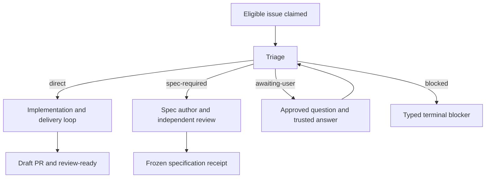

# Runner architecture and execution model

This document describes the current package runtime as implemented under `src/v2/`. It is the technical companion to the user-oriented README: the README explains how to operate the package; this document explains ownership, state transitions, worker contracts, validation, recovery, and publication.

## 1. System boundary

Codex Orchestrator has one public runtime and one delivery authority.

The npm binary is `dist/src/v2/cli.js`. It is the only public command entrypoint and exposes:

- `setup`
- `doctor`
- `status`
- `run`
- `daemon`

Direct `run` and daemon-discovered issues both enter the same `RunIssue.runIssue` lifecycle. The daemon only adds serial polling around that lifecycle. The package root export exposes V2 contracts, and the published tarball contains only the compiled V2 closure, the generated internal workflow, public documentation, changelog, license, and package metadata.

Reusable orchestration policy lives in `src/v2/`. Git, GitHub, process, durable-file, browser, and mobile integrations live in `src/v2/adapters/` or other package-owned V2 runtime modules. Target-specific policy lives in `.codex-orchestrator/config.json`; it is not inferred from worker prompts.

## 2. Trusted Runner and untrusted workers

The trusted Runner owns every action that can authorize work, change durable orchestration state, or publish externally:

- repository identity and configuration validation;
- issue discovery and `agent:auto` authorization;
- repository ownership locks and fencing;
- run records, worktrees, branch identity, and Git snapshots;
- workflow generation materialization and verification;
- worker launch, timeout, cancellation, and process-group quiescence;
- configured checks;
- proof capabilities and artifact validation;
- commits, pushes, draft pull requests, labels, and issue comments;
- browser/mobile proof policy and device leases.

Codex processes are operation-scoped workers. The current internal workflow defines seven operations: `triage`, `ambiguity-review`, `spec-author`, `spec-review`, `implementation`, `code-review`, and `acceptance-proof`. A worker receives a dedicated tool home, a restricted environment, a safe `PATH`, bounded prompt facts, a report schema, and only the files appropriate to its operation.

Workers do not receive GitHub, SSH, npm, or cloud publication credentials. They cannot turn a proposed shell command into Runner authority and cannot directly push, create a pull request, alter issue labels, or publish comments.

This is an authority-containment boundary, not an OS sandbox. Ordinary Codex execution and native Codex subagents use the same local OS account and may use the user's existing Codex authentication or read files available to that user. The containment certificate records that accepted local-read risk. Environment scrubbing, denied paths, isolated read views, and report/artifact validation prevent those local capabilities from becoming an external publication grant.

## 3. Strict repository configuration

`.codex-orchestrator/config.json` is an exact versioned contract with schema `codex-orchestrator.agent-auto`, version `2`. Unknown, missing, removed, or malformed keys are rejected.

The config contains:

- `github`: canonical owner/repository, base branch, and five distinct label definitions;
- `runner`: worktree root, durable state directory, fixed branch template, daemon polling interval, and the five-cycle limit;
- `codex`: command, exact supported version, total and idle timeouts, and denied worker tool network;
- `checks`: a finite map of check IDs to Runner-owned commands;
- `proof.artifactDir`: proof-owned artifact root inside the issue worktree;
- `deny.readPaths`: repository-relative or canonical absolute paths protected from workers;
- `deny.commands`: canonical absolute command paths excluded from worker authority.

Default setup creates:

```text
.codex-orchestrator/config.json
.codex-orchestrator/workspaces-v2/
.codex-orchestrator/v2/state/
.codex-orchestrator/v2/proofs/
```

The three runtime directories are placed in a managed `.gitignore` block. Setup adds `npm test` and `npm run typecheck` to `checks` only when matching scripts exist in the target `package.json`.

`setup`, `doctor`, and `status` use the same strict parser. Setup can create or verify the current policy and optionally prepare labels; doctor/status are read-only. Older or unrelated config shapes are not execution authority and are rejected instead of loading a compatibility runtime.

## 4. Immutable package-owned workflow

`internal-workflow/manifest.json` is the sole inventory of worker operations. Maintainers regenerate it with `npm run refresh:workflow` from the explicit source declaration in `scripts/agent-auto-workflow-source.json` and the allowlisted files under `${CODEX_HOME:-$HOME/.codex}`.

The generated inventory binds each operation to:

- an operation ID and profile;
- its primary and dependency skills;
- shared routing resources;
- an exact file closure;
- input/output schemas and wrapper resources;
- its authority policy;
- package-owned eval suites used by maintainers.

Compilation rejects missing dependencies, stale bytes, undeclared resources, or adapters that fail to link all declared authorities. Eval files are included in the immutable generation and schema-validated, but excluded from operation snapshots so workers cannot consume expected or forbidden test answers.

At the beginning of a new run, the Runner verifies the packaged workflow tree and materializes one immutable generation under the private orchestrator home. Publication uses no-replace claims, sealed file evidence, hashes, and a ready receipt. The generation receipt and skill hashes are persisted in the run record. Every later operation is created from that pin, so a package update or conflicting consumer skill cannot alter an active run.

`npm run check:workflow` compares local workflow sources with committed generated bytes without writing. `npm run verify:workflow` verifies the committed package without consulting local or consumer skills.

## 5. Issue eligibility and ownership

For a new run, the Runner performs these checks before allowing worker execution:

1. Parse the strict config and derive the lowercase canonical repository identity.
2. Acquire the repository owner lock. A known live owner returns `requeued`; ambiguous ownership returns a resumable safety block.
3. Re-read the config after lock acquisition and require byte-identical policy and repository identity.
4. Validate the current containment certificate.
5. Read the issue and durable run state.
6. Require an open issue with `agent:auto`, without running, blocked, review, or waiting-human labels.
7. Require that no open pull request already owns `codex/issue-${issueNumber}` against the configured base branch.

For an eligible issue, the Runner freezes the issue snapshot and acceptance criteria, resolves the base SHA, creates the run record, and persists an intent to claim labels before changing GitHub. The issue is moved to the exact running label set and receives one marker-bound claim comment. Only then does the Runner create `.codex-orchestrator/workspaces-v2/issue-${issueNumber}` on `codex/issue-${issueNumber}`.

Every later externally meaningful phase revalidates authorization. The open issue must still carry `agent:auto` and `agent:running`, and exactly one trusted claim comment must bind the run ID, issue, and branch. Revoked or conflicting authority fails closed.

## 6. Routing before implementation

After claim and worktree creation, the Runner invokes `triage` against the frozen issue facts, acceptance criteria, repository, base SHA, and pinned workflow generation. Triage must return a schema-valid, evidence-backed route:

- `direct`
- `spec-required`
- `awaiting-user`
- `blocked`

The route report records inspected evidence, explicit assumptions, and route-specific details. The Runner hashes the report and persists a route receipt bound to the workflow generation.

A malformed triage report has one report repair budget. A clean transport failure has one separate transport retry. These retries do not become implementation cycles.

An `awaiting-user` proposal is privileged because it pauses autonomous work. It must describe at least two materially different observable product outcomes and prove that repository authority does not select between them. A separate `ambiguity-review` worker receives the candidate and either approves or rejects it. Only one candidate review is allowed. A rejected candidate can use the single triage repair path; an approved candidate becomes the durable route receipt.

The route determines the downstream lifecycle:



### Direct route

The issue already contains enough behavioral authority and verification detail for deterministic implementation. The Runner enters the bounded implementation/review/check/proof loop described below.

### Specification-required route

Complexity, cross-cutting behavior, or insufficient executable detail makes direct implementation unsafe even though no product decision is missing. The Runner starts a durable specification state machine:

1. `spec-author` creates a revision in `author` mode.
2. `spec-review` independently reviews the exact revision in `full` mode.
3. A needs-work verdict preserves a defect ledger and returns to `spec-author` in repair mode.
4. The same reviewer session performs closure review against the affected defects.
5. Only an approved revision with resolved blockers is frozen.

Prepared and launched invocation records are persisted before and after process launch. Recovery proves process-group absence before replacing an uncertain invocation. Malformed reports and transport retries are bounded; exhaustion becomes a typed blocker rather than an unbounded author/reviewer loop.

The terminal result for this route is `spec-frozen` with an immutable `FrozenSpecReceipt`. The current runtime does not silently continue from a newly authored specification into implementation. That boundary keeps specification approval separately auditable.

### Awaiting-user route

After independent ambiguity approval, the waiting-human coordinator:

1. creates a marker-bound question receipt;
2. persists comment intent before posting the question;
3. changes labels from running to `agent:auto` + `agent:waiting-human`;
4. scans only post-question replies using the required answer prefix;
5. accepts answers only from a current repository writer with sufficient permission;
6. normalizes equivalent answers and freezes their hashes;
7. treats conflicting trusted answers as a bounded clarification, not an arbitrary choice;
8. revalidates answer authority before restoring running labels;
9. archives the waiting episode and reruns triage in the same run with the trusted answer.

The first unanswered pass returns `awaiting-user`. At most one follow-up question is allowed; unresolved conflict or repeated ambiguity exhausts the waiting budget. A frozen answer is immutable and cannot be replaced by a later edited comment.

## 7. Direct implementation and independent review

The direct route uses one issue worktree for at most five implementation cycles. Each cycle is bound to the same run, frozen issue criteria, route receipt, and workflow generation.

An `implementation` worker receives the current cycle and any findings from prior review, checks, or proof. It must return a structured implementation report. The Runner then:

- verifies that denied paths did not change;
- validates the exact report schema;
- allows one report-only repair when the report is malformed;
- proves that report repair did not change the worktree;
- distinguishes an external blocker from a completed implementation;
- requires the branch head to remain at the frozen base SHA;
- inventories tracked, staged, unstaged, untracked, and denied-path state;
- requires the reported changed-file list to equal the observed change set.

A clean implementation transport failure receives one separate retry only if the complete Git freshness baseline is unchanged. Any unexplained mutation converts that retry into a safety block.

Before configured checks, a separate `code-review` worker reviews a fingerprint of the complete implementation target. The fingerprint binds Git freshness, changed files, route decision, workflow generation, cycle, and frozen criteria. Full review covers at least acceptance criteria, correctness, and test quality; cleanup is a lens within this final review.

Review maintains an append-preserving defect ledger. If review returns `needs-work`, open defects become implementation findings and consume the next implementation cycle. After repair, the same reviewer session performs closure review only for affected defects while preserving unrelated and previously accepted findings. Approved review requires every blocker or execution risk to be verified or explicitly superseded.

Review invocation intent, process IDs, report hashes, transport retries, report repairs, target revisions, and target fingerprints are durable. A crash after launch cannot cause a replacement review until process absence is proven. Review target drift after approval is a safety failure.

## 8. Configured checks and `CheckedChange`

After review clears, the Runner executes the finite commands in `config.checks`. Workers cannot add commands to this set. Each result records its ID, exact command, pass/fail status, and output hash.

A failed check becomes a durable repair finding and starts another implementation cycle if the five-cycle budget remains. Passed checks are reused on a safe resume, but any new repair cycle clears stale check and proof bindings.

Once all checks pass, the Runner fingerprints the reviewed files and content, stages the complete validated change, and verifies that staging did not change either binding. It then mints a `CheckedChange` capability containing:

- canonical repository, run ID, issue number, and cycle;
- base and head SHA;
- index tree SHA;
- tracked and untracked content hashes;
- worktree identity;
- exact changed files;
- passed check records and check-policy hash;
- package and proof schema versions.

Any later change to Git, the index, tracked or untracked content, worktree identity, changed files, or check policy invalidates the capability.

## 9. Acceptance Proof

Acceptance Proof is independent from both implementation and code review. The `acceptance-proof` worker receives the frozen issue criteria and a nominal checked-change capability. It runs in a separate contained process and may write only below its proof-owned artifact root.

The Runner validates:

- the exact Proof Report schema and status semantics;
- one result for every frozen criterion ID;
- evidence references and required confidence;
- artifact root containment and canonical paths;
- regular-file type, size, hash, UTF-8 validity, and freshness;
- credential absence in all text artifacts;
- public artifact type and host-identity removal;
- no product diff during proof;
- current browser workflow and viewport evidence for browser targets;
- exact Android or iOS lease ownership for mobile targets;
- checked-change freshness again after proof.

Local command output and static-inspection evidence may contain machine paths because they are never public. Public evidence is restricted to screenshots or sanitized generated summaries under the stricter publication contract. Credentials are forbidden in both local and public evidence.

Browser proof validates current workflow evidence rather than accepting an isolated screenshot. Mobile proof uses Runner-owned leases and refuses to take over a user-owned device, app, IDE, or Flutter session.

`needs-rework` findings return to the same implementation loop and consume another cycle. External, safety, malformed, quiescence, or exhausted outcomes are mapped to typed run results. Only `passed` proof produces a proof receipt and permits publication.

## 10. Runner-owned publication

Workers never publish. After proof passes, the Runner performs publication in this order:

1. Revalidate issue authorization.
2. Persist commit intent bound to parent SHA, tree SHA, and message.
3. Create or reconcile the single implementation commit.
4. Persist push intent and verify the remote branch SHA.
5. Persist pull-request intent and find or create the marker-bound draft PR.
6. Verify the PR head, base, marker, and repository identity.
7. Persist and publish the final issue comment.
8. Replace running labels with the exact review-ready label set.
9. Write local terminal evidence and persist `review-ready` with the PR URL.

Every step checks its postcondition before proceeding. A conflicting remote branch, duplicate marker, unexpected PR, changed tree, revoked authorization, or ambiguous effect becomes a safety or transport result; it is never treated as implicit success.

## 11. Durable state and crash recovery

The durable run file is stored beneath the configured state directory. Each run record contains identity, lifecycle, cycle budgets, frozen issue data, workflow pin, route state, waiting-human history, spec/review state, process records, checks, proof bindings, publication intent, and terminal outcome.

State updates use generation-based compare-and-swap. Atomic files use write, flush, rename, and directory synchronization where supported. Locks and leases include fencing plus process and boot identity.

External and non-idempotent effects follow intent-before-effect and confirmation-after-observation:

```text
persist intent -> perform finite effect -> observe exact postcondition -> clear intent
```

If the process exits after the effect but before confirmation, the next invocation reads the intent and checks the local or remote postcondition. It does not infer failure from a lost response and does not blindly repeat the effect.

Prepared worker invocations can be abandoned without launch. Launched invocations require positive process-group absence before replacement. If quiescence cannot be proven, the run enters `safe-halt` or a non-resumable transport/safety outcome. Unknown process state is never permission to relaunch against the same worktree.

An existing nonterminal issue run is resumed only when its canonical repository, branch, worktree path, base SHA, workflow generation, authorization, and lifecycle invariants still match. Terminal outcomes are replayed without re-executing the workflow.

## 12. Result and failure model

The CLI prints exact JSON envelopes. Run results include:

- `review-ready`: direct delivery completed and the draft PR is verified;
- `spec-frozen`: the specification route completed with an immutable receipt;
- `awaiting-user`: a durable question is waiting for an authorized answer;
- `not-eligible`: the issue was never claimed because public eligibility failed;
- `requeued`: a known live owner currently holds the repository;
- `blocked`: a typed `external`, `safety`, or `exhausted` condition;
- `transport-failed`: effect delivery or observation could not be safely confirmed;
- `cancelled`: cancellation was observed and persisted;
- `internal-error`: an invariant, schema, or local operation failed outside a safe domain result.

`blocked.resumable` and `transport-failed.resumable` are part of the contract. A resumable result still requires the external condition to be corrected; it does not bypass reconciliation on the next call. `evidencePath` identifies the durable local evidence record for the result.

Exit codes are grouped for automation:

- `0`: successful or intentionally paused progress such as `review-ready`, `spec-frozen`, `awaiting-user`, or `requeued`;
- `20`: blocked policy or migration-required outcome;
- `21`: not eligible;
- `70`: transport or internal failure;
- `130`: cancelled.

Daemon mode processes discovered issues serially and returns the greatest observed exit severity for the polling pass.

## 13. Package verification and live validation

Local package verification is:

```sh
npm run refresh:workflow
npm run typecheck
npm test
npm pack --dry-run --json
```

The build deletes `dist` before TypeScript compilation so removed modules cannot survive in tests or the tarball. `prepack` verifies the committed workflow and rebuilds from a clean output directory.

`npm run smoke:live` packs and installs the exact candidate bytes into a temporary consumer and mutates only the configured scratch GitHub repository. The default `core-release` profile proves package installation, a real Codex path, browser evidence, and a safety-negative path. Cleanup verifies that run-owned issues, PRs, branches, labels, worktrees, and temporary directories are absent.

Live smoke is not a normal local test and must run only with explicit authorization. Release publication is owned by the GitHub release workflow after the release commit reaches `main`.
