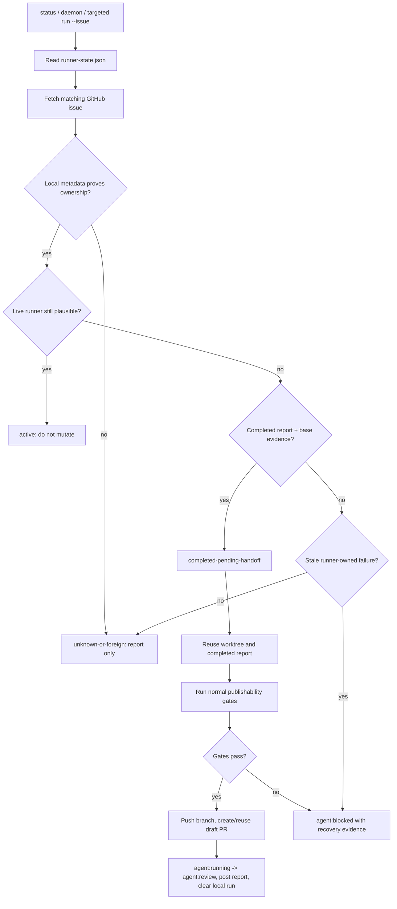

# codex-orchestrator Deep Dive

This document is the technical companion to the main README. The README explains
what problem `codex-orchestrator` solves and how to start using it. This file
describes how the package works internally, what features it provides, and where
the main control points are.

## System Role

`codex-orchestrator` is a local runner that connects four things:

- GitHub Issues as the work queue;
- GitHub labels as the authorization and state model;
- git worktrees as isolated implementation workspaces;
- Codex CLI as the implementation agent.

The runner does not replace human review. It prepares work for review. A
successful run ends with a pushed branch, a draft pull request, issue comments,
and review labels. It does not auto-merge.

## Package vs Repository Policy

The npm package contains reusable orchestration logic:

- CLI commands;
- config schema and validation;
- GitHub issue and PR operations;
- worktree and branch management;
- Codex prompt execution;
- validation and review-gate evaluation;
- durable local state and recovery reports.

Each target repository owns its policy under `.codex-orchestrator/`:

- `config.json` for labels, branches, checks, gates, deny rules, and runner
  behavior;
- `prompts/` for repo-local prompts used by Codex workflows;
- proof and artifact directories created during runs.

This split keeps the package generic while letting each repository choose how
strict autonomous work should be.

## CLI Commands

### `health`

Checks whether the CLI can run in the current environment. It is intended as a
quick sanity check after installation.

### `setup`

Creates project-local config and prompt files under `.codex-orchestrator/`.

Important behavior:

- infers GitHub owner and repo from `git remote origin` by default;
- can override owner, repo, or target path with flags;
- can create missing GitHub labels with `--prepare-labels`;
- can preview changes with `--dry-run`;
- copies package-owned fallback prompts when local skills are missing;
- does not launch Codex, commit files, or open pull requests.

### `status`

Reads GitHub Issues and local runner state, then reports:

- issues eligible for autonomous work;
- skipped issues and the reason they were skipped;
- blocked or recoverable local state.

`status` is read-only. It does not mutate GitHub or launch Codex.

### `run`

Executes one selected issue when its labels and state allow autonomous work.

`run` supports both authorization modes:

- `agent:auto` for one scoped implementation issue;
- `agent:plan-auto` for parent planning and issue-tree execution.

### `daemon`

Polls GitHub Issues for eligible autonomous work. Scoped `agent:auto` issues can
run concurrently up to the daemon concurrency limit when their runner metadata
declares non-overlapping ownership. `agent:plan-auto` parent runs are exclusive.

The daemon applies the configured issue selection policy after safety filters.
By default, priority labels sort eligible issues and issue number is the
deterministic tie-breaker.

Parallel scoped issue selection uses the issue body section
`## codex-orchestrator metadata` and its `Ownership:` bullet list. Issues without
that metadata are treated as unknown ownership and run one at a time. Two scoped
issues cannot share a batch when their ownership entries are the same path or
match each other as supported path globs.

After polling, the daemon can clean up runner-owned worktrees whose pull
requests have already been merged. Dirty, blocked, active, or unpublished
worktrees are preserved.

## Issue Authorization Model

The runner only starts work that is explicitly authorized.

Default labels:

- `agent:auto` authorizes one standalone scoped implementation run;
- `agent:plan-auto` authorizes parent planning and child issue execution;
- `agent:child` marks child issues that belong to an autonomous parent tree
  and is not a standalone authorization label;
- `agent:running` means a runner has claimed the issue;
- `agent:blocked` means maintainer input or manual recovery is needed;
- `agent:manual` reserves the issue for human work;
- `agent:review` means the result is ready for human review.

Issues are skipped when they are closed, manual, blocked, already running,
already in review, or otherwise not authorized by policy.

Child issues are not inferred from ordinary GitHub links, milestones, project
fields, or casual references. They must carry the configured child label and the
runner-owned parent marker. Child issues do not use `agent:auto`; the parent
`agent:plan-auto` flow owns child execution through the marker, child label, and
AFK/HITL metadata.

## Scoped Issue Run

For an `agent:auto` issue, the runner follows this lifecycle:

1. Load config and validate policy.
2. Fetch the issue from GitHub.
3. Check labels and state.
4. Claim the issue with the running label.
5. Create a runner-owned branch and git worktree.
6. Build a prompt from the issue, config, and scoped implementation workflow.
7. Run Codex CLI in the issue worktree.
8. Read the Codex completion report.
9. Collect the full local change set.
10. Run configured validation checks.
11. Run acceptance proof when required.
12. Evaluate quality gates and deny rules.
13. Optionally run bounded rework for machine-checkable blockers.
14. Optionally run Fresh-Context Review.
15. Write durable run evidence.
16. Push the branch.
17. Open a draft pull request.
18. Post the review report and move the issue to review.

If a blocking condition is found, the runner does not publish the result. It
marks the issue blocked, preserves useful local evidence, and reports the
reason.

## Parent Planning and Child Waves

`agent:plan-auto` is for larger work that should be planned before
implementation.

The parent flow can:

- ask Codex to produce or update the PRD;
- break the parent into child implementation issues;
- review the breakdown;
- triage child issues;
- identify which children are safe for autonomous execution;
- run children in dependency-aware waves;
- merge successful child branches into one integration branch;
- validate the integration branch;
- open one integration draft PR.

Parallel child execution is bounded by `runner.maxParallelChildren`. Parallel
standalone scoped execution is bounded by `runner.maxParallelScopedIssues` or
the daemon `--concurrency` override. Child and standalone work use separate
worktrees so concurrent runs do not share a mutable workspace.

## Full Change-Set Awareness

The runner evaluates the whole result of an agent run:

- local commits;
- staged files;
- unstaged files;
- untracked files.

This matters because Codex may be allowed to create local commits. Those commits
are still treated as untrusted agent output until the runner validates them.

The runner owns external publication:

- pushing branches;
- opening draft PRs;
- moving labels;
- posting comments;
- merging child branches into integration branches;
- publishing packages or deploying.

If agent output attempts to bypass those boundaries, the run is blocked.

## Validation Checks

Configured checks live in `.codex-orchestrator/config.json`.

Typical checks include commands such as:

```json
{
  "checks": {
    "test": "npm test",
    "typecheck": "npm run typecheck"
  }
}
```

Setup and runtime config loading adapt package-owned default `npm run <script>`
checks to the target `package.json`: unsupported default npm checks are omitted
when `checksPolicy.missingNpmScript` is `skip`, while custom checks are
preserved. Repositories can make missing scripts fail with
`checksPolicy.missingNpmScript`.

For repositories with existing lint debt, `checksPolicy.lintBaseline.mode` can
be set to `touched-only`. In that mode, a repo-wide lint failure can be
downgraded when a separate touched-files lint command passes.

## Review Gates

Review gates are runner-enforced checks that decide whether a result can be
published for human review.

The quality gate can require:

- strict TDD red-to-green evidence;
- a changed test file when runtime code changed;
- code review evidence;
- cleanup review evidence for larger runtime changes.

TDD proof can be reported as structured validation evidence inside the existing
completion-report `validation[]` array:
`evidence.kind: "tdd-red-green"` with a failed red command and a passed green
command. Legacy summary text is still accepted as a fallback, but structured
evidence is the primary path.

Runtime and test paths are configurable through:

- `reviewGates.quality.runtimeChangedPathGlobs`;
- `reviewGates.quality.testChangedPathGlobs`.

The acceptance proof gate can require runner-owned proof artifacts when issue
text or changed paths indicate UI, API, worker, CLI, or smoke-verifiable work.
`reviewGates.acceptanceProof` is canonical; `reviewGates.visualProof` remains a
configuration migration adapter for existing screenshot and mobile proof policy.

The risk-routing gate checks declared review metadata instead of inferring risk
with an LLM. `reviewGates.riskRouting` defaults to enabled `warn` mode so older
repositories surface findings without unexpected publication blocks. In
`block` mode, the same findings become publication blockers.

For scoped runs, risk routing checks the completion report `reviewHandoff`:

- required handoff fields must be present and non-empty;
- low-risk claims must use an allowed low-risk flow;
- configured `riskyChangedPathGlobs` can flag low-risk claims that changed
  risky paths;
- high-risk claims require passed code-review validation when
  `highRiskRequiresCodeReview` is true.

Low-risk routing never weakens existing quality, acceptance proof, visual proof,
deny, or configured-check gates. It can only add warnings or blockers.
Scoped risk-routing blockers are retryable only when
`loopPolicy.rework.retryableBlockers` explicitly includes
`risk-routing-policy`.

For parent `agent:plan-auto` runs, risk routing checks the planning report after
it is read and before parent content or child issues are mutated. Parent
`sizeRisk` must partition every child stable id exactly once across
`small`, `medium`, and `high`; `parentReviewHandoff` must include risks, proof
strategy, and human review focus. In warn mode, findings render under
`Risk routing warnings` in the parent PR body and review report while execution
continues. In block mode, the parent stops at that point and does not create
child issues, execute children, create a draft PR, or attempt parent planning
rework.

## Acceptance Proof

Acceptance proof is intentionally runner-owned. Codex can implement product
behavior, but the runner decides whether proof is required, starts the proof
phase after implementation, validates the proof report, and makes the final
publishability decision. Runtime config loading still preserves package-owned
visual proof behavior for older configs where visual proof is enabled but no
runner command is set, but screenshot-only command success is not sufficient for
Acceptance Proof.

Adaptive Acceptance Proof is the canonical proof model. Instead of treating a
screenshot or a final agent sentence as enough evidence, the runner can launch a
separate `acceptance-proof` Codex phase with the issue, changed files,
implementation evidence, and repository proof policy. Repositories opt into that
adaptive Codex proof session by configuring `codex.profiles.acceptance-proof`;
existing runner-owned visual/mobile proof commands remain evidence producers, not
standalone pass conditions. The adaptive phase can navigate a browser, inspect
mobile UI state, run API or CLI checks, inspect logs, or create a focused
live-smoke check for observable product behavior. The proof phase writes
artifacts under the runner-owned proof directory and writes a machine-readable
`acceptance-proof-report.json`.

The gate is selected when `reviewGates.acceptanceProof.enabled` is true and
either:

- the issue title or body matches `reviewGates.acceptanceProof.issueTextPatterns`;
  or
- the implementation changed a path matched by
  `reviewGates.acceptanceProof.changedPathGlobs`.

The proof phase is not an implementation phase. It has no publication authority
and must not edit GitHub issues, labels, comments, branches, pull requests,
releases, or deployments. If a proof script needs repair, edits must stay inside
`reviewGates.acceptanceProof.proofOwnedPathGlobs`. Product-code changes during
proof are blockers, even when the proof report claims success.

The proof report has three top-level outcomes:

- `passed` means every required acceptance criterion has `status: "passed"`,
  `confidence: "high"`, and at least one artifact reference.
- `needs-rework` means proof found missing or uncertain product behavior and
  returns a concrete rework request for the next implementation attempt.
- `blocked` means proof could not continue safely, for example because the
  environment is missing required credentials or tooling.

The runner validates the report independently. It rejects malformed JSON, empty
criteria, low or medium confidence, failed or unknown criteria, missing artifact
references, artifact paths that do not exist, and forbidden product-code diffs
from the proof phase.

For UI proof, the proof report must satisfy the UI Evidence Contract. Screenshot
or UI-dump artifacts must be mapped to:

- the exact user workflow under test, including the relevant entrypoint and
  create/edit/detail context;
- viewport coverage, with wide desktop required for web layout proof and mobile
  required when the issue or acceptance criteria mention responsive or mobile
  behavior;
- artifact freshness, so the report identifies the current post-run artifact
  rather than an old or intermediate screenshot;
- visual layout review for spacing, padding, clipping, overlap, alignment, and
  the specific visual complaint being verified;
- user-facing copy review, including absence of rejected implementation terms
  when copy is part of the acceptance path;
- source inputs that show how the proof derived task-specific checks from issue
  criteria, implementation evidence, reproduction signals, runtime validation,
  and any Manual QA Plan content.

If authentication is required and smoke or admin credentials are available
through configured environment variables, UI proof should use the real sign-in
flow. Session or cookie seeding is allowed only when the report records why the
normal UI login path is unavailable or irrelevant to the acceptance criteria.

This borrows workflow discipline from UI proof systems such as Symphony:
user-facing changes should have an end-to-end UI walkthrough, a reproduction
signal when one exists, runtime/media evidence for app-touching work, and Manual
QA Plan expectations when provided. Codex Orchestrator enforces those inputs
through the runner-validated Proof Report rather than requiring Symphony's
Linear workpad or PR media workflow.

When proof returns `needs-rework`, the runner feeds the rework request back into
the bounded implementation loop. The maximum number of implementation-plus-proof
iterations is controlled by `reviewGates.acceptanceProof.maxIterations`; the
runner keeps the issue claimed while the loop continues. A successful proof can
continue to the normal publishability gates and draft PR handoff. A terminal
proof blocker marks the issue blocked and preserves the proof prompt, report
path, artifact directory, validation line, residual risks, and blocker summary in
runner evidence.

Child Codex processes receive a mobile-device guard directory at the front of
`PATH`. The guard blocks direct device/emulator control through `adb`,
`emulator`, Flutter device-control subcommands, and `xcrun simctl`. Adaptive
proof Codex phases keep that guard, so they can inspect and verify behavior
without independently owning shared devices. Runner-owned mobile proof commands
use the shared mobile lease described below.

The proof phase often runs browser automation, such as Playwright, but the same
contract applies to non-visual proof. A live-smoke proof can exercise an API,
worker, CLI, or other observable behavior and save the command output as a
`smoke-output` artifact. The runner provides environment variables for:

- issue number;
- artifact directory;
- proof directory;
- Playwright profile directory;
- worktree path;
- changed files;
- target root and shared state directory when the runner knows them;
- mobile device lock directory for runner-owned Android proof.

Proof artifacts created under the proof directory are attached to the PR and
issue review report. Supported artifact types include screenshots, UI dumps,
logs, smoke outputs, and other explicit artifacts. Screenshots remain supported
for visual proof, but screenshot existence alone is not sufficient: each required
criterion must map to high-confidence artifact evidence in the proof report, and
UI artifacts must satisfy the UI Evidence Contract.

Visual proof reporting separates desire from capability. UI-like issue text or
changed frontend paths can make visual proof desirable, but the runner only emits
missing-screenshot artifact warnings when a runner-owned provider is configured
and has not reported a tooling/provider capability gap. If proof is desirable
but no command, device, emulator, or platform tooling is available, the review
report records a capability note instead of an actionable-looking artifact
warning. Repositories that intentionally want visual-desirable work to block
review-ready publication until proof is produced can set
`reviewGates.visualProof.requireWhenDesirable` to `true`.

Setup now uses the package-owned
`codex-orchestrator visual-proof auto --issue ${issueNumber}` command. Auto
dispatch uses one shared policy owner: web/frontend paths route to browser
proof, while Android, iOS, Flutter, and mobile app paths remain device-backed.
When acceptance proof is required but the changed paths are backend/API/CLI-only
and visual proof is not desirable, auto proof does not force a browser or mobile
target; the runner evaluates the prepared machine-readable
`acceptance-proof-report.json` and its non-visual artifacts instead. Explicit
legacy proof command overrides are preserved.

For web UI work, `codex-orchestrator visual-proof browser` reads a proof-owned
browser scenario, drives Playwright Core against an explicit base URL, and
writes screenshots, DOM snapshots, console logs, network failure logs, a run
summary, and `acceptance-proof-report.json` under the runner proof directory.
Before downloading a browser, the command first uses an explicit
`CODEX_ORCHESTRATOR_BROWSER_EXECUTABLE_PATH` when provided, then looks for an
installed Chrome, Chromium, or Edge executable. If no installed browser is
available, Playwright's existing browser cache is tried; only a missing-browser
launch failure triggers `playwright-core install chromium` and one retry.
Scenarios are versioned and must map criteria to named screenshot or DOM
checkpoints. Missing scenarios, malformed scenarios, missing Playwright/browser
runtime, blocked auth metadata, or browser launch failures produce blocked
proof. Assertion failures produce `needs-rework`. Console and network failures
are always recorded and can be configured as blockers through
`reviewGates.acceptanceProof.browserProof`.

For mobile UI work, the auto command selects the package-owned mobile proof
path. The mobile command detects Flutter, native Android, and native iOS
projects. It tries
Android first when an Android target exists, resolving SDK tools from
environment variables, `PATH`, and the default macOS, Linux, and Windows SDK
locations. Android proof takes a runner-owned mobile device lease under the
shared state directory before selecting a connected device, starting an AVD, or
using adb, so parallel issue work cannot race over one emulator. If Android
tooling or devices are unavailable on macOS and an iOS target exists, it falls
back to the iOS simulator. Native iOS projects go directly through Xcode
simulator tooling with a writable DerivedData path. Repos that need a specific
Flutter launch config, flavor, Gradle install task, package name, iOS scheme, or
bundle id pass that through command flags or `CODEX_ORCHESTRATOR_*` environment
variables. Missing mobile tooling or no usable device is reported as a concrete
warning instead of a release blocker by itself.

## Loop Policy

Loop Policy controls runner-owned automation around retries and evidence.

It includes:

- issue selection priority labels and tie-breaker;
- bounded rework attempts;
- retryable blocker types;
- Fresh-Context Review;
- Durable Run Summaries;
- non-mutating Policy Suggestions.

Bounded rework is limited to machine-checkable blockers such as missing or
invalid completion reports, no changed files, failed configured checks, or
missing quality-gate evidence. `ReworkDecision` classifies each blocked attempt
as `retry`, `exhausted`, or `hard-block` from one source of truth in the runner
policy. Retry uses zero-based attempts: attempt `0` is the original run, and
retry continues only while `attempt < maxAttempts`.

Hard blockers always stop publication. These include denied paths,
runner-owned publication violations, destructive database/cache actions,
production deploy/release actions, unknown Codex exits, and required Figma MCP
failures. Optional Figma MCP failures are retryable when configured; the next
attempt disables optional Figma MCP while required Figma access remains a hard
dependency.

Figma MCP routing is configured with optional and required issue-text patterns.
Optional matches add Figma MCP as helpful context; required matches treat design
access as part of the issue contract. Legacy `issueTextPatterns` are migrated to
optional patterns by setup/config compatibility handling.

Fresh-Context Review runs a separate Codex session with the issue, diff, and
validation evidence. It does not reuse the implementation transcript. In the
current config model, the mode is advisory; repositories can choose whether
high-confidence policy violations block publication.

Durable Run Summaries record the outcome, confirmed facts, validation, blockers,
residual risks, next action, and policy suggestions. They reference existing
logs and reports; they do not replace them.

Policy Suggestions are report-only. They never edit prompts, config, labels, or
issue state.

## Deny Rules

Deny rules block publication when the agent result touches forbidden areas or
attempts unsafe actions.

The default policy can block:

- secret files;
- destructive database or cache actions;
- production deploy or release actions;
- additional repository-defined path globs.

These rules are evaluated before a result is published.

## Durable State and Recovery

The runner keeps local state so interrupted work can be inspected and recovered.

Durable evidence can include:

- agent output;
- completion reports;
- validation results;
- skipped checks;
- blocked reasons;
- visual artifacts;
- run summaries;
- preserved worktrees.

The runner preserves worktrees when deleting them would hide useful evidence,
for example when they are dirty, blocked, active, or unpublished.

### Interrupted Scoped Handoff Recovery

The main recovery case is an interrupted scoped issue run. This can happen when
Codex already wrote a completed report and left valid local changes in the
issue worktree, but the outer runner stopped before it pushed the branch,
opened the draft PR, posted the review report, and moved the issue from
`agent:running` to `agent:review`.

Recovery is runner-owned. It does not ask Codex to implement the issue again.
Instead, the runner treats the preserved worktree and completion report as the
candidate output, then runs the same publication gates used by a normal scoped
handoff.



The local run metadata must match the GitHub issue and the preserved workspace:
issue number, mode, branch, worktree path, report path, session id, and base
evidence. New scoped runs also record a runner lease with host, process id, and
timestamps. Daemon recovery mutates GitHub only when that lease is stale and the
same-host process is gone. If the process still looks alive, the host is
unknown, or the metadata is incomplete, recovery stays read-only.

Targeted `run --issue <number>` can recover a legacy interrupted run when the
local context snapshot contains the base SHA and the operator explicitly picked
that issue. This is how old runs that predate lease metadata can still be
finished without allowing the daemon to mutate them automatically.

Recoverable runs are classified with explicit states:

- `active` means a live runner may still own the issue, so nothing changes.
- `completed-pending-handoff` means the completed report, worktree, branch, and
  base evidence are sufficient to retry runner-owned publication.
- `failed-pending-block` means the stale runner-owned run cannot satisfy
  publication preconditions and should be moved to `agent:blocked` with concrete
  evidence. Missing completion reports get one bounded recovery retry first when
  `missing-completion-report` is configured as retryable, the stale attempt has
  remaining rework budget, same-host stale ownership is proven, and the branch
  has no committed, staged, unstaged, or untracked changes since the recovered
  base SHA. If any of those checks fail, recovery blocks instead of resetting or
  building on unreported work.
- `unknown-or-foreign` means ownership or safety cannot be proven, so the runner
  does not mutate GitHub.

When a matching open draft PR already exists for the branch and base, recovery
verifies those refs and completes the remaining label, comment, lifecycle, and
local-state cleanup instead of creating a duplicate PR. Blocked recovery uses a
stable marker in the GitHub comment so repeated recovery attempts do not post
the same blocked report again.

Recovery is intentionally narrow. It does not scan every `agent:running` issue
blindly, does not recover runs from another repository, does not recover
plan-parent or tree-child publication in the scoped path, does not auto-merge,
and does not rerun Codex just to finish a handoff. The package live-smoke suite
is not part of the default recovery gate because it creates or updates real
GitHub issues and pull requests.

### Plan-Auto Tree Recovery

`agent:plan-auto` has its own tree recovery path because parent branches and
child branches have different safety contracts than standalone scoped issues.
Before creating the parent worktree, the runner classifies local tree evidence.
A parent tree resumes only when runner metadata proves `plan-parent` ownership,
the issue number, branch, worktree path, session, stale same-host lease, clean
worktree, and configured base SHA all match. Ambiguous evidence, dirty
worktrees, foreign hosts, active or unknown processes, missing base evidence,
or branch drift hard-block with a stable recovery marker and preserve the local
worktree.

During child scheduling, a closed child can be treated as recovered only when
the current GitHub child issue still has the child label and parent marker,
tree-child runner metadata matches the parent, a current durable run summary is
`review-ready`, and Git proves the child branch is already merged into the
parent branch. Recovered children satisfy dependency ordering and render as
recovered evidence in the parent handoff instead of being re-executed.

Blocked children resume only when their tree-child metadata, existing branch and
worktree, blocked durable summary, and `decideImplementationRework()` all prove
that the next bounded rework attempt is allowed. The retry reuses the existing
worktree, starts with the normal automatic rework prompt, and still passes
through the usual publishability, quality, acceptance-proof, durable-summary,
and parent integration gates.

## Prompt and Workflow System

Workflows are configured in `config.json`.

The default workflow set includes:

- PRD creation or update;
- issue breakdown;
- breakdown review;
- triage;
- scoped implementation;
- issue-tree orchestration.

Each workflow points to either a package-owned fallback prompt or a compatible
local skill/prompt copied during setup. This lets the package work out of the
box while still allowing repositories to customize agent behavior.

## Config Surface

The top-level config areas are:

- `github` for owner, repo, label preparation, and label definitions;
- `runner` for workspace root, child concurrency, state directory, local commit
  policy, and worktree cleanup;
- `codex` for Codex CLI command, args, timeouts, and prompt/report env vars;
- `project` for config and prompt directories;
- `workflows` for prompt or skill routing;
- `checks` and `checksPolicy` for validation commands;
- `reviewGates` for quality, risk-routing, and acceptance proof requirements;
- `loopPolicy` for issue selection, rework, review, summaries, and suggestions;
- `deny` for secret and unsafe-action protection;
- `branches` for branch templates;
- `pullRequests` for PR title templates;
- `issueClassification` for promotion criteria and clarification behavior.

Runtime state must not be committed as config. The schema rejects known runtime
keys in committed config files.

## Current Boundaries

The package currently focuses on local runner workflows:

- explicit one-off runs;
- daemon polling;
- project-local config;
- runner-owned worktree cleanup;
- GitHub Issues and Pull Requests;
- Codex CLI as the agent backend.

Hosted infrastructure, non-GitHub issue trackers, and non-Codex agents are not
part of the current package, although the code keeps adapter boundaries for
future expansion.
