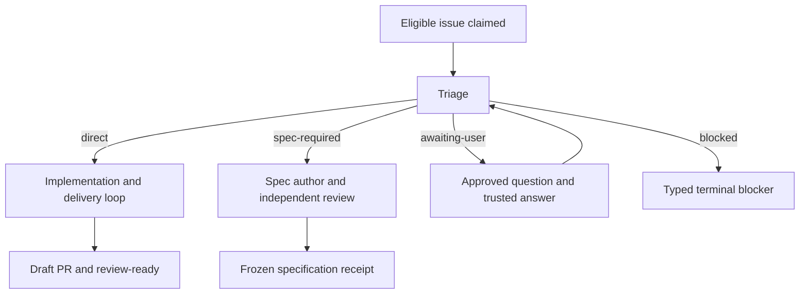

# Runner architecture and execution model

> **Human-maintainer document.** Agents must not read or use this file as
> routine context or implementation authority. An agent may access it only
> when a human explicitly asks to edit or audit this file. For agent work, use
> `AGENTS.md`, `CONTEXT.md`, relevant ADRs, and current code, configuration, and
> tests.

This document describes the current package runtime as implemented under `src/v2/`. It is the technical companion to the user-oriented README: the README explains how to operate the package; this document explains ownership, state transitions, worker contracts, validation, recovery, and publication.

## 1. System boundary

Codex Orchestrator has one public runtime and one delivery authority.

The npm binary is `dist/src/v2/cli.js`. It is the only public command entrypoint and exposes:

- `setup`
- `doctor`
- `status`
- `run`
- `daemon`

Direct `run` and daemon-discovered issues both enter the same `RunIssue.runIssue` lifecycle. The daemon only adds serial polling around that lifecycle. The package root export exposes V2 contracts, and the published tarball contains only the compiled V2 closure, the generated internal workflow, public documentation, changelog, license, and package metadata.

Reusable orchestration policy lives in `src/v2/`. Git, GitHub, process, durable-file, browser, and mobile integrations live in `src/v2/adapters/` or other package-owned V2 runtime modules. Target-specific policy lives in `.codex-orchestrator/config.json`; it is not inferred from worker prompts.

## 2. Trusted Runner and untrusted workers

The trusted Runner owns every action that can authorize work, change durable orchestration state, or publish externally:

- repository identity and configuration validation;
- issue discovery and `agent:auto` authorization;
- repository ownership locks and fencing;
- run records, worktrees, branch identity, and Git snapshots;
- workflow generation materialization and verification;
- worker launch, timeout, cancellation, and process-group quiescence;
- configured checks;
- proof capabilities and artifact validation;
- commits, pushes, draft pull requests, labels, and issue comments;
- browser/mobile proof policy and device leases.

Codex processes are operation-scoped workers for routing and ambiguity review,
specification, qualification repair, implementation, independent review, and
acceptance proof. `internal-workflow/manifest.json` is the complete current
operation inventory. A worker receives a dedicated tool home, a restricted
environment, a safe `PATH`, bounded prompt facts, a report schema, and only the
files appropriate to its operation.

Workers do not receive GitHub, SSH, npm, or cloud publication credentials. They cannot turn a proposed shell command into Runner authority and cannot directly push, create a pull request, alter issue labels, or publish comments.

This is an authority-containment boundary, not an OS sandbox. Ordinary Codex execution and native Codex subagents use the same local OS account and may use the user's existing Codex authentication or read files available to that user. Configuration does not pin a Codex release and execution does not depend on a local certificate. Environment scrubbing, fixed sandbox and network policy, denied paths, isolated read views, and report/artifact validation prevent those local capabilities from becoming an external publication grant.

## 3. Strict repository configuration

`.codex-orchestrator/config.json` is an exact versioned contract with schema `codex-orchestrator.agent-auto`, version `2`. Unknown, missing, removed, or malformed keys are rejected.

The config contains:

- `github`: canonical owner/repository, base branch, and five distinct label definitions;
- `runner`: worktree root, durable state directory, fixed branch template, daemon polling interval, and the five-cycle limit;
- `codex`: command, total and idle timeouts, and denied worker tool network;
- `checks`: a finite map of check IDs to Runner-owned commands;
- `proof.artifactDir`: proof-owned artifact root inside the issue worktree;
- `deny.readPaths`: repository-relative or canonical absolute paths protected from workers;
- `deny.commands`: canonical absolute command paths excluded from worker authority.

Default setup writes these runtime paths into the config:

```text
.codex-orchestrator/config.json
.codex-orchestrator/workspaces-v2/
.codex-orchestrator/v2/state/
.codex-orchestrator/v2/proofs/
```

The three runtime directories are placed in a managed `.gitignore` block and
are created lazily by the runtime, not by setup. Setup adds `npm test` and
`npm run typecheck` to `checks` only when matching scripts exist in the target
`package.json`.

`setup`, `doctor`, and `status` use the same strict parser. Setup can create or verify the current policy and optionally prepare labels; doctor/status are read-only. Older or unrelated config shapes are not execution authority and are rejected instead of loading a compatibility runtime.

## 4. Immutable package-owned workflow

`internal-workflow/manifest.json` is the sole inventory of worker operations. Maintainers regenerate it with `npm run refresh:workflow` from the explicit source declaration in `scripts/agent-auto-workflow-source.json` and the allowlisted files under `${CODEX_HOME:-$HOME/.codex}`.

The generated inventory binds each operation to:

- an operation ID and profile;
- its optional primary skill and dependency skills;
- shared routing resources;
- an exact file closure;
- input/output schemas and wrapper resources;
- its authority policy;
- package-owned eval suites used by maintainers.

Compilation rejects missing dependencies, stale bytes, undeclared resources, or adapters that fail to link all declared authorities. Eval files are included in the immutable generation and schema-validated, but excluded from operation snapshots so workers cannot consume expected or forbidden test answers.

At the beginning of a new run, the Runner verifies the packaged workflow tree and materializes one immutable generation under the private orchestrator home. Publication uses no-replace claims, sealed file evidence, hashes, and a ready receipt. The generation receipt and skill hashes are persisted in the run record. Every later operation is created from that pin, so a package update or conflicting consumer skill cannot alter an active run.

`npm run check:workflow` compares local workflow sources with committed generated bytes without writing. `npm run verify:workflow` verifies the committed package without consulting local or consumer skills.

## 5. Issue eligibility and ownership

For a new run, the Runner performs these checks before allowing worker execution:

1. Parse the strict config and derive the lowercase canonical repository identity.
2. Acquire the repository owner lock. A known live owner returns `requeued`; ambiguous ownership returns a resumable safety block.
3. Re-read the config after lock acquisition and require byte-identical policy and repository identity.
4. Read the issue and durable run state.
5. Require an open issue with `agent:auto`, without running, blocked, review, or waiting-human labels.
6. Require that no open pull request already owns `codex/issue-${issueNumber}` against the configured base branch.

For an eligible issue, the Runner freezes the issue snapshot and acceptance criteria, resolves the base SHA, creates the run record, and persists an intent for one marker-bound claim comment. After that trusted comment is observed, the issue is moved to the exact running label set. Only then does the Runner create `.codex-orchestrator/workspaces-v2/issue-${issueNumber}` on `codex/issue-${issueNumber}`.

Every later externally meaningful phase, including every triage launch, revalidates authorization from a fresh issue observation. The open issue must still carry `agent:auto`, must not carry blocked/review/waiting-human labels, and exactly one trusted claim comment must bind the run ID, issue, and branch. `agent:running` remains status and may be restored without becoming authorization. Valid claim comments frozen before the current run remain historical audit evidence, bound to their immutable GitHub comment IDs. Legacy snapshots without IDs additionally require the live comment's creation and last-update timestamps to predate the run. A malformed current marker, duplicate current claim, replaced historical comment, or foreign claim first observed after the run was created is conflicting authority and fails closed. The fresh pre-triage observation also refreshes ordinary issue comments supplied to routing.

Issue-worktree creation is an idempotent local effect. If it fails before the
worktree exists, the Runner keeps the run in `claimed`, writes a bounded local
Git diagnostic, and returns a resumable transport result. A later invocation
reconciles the same claim and retries creation after the operator corrects the
configured base branch, stale ref, or worktree collision. Git failures after
implementation or staging remain fail-closed because their partial effects are
not equivalent to an absent worktree.

## 6. Routing before implementation

After claim and worktree creation, the Runner invokes `triage` against the frozen issue facts, acceptance criteria, repository, base SHA, and pinned workflow generation. Triage must return a schema-valid, evidence-backed route:

- `direct`
- `spec-required`
- `awaiting-user`
- `blocked`

The route report records inspected evidence, explicit assumptions, and route-specific details. The Runner hashes the report and persists a route receipt bound to the workflow generation.

A malformed triage report has one report repair budget. A clean transport failure has one separate transport retry. These retries do not become implementation cycles.

An `awaiting-user` proposal is privileged because it pauses autonomous work. It must describe at least two materially different observable product outcomes and prove that repository authority does not select between them. A separate `ambiguity-review` worker receives the candidate and either approves or rejects it. Only one candidate review is allowed. A rejected candidate can use the single triage repair path; an approved candidate becomes the durable route receipt.

The route determines the downstream lifecycle:


```mermaid
flowchart TD
    A["Eligible issue claimed"] --> B["Triage"]
    B -->|"direct"| C["Implementation and delivery loop"]
    B -->|"spec-required"| D["Spec author and independent review"]
    B -->|"awaiting-user"| E["Approved question and trusted answer"]
    B -->|"blocked"| F["Typed terminal blocker"]
    D --> G["Frozen specification receipt"]
    E --> B
    C --> H["Draft PR and review-ready"]
```

### Direct route

The issue already contains enough behavioral authority and verification detail for deterministic implementation. The Runner enters the bounded implementation/review/check/proof loop described below.

### Specification-required route

Complexity, cross-cutting behavior, or insufficient executable detail makes direct implementation unsafe even though no product decision is missing. The Runner starts a durable specification state machine:

1. `spec-author` creates a revision in `author` mode.
2. `spec-review` independently reviews the exact revision in `full` mode.
3. A needs-work verdict preserves a defect ledger and returns to `spec-author` in repair mode.
4. The same reviewer session performs closure review against the affected defects.
5. Only an approved revision with resolved blockers is frozen.

Prepared and launched invocation records are persisted before and after process launch. Recovery proves process-group absence before replacing an uncertain invocation. Malformed reports and transport retries are bounded; exhaustion becomes a typed blocker rather than an unbounded author/reviewer loop.

The terminal result for this route is `spec-frozen` with an immutable `FrozenSpecReceipt`. The current runtime does not silently continue from a newly authored specification into implementation. That boundary keeps specification approval separately auditable.

### Awaiting-user route

After independent ambiguity approval, the waiting-human coordinator:

1. creates a marker-bound question receipt;
2. persists comment intent before posting the question;
3. changes labels from running to `agent:auto` + `agent:waiting-human`;
4. scans only post-question replies using the required answer prefix;
5. accepts answers only from a current repository writer with sufficient permission;
6. normalizes equivalent answers and freezes their hashes;
7. treats conflicting trusted answers as a bounded clarification, not an arbitrary choice;
8. revalidates answer authority before restoring running labels;
9. archives the waiting episode and reruns triage in the same run with the trusted answer.

The first unanswered pass returns `awaiting-user`. At most one follow-up question is allowed; unresolved conflict or repeated ambiguity exhausts the waiting budget. A frozen answer is immutable and cannot be replaced by a later edited comment.

## 7. Direct implementation and independent review

The direct route uses one issue worktree for at most five implementation cycles. Each cycle is bound to the same run, frozen issue criteria, route receipt, and workflow generation.

After the trusted claim exists, `agent:auto` is the durable authorization.
`agent:running` is status only; losing that status label does not revoke an
otherwise authorized run. Explicit blocked, review, or waiting-human states do
prevent ordinary execution.

Qualification repair and implementation are the mutable phases: they run in the
issue worktree and may change its Git-trackable contents. An `implementation`
worker receives the current cycle and any findings from prior review, checks, or
proof. It must return a structured implementation report. The Runner then:

- verifies that denied paths did not change;
- validates the exact report schema;
- allows one report-only repair when the report is malformed;
- proves that report repair did not change the worktree;
- distinguishes an external blocker from a completed implementation;
- requires the branch head to remain at the frozen base SHA;
- inventories tracked, staged, unstaged, untracked, and denied-path state;
- requires the reported changed-file list to equal the observed change set.

A clean implementation transport failure receives one separate retry only if the complete Git freshness baseline is unchanged. Any unexplained mutation converts that retry into a safety block.

After accepting the report, the Runner captures and pins the complete candidate
described in the next section. A separate `code-review` worker runs in a fresh
detached materialization of that candidate. Its target fingerprint binds the
candidate, changed files, route decision, workflow generation, cycle, and frozen
criteria. Full review covers at least acceptance criteria, correctness, and test
quality; cleanup is a lens within this final review.

Review maintains an append-preserving defect ledger. If review returns `needs-work`, open defects become implementation findings and consume the next implementation cycle. After repair, the same reviewer session performs closure review only for affected defects while preserving unrelated and previously accepted findings. Approved review requires every blocker or execution risk to be verified or explicitly superseded.

Coverage text is descriptive, not an identity contract: Closure may paraphrase or omit it. Stable defect and repair-finding IDs, target revision, target fingerprint, and Closure hash carry correlation. Each target revision receives up to four report-only format repairs. Starting a new Closure revision resets that local budget. An eligible legacy terminal malformed-review report can resume only when its evidence ID proves that cause, its per-revision budget remains, and issue authorization, trusted claim, worktree identity, head, changed files, and target fingerprint still match. Current exhausted revisions remain terminal and replay without new effects.

Review invocation intent, candidate execution lease, process IDs, report hashes,
transport retries, report repairs, target revisions, and target fingerprints are
durable. A crash after launch cannot cause a replacement review until process
absence is proven or the exact report is recovered. A mutated or missing
materialization is a safety failure. A `needs-work` result releases the current
candidate before mutable repair begins; the repaired cycle must be captured and
reviewed as a new candidate.

## 8. Issue-scoped checks, immutable candidates, and `CheckedChange`

For a new direct run, the Runner resolves its finite check policy from the frozen issue body. A command-only `Verification:` or `## Verification:` section replaces repository-wide checks with deterministic `issue-verification-NNN` entries. Scoped entries are limited to `npm [--prefix <repository-relative-path>] test ...` and `npm [--prefix <repository-relative-path>] run <script> ...`; the Runner parses them to argv and executes them without a shell. Interpreter eval, package-exec, nested-shell, shell-composition, malformed, duplicate, mixed-validity, and ambiguous sections fail closed before any check runs. The triage worker's free-text verification output is never command authority. `config.checks` is used only when the frozen issue has no Verification section.

Before issue implementation starts, the Runner executes the resolved policy as a
qualification gate. Each qualification attempt captures its own candidate and
runs every command in a separate detached materialization. If any command fails,
the Runner releases that candidate and launches the sealed
`qualification-repair` operation in the mutable issue worktree. The repair sees
the scoped failures but not the issue acceptance criteria. The complete policy
is then recaptured and rerun. Qualification repairs have their own maximum of
five launched attempts and do not consume the issue implementation-cycle
budget. Their cumulative files remain in the issue worktree and are included in
the later implementation report, review, final checks, proof, and PR.

A qualification process that cannot start returns a resumable transport outcome without consuming either budget. Once launched, its existing prepared/launched receipt reserves one repair attempt; restart proves process absence and recovers its report, or requires an unchanged launch baseline before retrying. A dirty resumed worktree does not skip qualification. The main implementation cycle advances only after its own launch is durably recorded. Timeout and cancellation retain ownership until the complete process group is proven absent. Unprovable process-group quiescence or an unreported changed worktree fails closed. Invalid scoped policy remains a resumable no-effect outcome so a package-side policy correction can continue the existing run instead of replaying a terminal failure.

Once qualification is green, issue implementation starts. After each accepted
implementation or review-feedback repair report, the Runner captures the issue
worktree twice through a private index initialized from expected HEAD. Tracked
edits, deletions, mode changes, symlinks, and non-ignored untracked files enter
the candidate. Ignored untracked files and untracked files below
`proof.artifactDir` do not; tracked files below that directory remain ordinary
candidate content. The two captures must have the same HEAD, tree, canonical
path set, and worktree identity. The shared index is not an authority for this
capture.

The stable tree is pinned by a synthetic single-parent commit under
`refs/codex-orchestrator/candidates/<runId>/<bindingId>`. The binding records the
expected HEAD, candidate commit and tree, canonical changed files, candidate
ref, and source-worktree identity. The implementation report's `changedFiles`
must exactly equal the candidate's canonical paths.

Direct review, every qualification or final check, and Acceptance Proof each run
in a fresh detached linked worktree at the pinned candidate commit. Before a
child process starts, the Runner persists a prepared execution lease; launch is
gated on persisting its PID and process-group ownership. A result is accepted
only when the materialization still has the exact detached HEAD and tree and no
non-proof diff. Missing, dirty, or branch-owning materializations fail closed.
At run entry, state-driven reconciliation preserves exact active refs and
executions, reconstructs a pin whose boundary was durable before a crash, and
removes only unowned candidate refs or execution worktrees.

After independent review clears, the Runner executes the resolved check policy
against the same implementation candidate. Every final check must pass. A
failure becomes a durable task-owned repair finding and starts another
implementation cycle if the five-cycle budget remains. There is no output-hash
attribution and no `unchanged-failure` success state. Passed final receipts bind
the candidate tree and check-policy hash and are reusable only for that exact
binding; a new repair cycle releases the candidate and clears stale check and
proof receipts.

Legacy `CheckedChange` V1 keeps its original mutable snapshot semantics. New
runs mint V2 with:

- canonical repository, run ID, issue number, and cycle;
- base SHA and the complete candidate binding (binding ID, expected HEAD,
  candidate commit/tree, candidate ref, changed files, and worktree identity);
- exact changed files;
- passed check records and check-policy hash;
- package and proof schema versions.

V2 freshness compares candidate binding, candidate tree, and check policy, so
unrelated shared-index edits cannot invalidate or authorize the proof input.

## 9. Acceptance Proof

Acceptance Proof is independent from both implementation and code review. The
`acceptance-proof` worker receives the frozen issue criteria and a nominal
checked-change capability. For CheckedChange V2, the Runner binds the proof
invocation to the exact candidate execution lease; the worker runs from that
leased detached materialization. It may write only below its proof-owned
artifact root.

All proof artifacts are hash-validated in the materialization. Only publishable
evidence from a passed proof is copied back to the issue worktree through
create-only, symlink-safe writes; local-only evidence remains in the disposable
materialization. An existing destination is accepted only when it is a regular
file with the expected hash. Product bytes remain immutable. The same candidate
tree then becomes the durable commit intent and the observed publication commit
tree.

The Runner validates:

- the exact Proof Report schema and status semantics;
- one result for every frozen criterion ID;
- evidence references and required confidence;
- artifact root containment and canonical paths;
- regular-file type, size, hash, UTF-8 validity, and freshness;
- credential absence in all text artifacts;
- public artifact type and host-identity removal;
- no product diff during proof;
- current browser workflow and viewport evidence for browser targets;
- exact Android or iOS lease ownership for mobile targets;
- checked-change freshness again after proof.

Local command output and static-inspection evidence may contain machine paths because they are never public. Public evidence is restricted to screenshots or sanitized generated summaries under the stricter publication contract. Credentials are forbidden in both local and public evidence.

Browser proof validates current workflow evidence rather than accepting an isolated screenshot. For a configured Android surface, the trusted Runner durably reserves preparation before starting the configured AVD on an unused port with a clean ephemeral data directory. The lease records both PID and process-start identity so replay cleanup never kills a foreign emulator after port reuse, and ownership is rechecked throughout boot, install, navigation, and capture. The Runner removes any prior APK target, executes only a bounded, cancellable, process-group-owned `flutter build apk` recipe, snapshots the fresh no-symlink result outside the worker-writable tree, and installs only that exact digest-bound snapshot. It launches the application, retries exact accessibility-label navigation within configured bounds, and captures proof-bound screenshot, validated UI hierarchy, PID-scoped log, and lease. The contained proof worker can inspect immutable-digest-bound worktree artifacts but cannot invoke `adb`, the emulator, Flutter, or an Android lease helper. Terminal or exceptional proof settlement performs replay-safe lease cleanup, stops only the same Runner-created process, and removes only its validated temporary data directory. Existing physical devices, user emulators, IDE sessions, and Flutter processes are observed but never taken over. Android infrastructure or startup failure is recorded as an unfinished-UI-proof warning and does not alone block delivery; successful Android proof remains strict and cannot be claimed without the complete validated artifact set.

For iOS, the Runner supplies an immutable helper path, lease root, proof ID,
owner PID, `xcrun` path, and discovered runtime/device-type IDs. The proof worker
may create and drive only the new Simulator returned by that helper, using its
literal UDID. The lease and artifact must bind the proof, bundle, process, and
Runner-created device. Terminal settlement verifies ownership before shutting
down and deleting only that Simulator. Missing tooling or ambiguous existing
Simulator/IDE ownership is a typed tool blocker, not permission to reuse a
user-owned runtime.

`needs-rework` findings return to the same implementation loop and consume another cycle. External, safety, malformed, quiescence, or exhausted outcomes are mapped to typed run results. Only `passed` proof produces a proof receipt and permits publication.

## 10. Runner-owned publication

Workers never publish. After proof passes, the Runner performs publication in
this order:

1. Revalidate issue authorization and recapture the mutable issue worktree.
2. Require the recaptured binding and tree to equal the reviewed and proved candidate; drift opens another bounded repair cycle.
3. Persist commit intent bound to parent SHA, candidate tree, message, and candidate ref.
4. Create or observe one single-parent commit from the pinned tree and compare-and-swap the issue branch from its expected parent.
5. Normalize the shared index, require no residual non-proof worktree diff, persist push intent, and release the candidate pin only after the commit is durably represented by later recovery state.
6. Push and verify the exact remote branch SHA.
7. Persist pull-request intent and find or create the marker-bound draft PR.
8. Verify the PR head, base, marker, and repository identity.
9. Persist and publish the final issue comment, then replace labels with the exact review-ready set.
10. Write local terminal evidence and persist `review-ready` with the PR URL.

Every step checks its postcondition before proceeding. A conflicting local or
remote branch, duplicate marker, unexpected PR, changed tree, revoked
authorization, or ambiguous effect is never treated as implicit success. After
a candidate-bound commit intent exists, an unknown branch CAS becomes a
non-resumable transport result with the intent and pin retained for
observation; an unchanged parent produces a resumable transport result without
inventing an effect; revoked authority or branch/content divergence produces a
local non-resumable safety terminal with the exact intent and pin retained. The
Runner does not publish a misleading GitHub status for those retained-evidence
terminals.

### Post-PR review continuation

A successful direct run persists review-feedback state inside the same atomic
run record. The nested review-feedback contract migrates from version 1 to
version 2 independently of the outer run-state V3 contract. The first
observation of a migrated `review-ready` run baselines already-present eligible
source IDs without launching a worker or changing GitHub, so an upgrade cannot
retrospectively execute old feedback.

The daemon discovers both `agent:auto` and `agent:review`, deduplicates issue
numbers, and sends every candidate through `RunIssue.runIssue`. Unchanged
`review-ready` output is suppressed only in daemon memory; durable run state
remains authoritative. One-shot diagnostics and live smoke may additionally
constrain daemon execution to one discovered issue with `--once --issue`; the
ordinary long-running daemon always processes the complete discovered set. An
idle review-feedback V2 record observes one coherent PR snapshot bounded by
equal identity/head reads around all GraphQL thread and REST review pages.
Eligible inputs are:

- the non-empty root of an unresolved, non-outdated inline thread bound to the
  observed head; or
- a non-empty submitted `CHANGES_REQUESTED` review bound to that head.

Each exposed body requires a fresh repository `write` or `admin` permission
receipt tied to the immutable author ID. Replies can contribute IDs and hashes
to drift detection, but their bodies are never persisted or sent to a worker.
Bots, ordinary PR conversation comments, approvals, blank or dismissed reviews,
read-only identities, and consumed source IDs are excluded.

Activation is one atomic transition from outer `review-ready` to
`implementing`: it freezes and consumes the batch, reserves feedback round one,
opens the existing direct-review repair ledger with `pr-review` provenance,
clears terminal/check/CheckedChange/proof receipts, and persists the exact
`agent:auto` + `agent:running` label intent. Feedback rounds are independently
bounded to 1–3; completed needs-work results alone reserve the next round. The
original five-cycle counter is unchanged.

Every worker launch and publication effect revalidates PR identity, refs,
marker, source content, immutable author, and current permission. `pre-update`
requires the old published head and exact thread state. After the fast-forward
push, `post-push` requires the new head and unchanged trusted source, while
allowing only GitHub-derived resolved/outdated changes. Safety or exhaustion
blocks are non-resumable.

Terminal feedback safety/exhaustion cleanup performs only a monotonic authority
reduction from the exact run-owned running or review label set to
`agent:auto` + `agent:blocked`. This cleanup remains allowed when the claim was
just removed, because it cannot launch work or publish product state.

Update publication captures and pins the repaired feedback candidate and has
separate durable commit, push, PR-summary, and final-label intents. Local HEAD
and the remote branch must begin at the persisted published head; the new commit
must be its single parent-child successor with the candidate tree. Unknown
delivery is adopted only when the exact parent, tree, message, branch, and
resulting SHA match. No reset, rebase, amend, or force push exists. Success
posts one `review-feedback:<batch>` PR summary, returns the same issue and PR to
`agent:review`/`review-ready`, and records the new published head. GitHub review
threads are never auto-resolved.

## 11. Durable state and crash recovery

The durable run file is stored beneath the configured state directory. New
state is schema V3. Each run record contains identity, lifecycle, cycle budgets,
frozen issue data, workflow pin, route state, waiting-human history, spec/review
and review-feedback state, qualification state, candidate binding and execution
lease, checks, proof bindings, publication intent, and terminal outcome.

State V1 remains readable through normalization to V2. The first transition to
V3 stores the exact pre-V3 raw bytes—V1 or V2—and their generation/hash in an
adjacent `pre-candidate-v3` backup and metadata record before the V3 CAS. The
reader normalizes a raw V1 backup to V2 semantics. Rollback is an explicit store
operation, never an automatic runtime choice. It is allowed only while no
candidate process remains and before the durable `publicationEffectPossible`
watermark. The watermark is set idempotently before the first V3-owned GitHub or
branch effect and may therefore predate candidate publication, for example at
claim comment or label delivery. Once it is true, downgrade is permanently
forbidden even if a later observation shows that no remote effect occurred.

State updates use generation-based compare-and-swap. Atomic files use write, flush, rename, and directory synchronization where supported. Locks and leases include fencing plus process and boot identity.

External and non-idempotent effects follow intent-before-effect and confirmation-after-observation:

```text
persist intent -> perform finite effect -> observe exact postcondition -> clear intent
```

If the process exits after the effect but before confirmation, the next invocation reads the intent and checks the local or remote postcondition. It does not infer failure from a lost response and does not blindly repeat the effect.

Prepared worker invocations can be abandoned without launch. Launched invocations require positive process-group absence before replacement. If quiescence cannot be proven, the run enters `safe-halt` or a non-resumable transport/safety outcome. Unknown process state is never permission to relaunch against the same worktree.

Candidate refs and detached execution worktrees are reconciled from durable
state before issue work begins. Exact active owners are preserved; reconstructible
pre-CAS pins may be recreated from their durable boundary; unowned refs and
materializations are removed only after identity checks. A terminal safety
record may intentionally retain a candidate and commit intent when deleting it
would destroy the only evidence for an uncertain branch effect.

An existing nonterminal issue run is resumed only when its canonical repository, branch, worktree path, base SHA, workflow generation, authorization, and lifecycle invariants still match. Terminal outcomes are replayed without re-executing the workflow, except that a direct `review-ready` checkpoint may perform the bounded trusted-feedback observation described above.

## 12. Result and failure model

The CLI prints exact JSON envelopes. Run results include:

- `review-ready`: direct delivery completed and the draft PR is verified;
- `route-ready`: compatibility result accepted by the public CLI contract for a
  `spec-required` or `awaiting-user` handoff; the current production `RunIssue`
  continues those routes and normally returns `spec-frozen` or `awaiting-user`
  instead;
- `spec-frozen`: the specification route completed with an immutable receipt;
- `awaiting-user`: a durable question is waiting for an authorized answer;
- `not-eligible`: the issue was never claimed because public eligibility failed;
- `requeued`: a known live owner currently holds the repository;
- `blocked`: a typed `external`, `safety`, or `exhausted` condition;
- `transport-failed`: effect delivery or observation could not be safely confirmed;
- `cancelled`: cancellation was observed and persisted;
- `internal-error`: an invariant, schema, or local operation failed outside a safe domain result.

`blocked.resumable` and `transport-failed.resumable` are part of the contract. A resumable result still requires the external condition to be corrected; it does not bypass reconciliation on the next call. `evidencePath` identifies the durable local evidence record for the result.

Exit codes are grouped for automation:

- `0`: successful or intentionally paused progress such as `review-ready`,
  `route-ready`, `spec-frozen`, `awaiting-user`, or `requeued`;
- `20`: blocked policy outcome;
- `21`: not eligible;
- `70`: transport or internal failure;
- `130`: cancelled.

Daemon mode processes discovered issues serially and returns the greatest observed exit severity for the polling pass.

## 13. Package verification and live validation

Local package verification is:

```sh
npm run refresh:workflow
npm run typecheck
npm test
npm pack --dry-run --json
```

The build deletes `dist` before TypeScript compilation so removed modules cannot survive in tests or the tarball. `prepack` verifies the committed workflow and rebuilds from a clean output directory.

`npm run smoke:live` packs and installs the exact package bytes into a temporary consumer and mutates only the configured scratch GitHub repository. The default `core-release` profile proves package installation through real model-backed operations, browser evidence, and a safety-negative path. The supplemental `authoritative-candidate-publication` scenario injects a stale shared-index entry and proves that run-state V3, CheckedChange V2 candidate-bound checks, the exact published tree, pin release, and immutable execution cleanup all converge on final worktree bytes. Cleanup verifies that run-owned issues, PRs, branches, labels, worktrees, and temporary directories are absent.

Live smoke is not a normal local test and must run only with explicit authorization. Release publication is owned by the GitHub release workflow after the release commit reaches `main`.

Review this document when the public command/result contract, configuration
schema, workflow operation inventory, run-state or CheckedChange version,
candidate/publication boundary, proof capability, or recovery policy changes.
