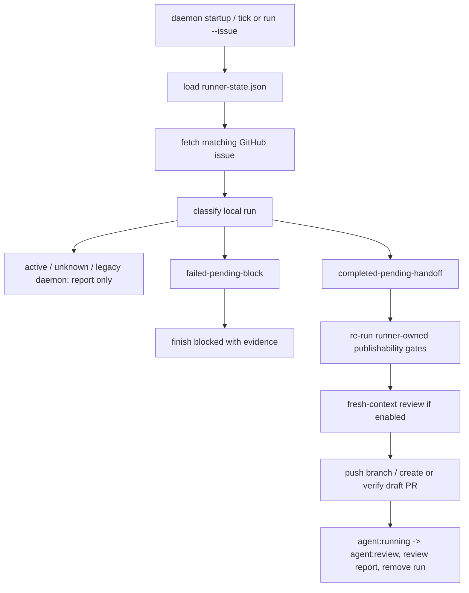

## 1. Executive Summary
- **Goal:** Add a runner-owned recovery sweeper that detects interrupted scoped runs like #773 and safely finishes draft PR handoff, or blocks with evidence, without rerunning child Codex.
- **Scope:** Extend local runner recovery classification, status output, daemon startup/tick behavior, and targeted `run --issue` behavior for scoped runs with matching local runner metadata. Add deterministic base-head evidence and a runner lease for future runs. Keep plan-auto/tree-child recovery out of the first implementation except read-only classification.
- **Chosen Option:** Option 2, the recommended daemon recovery sweeper. The same recovery use case should also be reachable from targeted `run --issue <number>` when the issue is already `agent:running`.
- **Why This Approach:** The bug is not child implementation failure; it is an interrupted runner publication path. The simplest sufficient fix is to reuse the existing scoped publishability and handoff pipeline from the runner, gated by strict local-state ownership checks, instead of creating a parallel publisher or rerunning Codex.

## 2. Current Understanding
- **Confirmed:** Issue #774 asks for daemon/startup recovery of `agent:running` runs interrupted after child Codex wrote a completed report. Issue #773 is the live fixture: GitHub still has `agent:running`, local `runner-state.json` contains issue number, mode, worktree path, session id, branch name, prompt/report/log paths, and the completion report has `status: completed` with passing validation.
- **Confirmed:** The #773 context snapshot contains deterministic base evidence: `repository.base.sha = ea69af1996ddf8305b63dd1c8a791d47ab7a2e45`, base branch `main`, branch name `codex/issue-773`, and the same prompt/report/log paths as local state.
- **Confirmed:** `src/runner/recovery.ts` currently classifies by GitHub labels and closure evidence only. A running issue with local completed report still returns `active`.
- **Confirmed:** `src/runner/scoped-auto-command.ts` owns the normal scoped flow: claim, create/resume worktree, run Codex, run `runImplementationPublishabilityCheck`, run Fresh-Context Review, write durable summary, push branch, create draft PR, transition labels to `agent:review`, post review report, remove local run metadata, and append lifecycle events.
- **Confirmed:** `src/runner/local-execution-session.ts` owns publishability checks, completion report parsing, changed-path safety, configured checks, Acceptance Proof/visual proof, review gates, and runner commits.
- **Confirmed:** `src/runner/daemon-command.ts` currently executes eligible work, then cleanup. It does not run recovery before selecting new work, and `--max-runs` currently counts only normal issue execution.
- **Confirmed:** `src/runner/status-command.ts` calls `reconcileRunnerState` in report-only mode and prints recovery entries.
- **Confirmed:** `src/cli.ts` rejects `agent:running` issues before `runScopedAutoCommand`; targeted recovery must be wired before that eligibility error.
- **Confirmed:** `GitHubPullRequestAdapter` has no open/draft PR lookup by head branch; only create, get by number, and find merged by head branch exist.
- **Confirmed:** ADR-0001 requires loop and publication authority to remain runner-owned. `docs/deep-dive.md` says durable state and preserved worktrees are the basis for interrupted-work recovery.
- **Assumptions:** Current worktree `HEAD` is acceptable as `afterHead` only after recovery proves the worktree is the recorded session worktree and the branch name matches the recorded branch. `beforeHead` must come from deterministic recorded evidence, not from the moving base branch.
- **Open Decisions:** None for planning. Live recovery of #773 is a validation gate, but should be run only after automated tests pass and the operator accepts the real GitHub mutation.

## 3. Architectural Design
- **Component Flow:**

- **Simplest Viable Path:** Add one scoped recovery module, for example `src/runner/scoped-recovery.ts`, that accepts existing adapters and state stores. It classifies only `mode: "scoped-issue"` runs with complete local metadata. For future runs, local metadata must include a recoverable lease and deterministic base evidence; for legacy runs like #773, daemon auto-recovery is read-only and explicit targeted recovery must read the context snapshot base SHA. For `completed-pending-handoff`, the module calls a shared scoped handoff helper extracted from `scoped-auto-command.ts`; for unsafe stale cases, it either reports read-only or uses the existing blocked report shape.
- **Why Not Simpler:** Changing `recovery.ts` to say `completed-pending-handoff` is not enough; #773 needs actual publication handoff. Adding a new ad hoc GitHub publisher would duplicate the most sensitive code path. Extracting the existing handoff block is the minimal way to keep one owner for PR body, review comment, label transition, durable summary, and lifecycle event behavior.
- **Architecture Lens:** The deep module is "scoped runner handoff": interface is "publish this validated scoped run or block with evidence"; implementation owns GitHub publication, durable summaries, review report, and cleanup. The seam is existing GitHub/Git/worktree adapters, not a new adapter. Deletion test: if the scoped recovery module is deleted, interrupted-run classification and recovery would be scattered across daemon, status, and scoped command; keeping it local concentrates recovery complexity.
- **Clean Architecture Map:** Domain: recovery state names and ownership rules. Application/Use Case: classify runner metadata and perform scoped handoff recovery. Infrastructure: GitHub adapters, Git worktree manager, shell executor, state/event stores. Presentation: CLI `status`, `daemon`, and `run --issue` output.
- **Reuse Strategy:** Reuse `RunnerStateStore`, `RunnerLifecycleEventStore`, `reconcileRunnerState` or its successor, `runImplementationPublishabilityCheck`, `runFreshContextReviewIfEnabled`, `writeDurableRunSummary`, `buildScopedPullRequestBody`, `buildScopedReviewReport`, `buildScopedBlockedReport`, `verifyPullRequestRefs`, `GitWorktreeManager`, `GhCliIssueAdapter`, and `GhCliPullRequestAdapter`. Add the smallest required PR adapter method for open/draft lookup by head/base before idempotent recovery.
- **Rejected Paths:** Do not rerun child Codex for recovery. Do not scan and mutate all `agent:running` issues without local metadata. Do not create a second PR/comment/label transition implementation. Do not auto-merge. Do not recover plan-parent/tree-child publication in this issue.

## 4. Constraints And Edge Cases
- **Data And Scale:** `runner-state.json` is small and local; current status/recovery loops load all runs. GitHub reads are one issue per local run, which is acceptable. No pagination change is needed for this issue.
- **Errors And Fallbacks:** Missing issue, missing worktree, missing branch name, mismatched mode, missing deterministic base evidence, existing PR with wrong refs, configured checks failure, proof failure, or deny-rule violation must not auto-publish. Missing or invalid reports are read-only while the run is not proven stale; only stale runner-owned runs can become `failed-pending-block`.
- **Concurrency And State:** Recovery must not race a live runner. Add a runner lease/heartbeat to `RunnerProcessMetadata` for new runs, for example `ownerPid`, `host`, `leaseUpdatedAt`, `attemptStartedAt`, `baseSha`, and `snapshotPath`. Daemon auto-recovery is allowed only when the lease is stale by a deterministic threshold, the process is not alive on the same host when checkable, and the report/worktree evidence matches. Legacy runs without lease metadata, including #773, are report-only for daemon auto-recovery but recoverable through explicit targeted `run --issue` when snapshot base evidence exists. Handoff recovery must be idempotent: if a matching open/draft PR already exists for branch/base, verify refs and complete labels/comments/state cleanup without creating another PR.
- **State Cleanup:** Recovery-ready publication must remove local run metadata just like normal review-ready scoped execution. Recovery-blocked execution should preserve local run metadata, mark it recovered/blocked with `lastRecoveredAt`, and avoid duplicate blocked comments by using a stable recovery marker in the comment or lifecycle event.

## 5. Impacted Areas
- `src/runner/recovery.ts` - extend recovery statuses and reasons to represent scoped interrupted handoff states.
- `src/runner/scoped-auto-command.ts` - extract reusable scoped handoff/failure helpers so recovery and normal execution share publication behavior.
- `src/runner/scoped-recovery.ts` or equivalent - new use case that classifies and recovers scoped local runs.
- `src/runner/daemon-command.ts` - run recovery sweeper at startup/tick before selecting new work and report recovery outcomes.
- `src/runner/status-command.ts` - show richer recovery states without mutating local/GitHub state.
- `src/runner/local-state.ts` - add lease/base metadata for new runs, keeping old state readable for legacy report-only or targeted recovery.
- `src/runner/context-snapshot.ts` - treat recorded base SHA and snapshot path as recovery evidence; ensure new local state points at the snapshot path.
- `src/github/pull-requests.ts` and `src/github/gh-pull-request-adapter.ts` - add open/draft PR lookup by head/base for idempotent partial handoff recovery.
- `src/cli.ts` - route recoverable `agent:running` scoped issues to targeted recovery before returning the normal eligibility error.
- `test/recovery.test.ts`, `test/status-command.test.ts`, `test/daemon-command.test.ts`, `test/scoped-auto-command.test.ts`, and/or a new `test/scoped-recovery.test.ts` - behavior coverage for classification, daemon integration, targeted recovery, idempotency, and safety.

## 6. Execution Slices And Multi-Agent Model
- **Slices:** Slice 1: add deterministic recovery evidence to local state for new scoped runs: base SHA, snapshot path, owner PID/host, and lease timestamps. Preserve compatibility with legacy state. Slice 2: add read-only classification for `completed-pending-handoff`, `failed-pending-block`, `active`, and `unknown-or-foreign`, including lease-stale rules and legacy #773 targeted-only behavior. Slice 3: add PR adapter lookup by head/base and tests for open/draft existing PRs. Slice 4: extract reusable scoped handoff helper from `scoped-auto-command.ts` without changing normal scoped behavior. Slice 5: implement scoped recovery for `completed-pending-handoff` using deterministic `beforeHead` from state/snapshot and prove no duplicate PR creation, including partial handoff where PR exists but labels/comment/state cleanup did not finish. Slice 6: implement stale `failed-pending-block` transition using existing blocked report evidence and duplicate-comment prevention. Slice 7: wire daemon startup/tick sweeper before issue selection and wire targeted `run --issue` recovery for already-running scoped issues with matching local metadata. Slice 8: run full tests and, with explicit approval, live-recover #773 through targeted recovery or prove why it blocks.
- **Per-Slice Test/Proof:** Slice 1 starts with local-state/context snapshot tests for new metadata and legacy state readability. Slice 2 starts with `test/recovery.test.ts` and `test/status-command.test.ts` failing expectations for recoverable, active, stale, and legacy targeted-only states. Slice 3 starts with pull-request adapter tests for open/draft PR lookup. Slice 4 starts with existing scoped auto tests proving no behavior change. Slice 5 starts with a fake adapter recovery test proving draft PR creation, label transition, local-state removal, and no duplicate PR when an open PR already exists. Slice 6 starts with a fake adapter test for stale missing/invalid report blocking and duplicate-comment prevention. Slice 7 starts with daemon/run command tests proving recovery runs before new eligible issue selection, does not count toward `--max-runs`, and targeted run does not reject already-running recoverable issues. Slice 8 uses `npm run typecheck` and `npm test`; live #773 recovery is an explicit final validation gate.
- **Exit Gates:** Every slice must pass its focused tests before moving on. Final gate is `npm run typecheck` and `npm test`. `npm run smoke:live` is not part of this plan.
- **Agent Matrix:** Single-agent implementation is preferred because the same publication path crosses recovery, daemon, and scoped command boundaries. Parallel subagents would increase conflict risk in `scoped-auto-command.ts`.
- **Parallelization Limits:** Do not edit daemon wiring and scoped handoff extraction in parallel. Do not run live recovery while tests or handoff extraction are unsettled.

## 7. Implementation Handoff Contract
- **approval_state:** ready-for-approval
- **approved_scope:** Implement Option 2 for #774: runner-owned daemon recovery sweeper plus targeted `run --issue` recovery for scoped interrupted handoff.
- **do_not_touch:** Do not change package release flow, npm publishing, auto-merge behavior, issue label vocabulary, or unrelated live-smoke cleanup. Do not read or edit `.env` or `.env.*`.
- **architecture_rules:** Keep one publication owner by sharing scoped handoff logic between normal scoped execution and recovery. Recovery may auto-publish only with matching local runner metadata, deterministic base SHA, stale lease proof, and validated worktree/report/branch evidence. Unsafe or incomplete evidence must not publish.
- **rejected_paths:** No child Codex rerun for recovery. No blind mutation of all `agent:running` issues. No duplicate PR creation. No plan-auto/tree-child handoff recovery in this issue. No new external service or scheduler.
- **required_docs:** Update `docs/deep-dive.md` recovery section if the user approves implementation; keep it short and describe statuses plus safety rules.
- **preconditions:** Authenticated GitHub access for live validation; local #773 fixture still present if using it. Automated implementation must work with fake adapters without live GitHub.
- **phase_boundaries:** Local evidence metadata first, classification second, PR lookup third, handoff extraction fourth, scoped recovery fifth, daemon/targeted wiring sixth, full validation seventh, optional live #773 targeted recovery last.
- **validation_gates:** Focused tests per slice, then `npm run typecheck`, `npm test`, and optional live `node dist/src/cli.js run --target . --issue 773` or dedicated recovery command after build.
- **blocking_assumptions:** None for code planning. Daemon auto-recovery for legacy runs without lease metadata is intentionally blocked; #773 live validation should use explicit targeted recovery backed by its context snapshot base SHA. If the #773 worktree/report/snapshot disappears before live validation, use automated fake-adapter tests as proof and skip live fixture with that concrete reason.

## Plan Review Notes
- **First Review Verdict:** Needs Work.
- **Findings Addressed:** The revised plan requires deterministic `beforeHead` from local state or context snapshot, adds lease/heartbeat metadata before daemon auto-recovery, adds open/draft PR lookup to the adapter surface, wires targeted recovery before CLI eligibility rejection, restricts `failed-pending-block` to stale proven runs, and defines local-state cleanup/idempotency semantics.
- **Resolved Questions:** #773-like legacy runs get canonical `beforeHead` from context snapshot base SHA and are explicit targeted recovery only. Future daemon auto-recovery requires stale lease proof. Existing open PRs are verified and completed without duplicate creation. Blocked recovery preserves metadata with duplicate-comment prevention. Daemon recovery is a pre-selection phase and does not count against `--max-runs`.
- **Second Review Verdict:** Approved; no remaining blockers.
