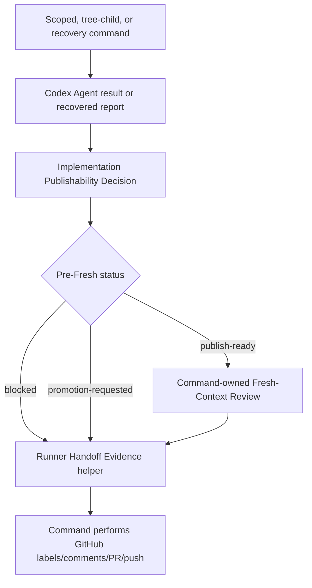

## 1. Executive Summary
- **Goal:** Deepen the Runner Publishability Decision so scoped execution, tree-child execution, and scoped recovery consume shared structured evidence for Agent result decisions and handoff inputs instead of manually rebuilding the same blocked, promotion, and review-ready data in each caller.
- **Scope:** In scope: preserve the pre-Fresh-Context `ImplementationPublishabilityResult` decision, add a small command-side handoff evidence helper for post-Fresh-Context durable/handoff inputs, update `runScopedAutoCommand`, `executeChild`, and `recoverScopedRun`, and add focused behavior tests. Out of scope: GitHub label/comment mutation ownership, draft PR creation, branch push semantics, parent child-batch scheduling, Acceptance Proof implementation redesign, risk-routing policy changes, config schema changes, prompt changes, live-smoke scripts, and release publishing.
- **Chosen Option:** Option 2, the recommended shared Runner handoff decision seam, approved by the user after recommendation. Product gate options were: Option 1 narrow cleanup inside `runImplementationPublishabilityCheck` (lower churn, insufficient locality), Option 2 shared pre/post decision evidence seam (recommended; best leverage for current duplication), Option 3 full workflow engine (too much scope and ADR risk).
- **Why This Approach:** It is the smallest path that fixes the shallow interface without moving publication authority. The pre-Fresh publishability module keeps local validation and commit decisions; a post-Fresh handoff helper concentrates repeated evidence assembly while command modules keep GitHub mutations and workflow scheduling.

## 2. Current Understanding
- **Confirmed:** `CONTEXT.md` defines the Runner as the trusted owner of issue selection, validation, GitHub mutations, and publication handoff. ADR-0001 requires Loop Policy, rework bounds, durable memory, and publication to remain Runner-owned. ADR-0002 requires Acceptance Proof to remain a runner-owned phase and forbids proof agents from owning publication. `runImplementationPublishabilityCheck` currently reads the completion report, runs local phases, validates safety and scope, runs configured checks, coordinates Acceptance Proof / visual proof, evaluates Review Gates, and commits local changes. `runScopedAutoCommand`, `executeChild` in `plan-auto-command.ts`, and `recoverScopedRun` in `scoped-recovery.ts` each translate publishability plus optional Fresh-Context Review into Durable Run Summary and handoff inputs. `package.json` exposes `npm run typecheck` and `npm test`; repo docs say not to run `npm run smoke:live` unless explicitly requested.
- **Assumptions:** Public CLI/GitHub behavior should stay unchanged. Existing report rendering remains in `handoff-evidence.ts`, and durable summary persistence remains in `durable-run-summary.ts`. No target repository config migration is needed.
- **Open Decisions:** None before implementation. Live smoke remains skipped unless the user explicitly requests it.

## 3. Architectural Design
- **Component Flow:**

- **Simplest Viable Path:** Keep `runImplementationPublishabilityCheck` as the pre-Fresh decision entrypoint and preserve its core responsibilities. Add one small runner module, for example `src/runner/runner-handoff-decision.ts`, that converts publishability plus optional Fresh-Context Review into structured inputs for Durable Run Summary and existing handoff functions. Prefer narrow builders by outcome/context over one universal decision adapter. Commands call those builders, then perform the actual GitHub mutations, pushes, PR creation, parent scheduling, and comments.
- **Why Not Simpler:** Only changing `runImplementationPublishabilityCheck` would leave `scoped-auto-command.ts`, `plan-auto-command.ts`, and `scoped-recovery.ts` rebuilding nearly identical post-Fresh blockers, residual risks, next actions, and summary inputs. The new helper is justified because it concentrates current duplication across three real consumers. It does not introduce an Adapter abstraction and does not render comments or write summaries.
- **Architecture Lens:** Module 1: Implementation Publishability Decision. Interface: Agent/recovered-result input to pre-Fresh status with changed files, validation, artifacts, skipped checks, residual risks, commits, promotion data, and Acceptance Proof evidence. Module 2: Runner Handoff Evidence Decision. Interface: publishability result plus optional Fresh-Context Review and context strings to structured durable-summary and handoff input fields. Seam: command modules cross this seam before the Runner-Owned Publication Boundary. Deletion test: deleting Module 1 spreads safety/check/proof/review-gate/commit decisions across callers; deleting Module 2 spreads post-Fresh evidence assembly across scoped, tree-child, and recovery callers. Both earn depth. Depth improves because callers learn decision shapes, not evidence assembly rules; locality improves because blocker and next-action semantics are maintained once.
- **Clean Architecture Map:** Domain: Runner decision status, blockers, review-ready evidence, promotion-requested evidence, Acceptance Proof evidence, and Fresh-Context Review outcome vocabulary. Application/Use Case: `runImplementationPublishabilityCheck`, command orchestration, recovery orchestration, rework decision use, post-Fresh handoff evidence assembly. Infrastructure: Git worktree collection/commit, shell checks, Codex command output, file-system report reads. Presentation: GitHub comments, draft PR bodies, lifecycle event strings, CLI output; these stay in command and rendering modules.
- **Reuse Strategy:** Reuse `runImplementationPublishabilityCheck`, `ImplementationPublishabilityResult`, `runLocalExecutionSession`, `evaluateReviewGates`, `runAcceptanceProofAttempt`, `runRunnerVisualProof`, `writeDurableRunSummary`, `buildScopedBlockedReport`, `buildPromotionRequestReport`, `buildChildBlockedReport`, `finishScopedBlockedHandoff`, `finishScopedReviewReadyHandoff`, `runFreshContextReviewIfEnabled`, and existing tests in `test/local-execution-session.test.ts`, `test/scoped-auto-command.test.ts`, `test/plan-auto-command.test.ts`, and `test/scoped-recovery.test.ts`.
- **Rejected Paths:** Do not move GitHub labels, comments, branch push, draft PR creation, or parent child-batch scheduling behind either decision module. Do not introduce a generic workflow engine. Do not add Adapter abstractions. Do not change Acceptance Proof policy or risk-routing policy. Do not move rendering into the decision helper; `handoff-evidence.ts` and `durable-run-summary.ts` keep formatting/persistence ownership.

## 4. Constraints And Edge Cases
- **Data And Scale:** Changed-file lists, validation lines, artifacts, and residual risks are small in normal runs but must remain arrays passed by value without extra filesystem scans beyond current change-set collection. No pagination or N+1 issue applies. Avoid holding large log contents in memory; keep log/report paths as evidence references.
- **Errors And Fallbacks:** Preserve blocker behavior for Codex nonzero exit, missing/invalid completion report, no file changes, ownership-scope violations, denied paths, failed configured checks, failed Acceptance Proof, forbidden proof-phase product diffs, Review Gate blockers, Fresh-Context Review blockers, and recovered stale runs without completed reports. Promotion stays a scoped `promotion-requested` outcome; tree-child and recovery promotion continue to become blocked handoff evidence because a child or recovered scoped run cannot autonomously promote itself into a parent plan. The helper contract must explicitly distinguish scoped `promotion-requested` from child/recovery promotion-as-blocked so next-action and outcome semantics do not drift.
- **Concurrency And State:** Scoped, recovery, and tree-child runs may operate in separate worktrees. Decision helpers must not mutate GitHub state or shared parent state. Local commit behavior must remain idempotent within one worktree attempt: commit only after gates pass and only when the worktree is not clean, preserving existing behavior. Recovery must keep its idempotent blocked-comment marker behavior.

## 5. Impacted Areas
- `src/runner/local-execution-session.ts`: preserve and possibly tighten the pre-Fresh publishability result shape.
- `src/runner/runner-handoff-decision.ts` or directly adjacent equivalent: new small helper for post-Fresh durable/handoff input assembly across scoped, tree-child, and recovery paths.
- `src/runner/scoped-auto-command.ts`: consume shared handoff evidence for blocked, promotion-requested, Fresh-Context Review blocked, and review-ready paths while preserving GitHub mutation ownership.
- `src/runner/plan-auto-command.ts`: update `executeChild` to consume shared child handoff evidence, including promotion-as-blocked evidence.
- `src/runner/scoped-recovery.ts`: consume the same handoff evidence for completed-pending-handoff and failed-pending-block recovery paths while preserving recovery marker idempotency.
- `src/runner/durable-run-summary.ts`: keep persistence unchanged; adjust only if a type export is useful for structured helper output.
- `src/runner/handoff-evidence.ts`: keep report rendering unchanged; adjust only if existing input types can be reused directly.
- `test/local-execution-session.test.ts`: pre-Fresh decision regression tests.
- `test/scoped-auto-command.test.ts`, `test/plan-auto-command.test.ts`, and `test/scoped-recovery.test.ts`: consumer behavior and idempotency regression tests.

## 6. Execution Slices And Multi-Agent Model
- **Slices:**
  1. Pre-Fresh publishability evidence stays explicit. Start with a failing test that a configured-check blocker returns the full pre-Fresh decision evidence currently needed by callers, including blockers, changed files, validation, skipped checks, residual risks, commits, and Acceptance Proof evidence when present. Implement only the minimal result-shape tightening needed for downstream helper input.
  2. Add post-Fresh Runner Handoff Evidence for blocked and Fresh-Context Review blocked outcomes. Start with a failing test for the new helper: blocked publishability and Fresh-Context Review blocked publishability produce durable-summary fields and blocked-handoff fields with correct blockers, residual risks, suggestion evidence, next action, and Acceptance Proof evidence. Update scoped command, tree-child blocked path, and recovery blocked path to consume it.
  3. Add promotion and review-ready handoff evidence. Start with failing tests that scoped promotion produces promotion summary input, tree-child/recovery promotion produces blocked evidence, and review-ready with optional Fresh-Context Review produces durable-summary fields without moving PR/push/label actions. Update all three consumers.
  4. Reconcile command regressions and remove dead caller assembly. Run focused command/recovery tests, delete duplicated assembly branches that are now represented by the helper, and verify rendered comments/PR bodies remain behaviorally equivalent.
- **Per-Slice Test/Proof:** Slice 1: `npm run build && node --test dist/test/local-execution-session.test.js`. Slice 2: `npm run build && node --test dist/test/scoped-auto-command.test.js dist/test/plan-auto-command.test.js dist/test/scoped-recovery.test.js` after adding helper tests in the closest existing test file or a focused new test file. Slice 3: same focused command plus recovery test command. Slice 4: final `npm run typecheck`, `npm test`, and `git diff --check`. No UI proof is required because this is runner TypeScript behavior with no user-facing UI.
- **Exit Gates:** Each slice must pass the focused build plus Node test command it introduced before moving on. Final gates: `npm run typecheck`, `npm test`, `git diff --check`. `npm run smoke:live` is skipped unless explicitly requested because it creates or updates real GitHub issues and PRs.
- **Agent Matrix:**
  | Phase | Owner | Input | Output | Dependencies |
  | --- | --- | --- | --- | --- |
  | Slice 1 | main implementation agent | existing publishability tests and result shape | explicit pre-Fresh decision evidence | none |
  | Slice 2 | main implementation agent | blocked publishability, Fresh-Context Review evidence, three consumers | shared blocked handoff evidence consumed by scoped/tree-child/recovery | Slice 1 |
  | Slice 3 | main implementation agent | promotion and review-ready paths | shared promotion/review-ready evidence consumed by scoped/tree-child/recovery | Slice 2 |
  | Slice 4 | main implementation agent | changed caller code and tests | regression cleanup and final validation | Slices 1-3 |
- **Parallelization Limits:** Do not parallelize edits to `local-execution-session.ts`, the new handoff decision helper, `scoped-auto-command.ts`, `plan-auto-command.ts`, or `scoped-recovery.ts`; their result-shape changes are tightly coupled. Verification can run only after the slice compiles.

## 7. Implementation Handoff Contract
- **approval_state:** approved
- **approved_scope:** Refactor Runner Publishability Decision evidence and post-Fresh handoff evidence assembly across scoped execution, tree-child execution, and scoped recovery without changing external CLI/GitHub behavior.
- **do_not_touch:** Do not read, print, or edit `.env` or `.env.*`. Do not change GitHub adapter write semantics, branch naming, label names, config schema defaults, package publishing workflow, live-smoke scripts, prompt workflow content, or release files unless a test proves it is strictly required for this refactor.
- **architecture_rules:** Publication remains Runner-owned. `runImplementationPublishabilityCheck` may decide whether an Agent result is publishable, blocked, or promotion-requested before Fresh-Context Review. The post-Fresh helper may assemble structured durable/handoff input fields but must not write summaries, render comments, mutate GitHub, push branches, create PRs, or schedule parent/child work. No new Adapter abstraction. New helpers must pass the deletion test by concentrating current duplicated decision evidence across all three consumers.
- **rejected_paths:** No workflow engine, no Acceptance Proof redesign, no risk-routing policy redesign, no moving GitHub writes into local execution session, no broad config migration, no rendering inside decision helpers, no live smoke by default.
- **required_docs:** None. Add a short code comment only if the decision type has a non-obvious invariant, such as why GitHub mutation evidence is intentionally absent.
- **preconditions:** Clean or intentionally managed worktree. Node 18+. Dependencies installed. No external services required for unit tests.
- **phase_boundaries:** Slice 1 pre-Fresh evidence; Slice 2 blocked/Fresh-blocked post-Fresh evidence; Slice 3 promotion/review-ready post-Fresh evidence; Slice 4 command/recovery regression cleanup and final validation. Pause before implementation if the user wants live smoke included as a required proof gate.
- **validation_gates:** Behavior-first test per slice using `npm run build && node --test dist/test/<focused>.test.js`; final `npm run typecheck`, `npm test`, `git diff --check`. Report live smoke as skipped unless explicitly requested.
- **blocking_assumptions:** None.
