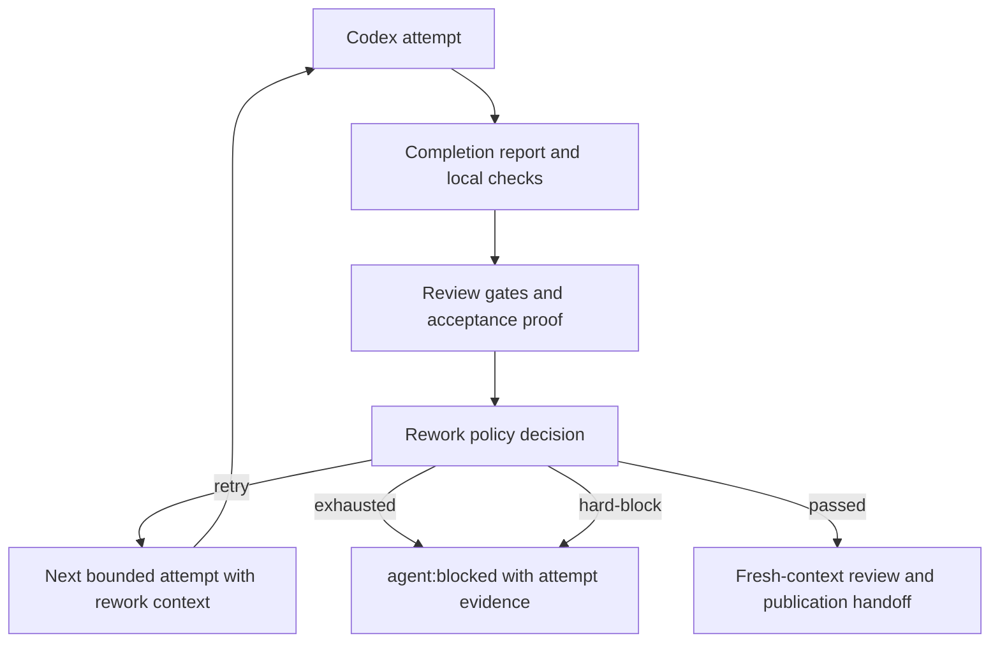

## 1. Executive Summary
- **Goal:** Make Codex Orchestrator continue fixable child/scoped work through a bounded rework loop instead of prematurely marking parent and child issues `agent:blocked`, while preserving hard blockers for cases that truly need maintainer input, including required Figma design access.
- **Scope:** In scope: `codex-orchestrator` package runner policy, tree-child/scoped/recovery rework callers, completion report validation evidence, Figma MCP dependency policy, setup/config schema/defaults, tests, docs, and target config guidance for Levantem. Out of scope: implementing or merging the blocked Levantem issues themselves, changing GitHub label names, changing runner-owned publication safety rules, or adding a generic multi-MCP orchestration subsystem.
- **Chosen Option:** Option C, approved by the user: replace the old boolean helper pair with a new `ReworkDecision` policy API and migrate callers directly. Do not keep `shouldRequestImplementationRework()` or `maxReworkAttemptsForReasons()` as compatibility wrappers. Option A was to only increase `loopPolicy.rework.maxAttempts`; Option B was to keep the existing helpers and add more reason patterns. Option C is the recommended path because it makes retry, exhausted retry, and hard block explicit at the call site.
- **Why This Approach:** The existing runner already owns bounded rework, worktrees, reports, and safety boundaries. The smallest sufficient fix is to deepen that existing policy seam instead of creating a second orchestration layer.

## 2. Current Understanding
- **Confirmed:** `docs/adr/0001-runner-owned-loop-policy.md` requires loop policy to remain runner-owned, deterministic, bounded, and machine-checkable. `CONTEXT.md` defines Rework Loop as bounded retry for machine-checkable blockers and distinguishes it from product uncertainty. `src/runner/local-execution-session.ts` converts failed review gates into `ImplementationPublishabilityResult.status === "blocked"` with reasons. `src/runner/rework-policy.ts` currently owns retryable/non-retryable reason matching through two exported helpers. `src/runner/scoped-auto-command.ts`, `src/runner/plan-auto-command.ts`, and `src/runner/scoped-recovery.ts` currently call those helpers. `src/runner/plan-auto-command.ts` already has a tree-child rework loop, but it uses one session id/report/log path shape and does not expose a first-class decision reason for retry versus exhaustion. `src/runner/review-gates.ts` emits quality gate reasons such as `Quality gate requires TDD red-to-green proof in validation.`. `src/runner/review-gate-policy.ts` currently proves TDD from regex heuristics over `validation[].summary`. `src/runner/completion-report.ts` currently validates each validation line as only `{ command, status, summary }`. `src/codex/command-adapter.ts` enables Figma MCP only when prompt text matches `codex.figmaMcp.issueTextPatterns`; it does not distinguish optional Figma references from required design dependencies. Levantem backend config currently has `loopPolicy.rework.maxAttempts: 1` and includes `missing-quality-gate-evidence` as retryable.
- **Assumptions:** The #265 failure mode is representative of a broader class of "implementation probably OK, proof format not accepted" quality-gate failures. Existing target repos can accept a config update as part of rolling out the package fix. No `docs/INDEX.md` exists in this repo, so `AGENTS.md`, `CONTEXT.md`, ADRs, `docs/deep-dive.md`, and source files are the evidence sources.
- **Open Decisions:** None. The user approved the direction and explicitly rejected compatibility wrappers for the old rework helper API.

## 3. Architectural Design
- **Component Flow:**

- **Simplest Viable Path:** Replace the helper pair in `src/runner/rework-policy.ts` with one exported `decideImplementationRework(input)` function that returns `retry`, `exhausted`, or `hard-block`. Move all caller conditionals in scoped, tree-child, and recovery flows to that decision. Extend completion report validation lines with optional structured evidence for TDD. Extend Figma MCP config with optional/required patterns and route optional Figma failures through the normal rework loop rather than a hidden process retry.
- **Why Not Simpler:** Merely raising `maxAttempts` would reduce the frequency of premature blocks but would not explain why a run stopped, would not separate hard blockers from fixable proof failures, and would not fix Figma optional/required behavior. Keeping the old helper names as wrappers would preserve a boolean mental model and invite drift. Adding structured validation evidence is justified because the current regex-only TDD proof is the direct weak point in #265-like failures.
- **Architecture Lens:** The affected module is the Runner Loop Policy. Its interface should be one explicit decision object, not two loosely coupled helpers. The decision module passes the deletion test because removing it would spread retry/exhausted/hard-block classification back into three callers. No new generic MCP adapter seam is introduced; Figma remains a specific policy inside the existing Codex command adapter and runner rework context. Depth improves because policy classification, attempt budgeting, and caller action become one coherent module with a small public surface.
- **Clean Architecture Map:** Domain: retryable blocker categories, hard blocker categories, attempt budget semantics, and Figma optional/required dependency semantics in `rework-policy.ts` and config types. Application/Use Case: scoped execution, tree-child execution, and recovery apply the decision and mutate runner state/GitHub labels. Infrastructure: `CodexCommandAdapter`, shell execution, Git worktree manager, and GitHub adapters execute external operations. Presentation: prompts, durable summaries, lifecycle events, issue comments, and README/deep-dive docs explain the decision.
- **Reuse Strategy:** Reuse `ImplementationPublishabilityResult.reasons`, `RunnerStateStore.upsertRun`, `RunnerLifecycleEventStore.append`, `buildScopedImplementationPrompt` rework input, tree-child prompt creation, `writeDurableRunSummary`, `readScopedCompletionReport`, existing config validation helpers, and existing `codex.profiles` phase support. Extract only small shared prompt formatting if it removes current scoped/tree-child rework text duplication.
- **Rejected Paths:** Do not keep `shouldRequestImplementationRework()` or `maxReworkAttemptsForReasons()` wrappers. Do not create an unbounded loop. Do not convert all non-zero Codex exits into retryable failures. Do not treat every Figma URL as a hard requirement. Do not silently rerun Codex inside `CodexCommandAdapter` after optional Figma MCP failure, because the first process may already have mutated the worktree. Do not add a generic MCP server abstraction until there is more than one real server policy to manage.

## 4. Constraints And Edge Cases
- **Data And Scale:** Attempt history is small but must stay bounded by config. Durable summaries may include several attempts; store concise per-attempt paths, status, reasons, and decision, not full logs or large command output. Completion report evidence remains inline and small; large proof artifacts stay as artifact paths/URLs.
- **Errors And Fallbacks:** Retryable failures include missing/invalid completion report, no changed files, failed configured checks, missing quality-gate evidence, acceptance proof needs-rework, and configured risk-routing policy blockers. Hard blockers include deny-policy violations, runner-owned publication violations, destructive/prod actions, child promotion requests, required Figma MCP/design access failure, and human-only product uncertainty. Optional Figma MCP failure becomes a retry decision with Figma disabled and a prompt note; required Figma failure becomes hard-block.
- **Concurrency And State:** Keep parent/child publication atomic as today: do not merge or publish a batch while a child is still retrying. Each attempt must update runner state with the current attempt number, session id, prompt/report/log paths, and lease metadata. Retrying continues from the existing worktree state; it must not reset user or agent changes. Re-running a child after optional Figma failure must be visible as a normal rework attempt, not hidden infrastructure behavior.

## 5. Impacted Areas
- `src/runner/rework-policy.ts`: replace helper pair with `ReworkDecision` model, reason classification, budget calculation, Figma optional/required decisions, and hard-block/exhausted semantics.
- `src/runner/scoped-auto-command.ts`: replace boolean retry conditional with decision handling and attempt-specific lifecycle evidence.
- `src/runner/plan-auto-command.ts`: apply the same decision in tree-child loop, split attempt artifacts, update state per attempt, and include final exhausted/hard-block evidence in child and parent comments.
- `src/runner/scoped-recovery.ts`: use the decision API for missing completion report recovery retry instead of helper composition.
- `src/runner/prompt.ts`: centralize rework prompt wording and add structured validation/TDD proof instructions.
- `src/runner/completion-report.ts`, `src/runner/handoff-evidence.ts`, `src/runner/review-gate-policy.ts`, and `src/runner/review-gates.ts`: extend validation line parsing/types and TDD proof evaluation without creating a second validation source of truth.
- `src/config/schema.ts` and `src/setup/project-config.ts`: add Figma optional/required policy fields, decision-related retryable blocker keys if needed, defaults, and setup migration from existing Figma pattern config into the new normalized config shape.
- `src/codex/command-adapter.ts`: classify when Figma MCP should be enabled for an attempt; support runner-provided "disable optional Figma for this attempt" context without owning retry itself.
- Tests under `test/rework-policy.test.ts`, `test/plan-auto-command.test.ts`, `test/scoped-auto-command.test.ts`, `test/scoped-recovery.test.ts`, `test/completion-report.test.ts`, `test/review-gates.test.ts`, `test/codex-command-adapter.test.ts`, `test/config-schema.test.ts`, `test/live-smoke-script.test.ts`, and live-smoke coverage.
- `scripts/live-smoke.mjs`: add a focused live-smoke scenario for tree-child quality-gate rework so the package can prove this exact failure mode end-to-end before release.
- Docs: `README.md`, `docs/deep-dive.md`, `CHANGELOG.md`, and target config guidance for Levantem.

## 6. Execution Slices And Multi-Agent Model
- **Slices:** 
  1. Rework decision core: add the `ReworkDecision` type and `decideImplementationRework()`; remove old helper exports; migrate scoped, tree-child, and recovery callers.
  2. Attempt evidence: make scoped/tree-child retry attempts write attempt-specific prompt/report/log/snapshot paths, update runner state per attempt, and write lifecycle/durable summary attempt history.
  3. Structured TDD evidence: extend `validation[]` with optional `evidence.kind === "tdd-red-green"` and update review-gate evaluation to prefer structured evidence before regex fallback.
  4. Figma policy: split Figma config into optional and required patterns; classify Figma MCP failure as retryable optional rework or hard required block; pass disable-optional-Figma context through the normal rework attempt.
  5. Live-smoke scenario: add a focused scenario in `scripts/live-smoke.mjs` that reproduces a tree-child quality-gate failure, verifies runner-owned rework continues the child, and confirms the parent is not marked blocked before the retry budget is exhausted.
  6. Config/docs rollout: update setup defaults, schema validation, target config migration guidance, docs, and changelog.
  7. Final proof: run focused tests, full tests/typecheck, and the new live-smoke scenario.
- **Per-Slice Test/Proof:** Slice 1 starts with failing policy tests for `retry`, `exhausted`, and `hard-block`, plus caller tests proving old helper exports are gone. Slice 2 starts with a failing tree-child test where a quality-gate miss retries with a new attempt report/log and does not block parent before budget exhaustion. Slice 3 starts with failing completion-report/review-gate tests where structured TDD evidence passes without relying on summary regex and malformed evidence fails cleanly. Slice 4 starts with failing Codex adapter/plan-auto tests for optional Figma failure retrying without MCP and required Figma failure marking hard block. Slice 5 starts with a failing `test/live-smoke-script.test.ts` assertion for the new scenario name/profile routing, then implements the scenario in `scripts/live-smoke.mjs`. Slice 6 starts with config-schema/setup tests for new Figma fields and migration from existing `issueTextPatterns`. Slice 7 runs `npm run typecheck`, `npm test`, `git diff --check`, and the new focused live-smoke scenario command.
- **Exit Gates:** No slice is complete until the slice-specific RED test turns GREEN and adjacent existing tests pass. Final exit requires full typecheck, full tests, diff check, docs updated, review of public exports to ensure the old helper API is removed, and a successful focused live-smoke run for the new tree-child quality-rework scenario.
- **Agent Matrix:**
  | Phase | Owner | Input | Output | Dependencies |
  | --- | --- | --- | --- | --- |
  | Decision core | Main implementation agent | Current rework policy and caller tests | New `ReworkDecision` API and migrated callers | None |
  | Attempt evidence | Main implementation agent | Decision core | Attempt-specific state/artifacts | Decision core |
  | TDD evidence | Main implementation agent | Completion report schema and review gates | Structured validation evidence | Decision core |
  | Figma policy | Main implementation agent | Config schema and command adapter | Optional/required Figma routing | Decision core |
  | Live smoke | Main implementation agent | Implemented decision/rework behavior | New smoke scenario and passing focused smoke run | Decision, attempt evidence, TDD evidence |
  | Review/proof | Main implementation agent | All changed files | Passing test suite and docs | All implementation slices |
- **Parallelization Limits:** Do not parallelize edits to `rework-policy.ts`, `plan-auto-command.ts`, and `scoped-auto-command.ts`; they share the same policy interface. TDD evidence and Figma policy tests can be explored in parallel only after the decision API shape is fixed. Do not run live smoke in parallel with source edits.

## 7. Implementation Handoff Contract
- **approval_state:** approved
- **approved_scope:** Replace the old rework helper API with a first-class decision model; migrate scoped/tree-child/recovery callers; add attempt-specific retry evidence; add structured TDD proof in existing validation lines; add Figma optional/required policy and bounded rework behavior; update config schema/setup/docs/tests.
- **do_not_touch:** Do not read or edit `.env` or `.env.*`. Do not weaken deny rules, runner-owned publication checks, GitHub label semantics, worktree safety, or acceptance-proof safety. Do not change unrelated package behavior, unrelated target repos, or issue implementation code for #262/#265 as part of this plan.
- **architecture_rules:** Runner policy owns retry/hard-block decisions. Callers execute decisions and perform state/GitHub mutations. Codex adapter may classify and configure Figma MCP for an attempt, but it must not hide a retry loop. Completion report validation evidence must stay inside the existing `validation[]` contract. No old helper compatibility wrappers are allowed.
- **rejected_paths:** No unbounded retries. No boolean helper wrappers. No generic MCP abstraction. No hidden adapter rerun after optional Figma failure. No regex-only TDD proof as the primary path after structured evidence exists. No hard block for optional Figma references.
- **required_docs:** Update `README.md`, `docs/deep-dive.md`, `CHANGELOG.md`, and any setup/config examples touched by schema changes. Add short code comments only where the retry decision type or Figma optional/required split would otherwise be non-obvious.
- **preconditions:** Node/npm dependencies installed; GitHub CLI available for live smoke only if the final proof runs live scenarios; target repo configs may need explicit update after package release. No external Figma token is required to unit-test optional/required policy because tests should mock process output.
- **phase_boundaries:** Implement slices in order: decision core, attempt evidence, structured TDD evidence, Figma policy, live-smoke scenario, config/docs rollout, final proof. Pause only if structured report schema changes would require a breaking public package version decision beyond the existing approved package update workflow.
- **validation_gates:** Slice tests as listed above; final `npm run typecheck`; final `npm test`; final `git diff --check`; add and run the focused live-smoke scenario for tree-child quality rework before release; manual inspection that old helper exports are removed and all callers use `decideImplementationRework()`.
- **blocking_assumptions:** None.
