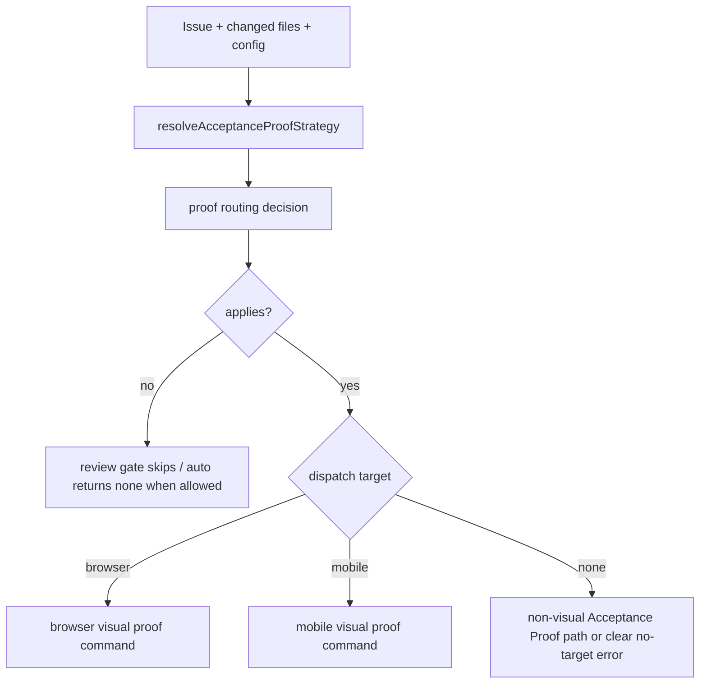

## 1. Executive Summary
- **Goal:** Centralize Acceptance Proof routing so review gates, prompt policy, and `visual-proof auto` use one runner-owned decision for whether proof applies, which proof target to dispatch, and why proof should be skipped or rejected.
- **Scope:** In scope: issue #1199, `src/runner/review-gate-policy.ts`, `src/runner/auto-visual-proof-command.ts`, adjacent proof-strategy/review-gate call sites only when needed, and characterization tests in `test/review-gates.test.ts` and `test/auto-visual-proof-command.test.ts`. Out of scope: changing Acceptance Proof report contracts, changing proof execution commands, changing ReworkDecision/Figma policy, changing GitHub labels, or broad visual/mobile proof rewrites.
- **Chosen Option:** Delegated recommended option C. Option A was to keep current helpers and add tests only; it lowers regression risk but leaves policy duplicated. Option B was to merge the current helpers into `review-gate-policy.ts` only; it reduces some branching but still makes `auto-visual-proof-command.ts` understand skip and dispatch rules. Option C is a small shared proof-routing decision function/module consumed by existing callers; it has the smallest durable interface while preserving current behavior.
- **Why This Approach:** The current code already has the needed raw inputs and strategy parser. The simplest complete fix is to move the scattered `proofStrategy`, changed-path, legacy `visualProof`, and dispatch-target logic behind one narrow decision object, then keep the existing command and review-gate behavior as consumers of that object.

## 2. Current Understanding
- **Confirmed:** GitHub issue #1199 is open with `agent:auto`, `agent:blocked`, and `self-improvement`; the blocked scoped run changed no files and stopped on `Codex exited with code 124`. `CONTEXT.md` defines Acceptance Proof as runner-owned and distinguishes the Runner from the Agent. `docs/deep-dive.md` says `reviewGates.acceptanceProof` is canonical while `reviewGates.visualProof` remains a migration adapter. `docs/adr/0001-runner-owned-loop-policy.md` requires deterministic runner-owned loop policy and publication authority. `src/runner/review-gate-policy.ts` currently owns `shouldApplyVisualProofGate`, `classifyVisualProofDispatchTarget`, `isVisualProofDesirable`, and `runnerVisualProofPolicy`; those functions each re-check some combination of proof strategy, legacy command fallback, issue text, and changed paths. `src/runner/auto-visual-proof-command.ts` imports three of those functions and adds its own `none`/`non-visual-smoke` skip/error branching. `src/runner/proof-strategy.ts` already resolves explicit issue `Proof Strategy:` overrides. `package.json` runs tests through build first via `npm test`.
- **Assumptions:** The future implementation can stay within the issue-listed files plus at most a small adjacent helper file, because current evidence does not require schema, CLI, proof report, or execution-runner changes. Existing test fixtures in `test/review-gates.test.ts` and `test/auto-visual-proof-command.test.ts` are sufficient to characterize legacy behavior before extraction. The implementation should keep the public `visual-proof auto` command name even though the domain term is now Acceptance Proof.
- **Open Decisions:** None. The user delegated the planning direction from the handoff, and the issue scope is narrow enough to plan without further product questions.

## 3. Architectural Design
- **Component Flow:**

- **Simplest Viable Path:** Add one decision API, likely in `src/runner/review-gate-policy.ts` unless extraction to `src/runner/proof-routing-policy.ts` improves locality after implementation starts. The API should accept `{ config, issue, changedFiles }` and return a small object such as `{ applies, desirable, dispatchTarget, proofStrategy, action, reason }`, where `action` is a narrow enum for `skip`, `dispatch`, `allow-non-visual`, or `error`. Rewrite `shouldApplyVisualProofGate`, `isVisualProofDesirable`, and `classifyVisualProofDispatchTarget` as compatibility exports that delegate to the decision, make `buildVisualProofPromptLines` use the same resolved decision where it currently branches on strategy/capability, and make `runAutoVisualProofCommand` consume the decision directly for dispatch and skip/error behavior.
- **Why Not Simpler:** Tests-only hardening does not remove the duplicated policy source. Folding only some branches into one existing helper still leaves the auto command deciding policy from multiple low-level helpers. A decision object is justified because deleting it would put the same strategy and target classification rules back into two modules.
- **Architecture Lens:** The affected module is Runner-owned Acceptance Proof routing. The interface should expose a decision, not policy ingredients. The seam is internal to the runner package; it is not an adapter seam and should not introduce factories or pluggable proof routers. Depth improves because callers ask one question and receive one answer, while details stay local to the policy. Leverage is high because review gates, prompt policy, and auto dispatch can share behavior. Locality is preserved by keeping legacy `visualProof` fallback inside the same policy owner.
- **Clean Architecture Map:** Domain: proof applicability, proof strategy override semantics, legacy `visualProof` compatibility, and dispatch target classification. Application/Use Case: review gates and auto visual proof apply the routing decision to produce warnings, blockers, command dispatch, or a clear no-target error. Infrastructure: browser/mobile proof commands, filesystem artifacts, env variables, and CLI argument parsing remain unchanged. Presentation: prompt lines and error messages explain the decision without owning policy.
- **Reuse Strategy:** Reuse `resolveAcceptanceProofStrategy`, `runnerVisualProofPolicy`, `globMatches`, `regexMatches`, existing path classifiers, existing `VisualProofDispatchTarget`, existing prompt-line builders inside `buildVisualProofPromptLines`, and the current tests that cover explicit `browser-visual`, `mobile-visual`, `non-visual-smoke`, backend-only acceptance proof, web/mobile path routing, and legacy command fallback.
- **Rejected Paths:** Do not change config schema or proof report schema. Do not rename the CLI from `visual-proof auto`. Do not remove legacy `visualProof` fallback behavior. Do not turn non-visual proof into browser proof. Do not make missing browser/mobile target silently pass when the issue explicitly asks for visual proof. Do not create a generic proof adapter framework.

## 4. Constraints And Edge Cases
- **Data And Scale:** Inputs are small: issue title/body, a changed-file list, and config pattern arrays. Normalize paths once in the decision function and avoid repeatedly compiling or matching more than the current callers do. No pagination, batching, or large artifact loading belongs in this change.
- **Errors And Fallbacks:** `proofStrategy: none` and `proofStrategy: non-visual-smoke` must skip browser/mobile dispatch. `browser-visual`, `mobile-visual`, and `visual` must remain deterministic and command-aware. Backend/API/CLI acceptance proof may apply with dispatch target `none` without throwing when visual proof is not desirable. Explicit visual proof with no browser/mobile target must still fail clearly. Legacy visual command override must continue to choose the legacy command/artifact/env policy exactly as today.
- **Concurrency And State:** The decision must be pure and side-effect free. It must not mutate config, read files, start proof commands, update runner state, or touch GitHub. This keeps parallel runner work safe and leaves serialization/device leasing inside existing browser/mobile proof command paths.

## 5. Impacted Areas
- `src/runner/review-gate-policy.ts`: introduce the shared proof-routing decision and migrate existing helper exports plus `buildVisualProofPromptLines` strategy/capability branching to delegate to it, or move only the decision to a new `proof-routing-policy.ts` if that makes imports clearer without broadening scope.
- `src/runner/auto-visual-proof-command.ts`: replace composed helper calls with one decision and keep browser/mobile runner invocation behavior unchanged.
- `src/runner/review-gates.ts`: update imports only if helper export names or internal routing change; review-gate semantics should remain behaviorally stable.
- `test/review-gates.test.ts`: add characterization coverage around the new decision surface while preserving existing helper expectations during migration.
- `test/auto-visual-proof-command.test.ts`: assert that auto dispatch, allowed `none`, backend-only acceptance proof, and explicit visual no-target errors all come from the shared decision.
- Docs are optional for implementation because this is an internal refactor; update docs only if a public behavior or term changes, which this plan rejects.

## 6. Execution Slices And Multi-Agent Model
- **Slices:** 
  1. Characterize routing behavior: add tests that exercise the intended shared decision outcomes for `auto`, `visual`, `browser-visual`, `mobile-visual`, `non-visual-smoke`, and `none` across issue-text and changed-path triggers.
  2. Introduce the decision API: implement the pure proof-routing decision with the current helper behavior preserved, and have existing helpers delegate to it.
  3. Migrate prompt and auto dispatch consumers: update `buildVisualProofPromptLines` and `runAutoVisualProofCommand` to consume the decision directly and remove duplicated strategy/desirability branching.
  4. Tighten regression coverage: add or adjust tests for legacy `visualProof` fallback, backend-only non-visual acceptance proof, explicit visual no-target failure, mobile path precedence over mixed web/mobile changes, and internal proof-module path exclusions.
  5. Final reconciliation: inspect imports/exports for duplicated routing logic and remove dead branches without changing CLI or public config behavior.
- **Per-Slice Test/Proof:** Slice 1 starts with failing assertions in `test/review-gates.test.ts` or `test/auto-visual-proof-command.test.ts` that describe the decision shape. Slice 2 turns those tests green while keeping existing helper tests green. Slice 3 starts with failing or changed prompt/auto tests proving prompt text and the command both use the shared decision for `target: none`, non-visual proof, and no-target errors. Slice 4 runs the focused dist tests after build: `npm run build && node --test dist/test/review-gates.test.js dist/test/auto-visual-proof-command.test.js`. Slice 5 runs final guards: `npm run typecheck`, `npm test`, and `git diff --check`.
- **Exit Gates:** No implementation slice is complete until the relevant RED test is GREEN. Final handoff requires focused proof for review-gates and auto-visual-proof-command, full typecheck, full test suite, diff check, and a manual scan confirming no caller outside the policy module recomputes proof strategy plus dispatch routing.
- **Agent Matrix:**
  | Phase | Owner | Input | Output | Dependencies |
  | --- | --- | --- | --- | --- |
  | Characterization | Implementation agent | Current tests and issue #1199 | Failing/passing tests that pin behavior | None |
  | Decision API | Implementation agent | Characterization tests and current helpers | Pure routing decision and delegated helpers | Characterization |
  | Prompt and auto migration | Implementation agent | Decision API | Prompt policy and auto command consume one decision | Decision API |
  | Regression hardening | Implementation agent | Existing edge-case tests | Legacy and no-target behavior locked | Prompt and auto migration |
  | Final proof | Implementation agent | Completed diff | Passing focused/full guards | All prior phases |
- **Parallelization Limits:** Do not parallelize edits to `review-gate-policy.ts` and `auto-visual-proof-command.ts`; they share the same decision contract. Avoid editing docs in parallel with source unless a public behavior change is discovered. Do not run live smoke for this issue unless a later implementation unexpectedly changes live proof execution behavior.

## 7. Implementation Handoff Contract
- **approval_state:** approved
- **approved_scope:** Centralize existing Acceptance Proof/visual proof routing decisions for issue #1199 with a small pure decision API, migrate current prompt, review-gate, and auto-dispatch callers, and lock current behavior with focused tests.
- **do_not_touch:** Do not read or edit `.env` or `.env.*`. Do not change unrelated runner loop policy, ReworkDecision/Figma behavior, GitHub label semantics, acceptance proof report schema, proof command execution internals, or package release metadata.
- **architecture_rules:** `reviewGates.acceptanceProof` remains canonical; `reviewGates.visualProof` remains a compatibility adapter. The routing decision is runner-owned, deterministic, pure, and side-effect free. Callers execute the decision; they do not recompute strategy, changed-path, or legacy fallback policy.
- **rejected_paths:** No generic proof adapter framework. No public CLI rename. No config migration. No silent pass for explicit visual proof with no dispatch target. No browser/mobile dispatch for `none` or `non-visual-smoke`. No broad visual proof rewrite.
- **required_docs:** None unless implementation changes public behavior; if that happens, update `README.md` and `docs/deep-dive.md` before handoff and explain the drift from this plan.
- **preconditions:** Node/npm dependencies installed. GitHub CLI is not required for implementation beyond reading issue context. Build is required before direct dist test commands because `npm test` runs `npm run build` first.
- **phase_boundaries:** Implement in this order: characterization tests, decision API, prompt and auto dispatch migration, regression hardening, final proof. Pause if implementation needs schema changes, public command changes, or proof report contract changes because those are outside approved scope.
- **validation_gates:** `npm run build && node --test dist/test/review-gates.test.js dist/test/auto-visual-proof-command.test.js`; `npm run typecheck`; `npm test`; `git diff --check`. Do not run `npm run smoke:live` for this docs/planning step or for the implementation unless live proof execution semantics change and the user explicitly approves live smoke.
- **blocking_assumptions:** None.
