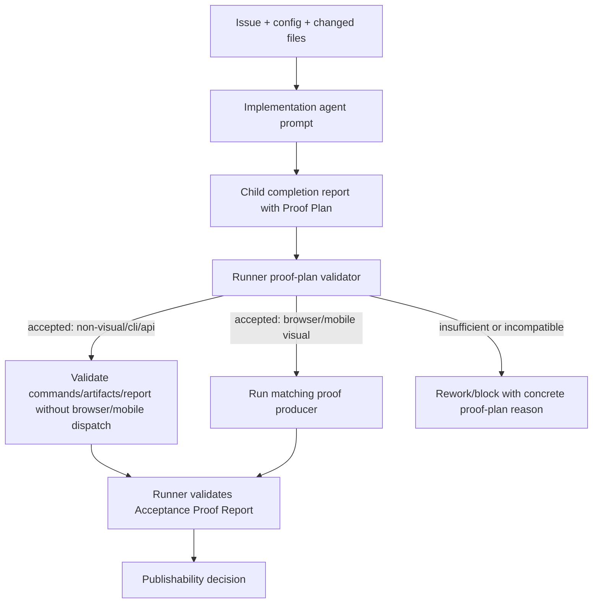

## 1. Executive Summary
- **Goal:** Stop routing non-visual work into browser/mobile proof by making the implementation agent declare the proof it needs, while the runner validates that declaration against issue intent, changed files, artifacts, and policy.
- **Scope:** In scope: the acceptance proof planning contract, prompt/report wiring, runner validation of the selected proof mode, command/adaptive proof selection, and regression tests for non-visual, CLI/API, browser visual, and mobile visual cases. Out of scope: changing GitHub publication authority, changing the Proof Report pass criteria, removing legacy `visualProof` compatibility, or adding a live smoke release run.
- **Chosen Option:** Option C, recommended and aligned with the user's direction: agent-authored `Proof Plan` plus runner-side validation. Option A is config cleanup only: remove broad triggers such as `acceptance`, `proof`, and `smoke`; it is fast but still leaves the runner guessing. Option B is deterministic runner routing only: centralize all path/text heuristics in one router; it improves locality but keeps brittle inference as the source of truth. Option C makes the agent state the intended proof mode and lets the runner accept, reject, or require stronger proof; it is the smallest durable change that removes the repeated non-visual-to-mobile failure mode.
- **Why This Approach:** The runner should own publication safety, not semantic guessing. A declared proof plan gives the runner an auditable contract to validate, and it lets the agent use task context that config regexes cannot safely infer.

## 2. Current Understanding
- **Confirmed:** `src/runner/proof-strategy.ts` only reads an explicit `Proof Strategy:` line or falls back to `reviewGates.acceptanceProof.proofStrategy`. `src/runner/acceptance-proof-loop.ts` currently plans a command proof when acceptance proof applies and `runnerValidationCommand` exists. The local config includes broad acceptance proof issue text triggers such as `acceptance`, `proof`, and `smoke`, and configures `codex-orchestrator visual-proof mobile --issue ${issueNumber}` as the acceptance proof runner command. `acceptanceProofApplies` can therefore select proof for generic issue template text before any agent-authored proof choice exists. ADR-0002 and `docs/deep-dive.md` already describe Acceptance Proof as runner-owned, adaptive, and valid for shell/browser/Android/smoke evidence; screenshots alone are not canonical proof.
- **Assumptions:** The child implementation report can be extended or complemented with a small proof-plan object without changing the final Proof Report schema. The runner can validate proof-plan compatibility from current inputs: issue title/body, changed files, config policy, implementation validation evidence, and produced proof artifacts. Existing adaptive proof and command proof paths can remain as proof producers after the plan is accepted.
- **Open Decisions:** None blocking for planning. Before implementation, confirm whether `Proof Plan` should be embedded in the existing child completion report or stored as a separate proof-owned JSON artifact; the recommended implementation starts embedded in the completion report to avoid another file contract.

## 3. Architectural Design
- **Component Flow:**

- **Simplest Viable Path:** Add one explicit proof-plan contract consumed by `planAcceptanceProofAttempt`. The plan should include `mode`, `reason`, `requiredArtifacts`, `validationCommands`, and optional `visualTarget`. Supported initial modes are `none`, `non-visual-smoke`, `cli`, `api`, `worker`, `browser-visual`, and `mobile-visual`; `visual` remains an issue/config strategy alias that the runner resolves to a concrete target before execution. The runner validates the mode against issue-level `Proof Strategy`, existing routing signals, and changed files, then only dispatches browser/mobile proof when the accepted mode requires it. For non-visual modes, the runner requires machine-readable proof artifacts or command evidence mapped into the existing Acceptance Proof Report instead of falling through to the configured mobile command.
- **Why Not Simpler:** Removing broad config patterns would fix this repository's current symptom but would not make future proof choices auditable. Hardcoding self-improvement or backend paths as non-visual would repeat the same inference problem with a larger exception list. A tiny proof-plan validator is justified because it replaces repeated implicit guessing across prompts, routing, and command selection with one explicit contract.
- **Architecture Lens:** Module: Acceptance Proof planning inside the runner. Interface: `ProofPlan` is the contract between the implementation agent and the runner; `AcceptanceProofReport` remains the proof evidence contract. Seam: this is not a new adapter framework; existing adaptive and command proof producers stay concrete. Deletion test: deleting the proof-plan validator would push proof-mode selection back into config regexes and command fallback logic. Depth improves because the runner exposes one validation decision instead of leaking trigger details into multiple callers; leverage is high because every issue class can declare proof intent; locality stays in `acceptance-proof-loop.ts` and report/prompt modules.
- **Clean Architecture Map:** Domain: proof modes, compatibility rules, artifact requirements, and pass/fail semantics. Application/Use Case: `planAcceptanceProofAttempt` validates the child proof plan and chooses non-visual validation, adaptive proof, command proof, rework, or block. Infrastructure: shell commands, browser/mobile proof runners, filesystem artifacts, and git diff capture remain existing adapters. Presentation: prompts and issue comments explain the selected proof plan and any rejection reason.
- **Reuse Strategy:** Reuse `resolveAcceptanceProofStrategy`, `decideProofRouting`, `runnerVisualProofPolicy`, existing acceptance proof report evaluation, existing proof artifact validation, and current prompt/report schemas where possible. Treat explicit issue-level `Proof Strategy` as an upper-bound contract: the agent may choose an equal or stronger concrete proof mode, but not a weaker one. Prefer extending the existing completion report parser over introducing a new standalone parser unless type boundaries become messy. Keep `reviewGates.acceptanceProof` canonical and `reviewGates.visualProof` as compatibility input only.
- **Rejected Paths:** Do not add more hardcoded path exceptions for self-improvement, backend, or local runner files. Do not let the implementation agent bypass proof by declaring `none` when issue/files require observable proof. Do not let runner command fallback override an accepted non-visual plan. Do not make browser/mobile proof optional for accepted visual/mobile plans. Do not introduce a generic plugin-like proof provider registry.

## 4. Constraints And Edge Cases
- **Data And Scale:** Inputs are small: issue text, changed-file paths, config arrays, validation command names, and artifact paths. Normalize paths once and keep validation set-based. No pagination, batching, or large artifact loading is needed.
- **Errors And Fallbacks:** Missing proof plan is allowed only for legacy completion reports that predate this contract, and should be recorded as a compatibility path with a policy warning. For prompts generated after this change, missing or invalid proof plan is a report-contract failure that produces rework or block evidence; it must not silently return to mobile command fallback. Invalid mode, missing reason, missing artifacts, or unsupported visual target should produce a runner rework request when implementation can fix the report, or a blocker when environment/tooling is unavailable. A non-visual plan for obvious UI/mobile changed files must be rejected unless the issue explicitly says proof is non-visual and the changed files are not user-facing. A visual/mobile plan with no provider capability should block or record a capability note according to current policy, not silently pass.
- **Concurrency And State:** The proof-plan validator must be pure and side-effect free. It must not run commands, mutate GitHub state, or inspect artifact contents. Proof execution remains bounded by the existing Acceptance Proof Loop and `maxIterations`; repeated invalid proof plans should consume the existing rework budget and preserve durable evidence.

## 5. Impacted Areas
- `src/runner/completion-report.ts`: extend the child completion report contract with an optional structured `proofPlan`, or add a narrow adjacent parser if embedding is too disruptive.
- `src/runner/prompt.ts` and workflow prompts under `.codex-orchestrator/prompts/workflows/`: require implementation agents to declare the proof plan and explain acceptable modes.
- `src/runner/acceptance-proof-loop.ts`: consume the proof plan in `planAcceptanceProofAttempt`, validate compatibility, and prevent accepted non-visual plans from falling through to browser/mobile command proof.
- `src/runner/review-gate-policy.ts`: keep policy/prompt helpers, but stop using generic issue text matches as the final command-dispatch source when a valid proof plan exists.
- `src/runner/visual-proof-runner.ts` and `src/runner/acceptance-proof-runner.ts`: remain proof producers; change only if they need to receive the accepted proof mode or include it in evidence.
- `.codex-orchestrator/config.json`: remove or narrow generic acceptance proof trigger patterns after the validator is in place, so config becomes guardrail rather than primary router.
- Tests: add focused coverage in `test/completion-report.test.ts`, `test/prompt-builder.test.ts`, `test/acceptance-proof-loop.test.ts`, `test/review-gates.test.ts`, and existing local-session tests when publishability behavior changes.

## 6. Execution Slices And Multi-Agent Model
- **Slices:** 
  1. Proof plan contract tracer bullet: add failing parser/schema tests for `proofPlan.mode`, `reason`, `validationCommands`, `requiredArtifacts`, and optional `visualTarget`; implement the minimum completion report support.
  2. Prompt/report wiring tracer bullet: update prompts so child agents must declare a proof plan; test prompt text and report validation for non-visual and visual examples.
  3. Runner validator tracer bullet: add a pure proof-plan validation function and tests for accepted non-visual CLI/API, rejected non-visual UI/mobile, accepted browser/mobile visual, invalid/missing plan compatibility, post-change missing-plan rework, issue `Proof Strategy` upper-bound enforcement, and explicit `none`.
  4. Acceptance loop integration tracer bullet: make `planAcceptanceProofAttempt` consume the accepted plan before command fallback; add regression coverage reproducing #1210-style non-visual self-improvement work so it does not run mobile proof.
  5. Policy cleanup tracer bullet: narrow generic config triggers and ensure `decideProofRouting`/legacy helpers are guardrails, not the final command source for valid proof plans.
  6. Final evidence tracer bullet: run focused tests, full tests, and inspect durable runner output formatting so blocked/rework comments name the rejected proof-plan reason.
- **Per-Slice Test/Proof:** Slice 1 uses completion report unit tests. Slice 2 uses prompt-builder tests and report validation tests. Slice 3 uses direct validator tests with table cases. Slice 4 uses `test/acceptance-proof-loop.test.ts` and at least one local-session regression if publication blocking behavior changes. Slice 5 uses review-gate tests to prove config no longer maps generic `Acceptance criteria` text to mobile proof by itself. Slice 6 uses `npm run typecheck`, `npm test`, and `git diff --check`. No UI proof target is required because this is runner infrastructure; live smoke is only needed if implementation changes live proof execution semantics.
- **Exit Gates:** Each behavior-changing slice starts with a failing test and ends with focused green tests. Final handoff requires full typecheck, full test suite, diff check, cleanup review, and final code-review pass. If the implementation changes CLI behavior, add a focused CLI smoke through the compiled `dist` tests.
- **Agent Matrix:**
  | Phase | Owner | Input | Output | Dependencies |
  | --- | --- | --- | --- | --- |
  | Contract | Implementation agent | Current completion report schema | Parsed `proofPlan` contract | None |
  | Prompt/report wiring | Implementation agent | Contract | Agents instructed to declare plan | Contract |
  | Validator | Implementation agent | Contract + existing routing signals | Pure compatibility decision | Contract |
  | Loop integration | Implementation agent | Validator + acceptance loop | Correct proof producer selection | Validator |
  | Policy cleanup | Implementation agent | Integrated loop | Config as guardrail | Loop integration |
  | Final proof | Implementation agent | Completed diff | Validated implementation | All prior phases |
- **Parallelization Limits:** Do not parallelize prompt/report contract changes with loop integration; the loop must consume the final contract shape. Do not run daemon/live issue automation against this change until local tests prove the proof-plan decision and the user explicitly approves rerunning live workflow.

## 7. Implementation Handoff Contract
- **approval_state:** ready-for-approval
- **approved_scope:** Introduce an agent-authored `Proof Plan` contract, validate it in the runner, integrate it into acceptance proof planning, and narrow config-based proof routing so non-visual tasks are not sent to mobile visual proof by generic issue text.
- **do_not_touch:** Do not read or edit `.env` or `.env.*`. Do not change package release metadata, GitHub workflow publication behavior, live smoke scripts, unrelated daemon state, or product-code proof report pass criteria unless a focused test proves the contract requires it.
- **architecture_rules:** Runner retains publication authority and validates proof. Agent declares proof intent but cannot force pass. `AcceptanceProofReport` remains the evidence contract; `ProofPlan` is the planning contract. `reviewGates.acceptanceProof` remains canonical; `reviewGates.visualProof` remains compatibility only. No command fallback may override an accepted non-visual proof plan.
- **rejected_paths:** No Redux-like centralized hardcoded routing table as the source of truth. No self-improvement-only exception. No broader regex list. No silent skip for visual work. No new proof provider registry. No agent-owned GitHub state mutation.
- **required_docs:** Update `docs/deep-dive.md` Acceptance Proof section after implementation to describe Proof Plan ownership, accepted modes, and runner validation. Add a short changelog note only if this ships in a release commit.
- **preconditions:** Node/npm dependencies available. Existing local tests pass before editing or known failures are documented. No live GitHub or device credentials are required for local implementation.
- **phase_boundaries:** Contract, prompt wiring, validator, loop integration, policy cleanup, final proof. Pause if implementation requires changing the public Proof Report JSON schema, deleting legacy `visualProof`, or running live smoke.
- **validation_gates:** Focused tests per slice, including a regression where generic `Acceptance criteria` text plus non-visual runner files cannot select mobile proof; final `npm run typecheck`; final `npm test`; final `git diff --check`; cleanup-review and code-review gates before commit. Optional daemon rerun for #1210 only after local proof-plan tests pass and the user approves live runner execution.
- **blocking_assumptions:** The existing completion report can carry a structured proof plan without breaking older readers. If not, store the proof plan as a separate runner-owned artifact and keep completion report compatibility intact.
