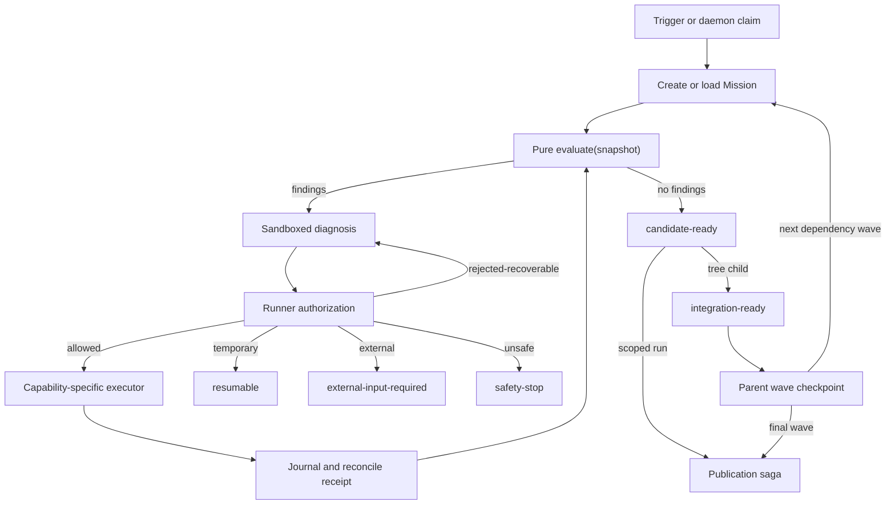

# 1. Executive Summary

Replace blocker-specific terminal branching with a Runner-owned **Resolution Mission**. The mission owns one invariant: continue until a locally reviewable candidate exists, execution is durably scheduled to continue, the user cancels, or a proven external/safety boundary is reached. The Agent chooses diagnoses and materially different recovery strategies; the Runner remains the sole authority for capabilities, scope grants, canonical writes, durable state, concurrency, integration, and publication.

This deliberately combines the strongest parts of both proposed directions:

- **Agent-led recovery:** the Agent may diagnose unknown local blockers, propose new strategies, request evidence-backed local scope expansion, and continue after an individual strategy stalls.
- **Runner safety kernel:** every read, command, write, scope expansion, state transition, Git mutation, integration step, and remote side effect is technically permitted, fenced, journaled, and reconciled by the Runner.

A mission never publishes directly. It returns `candidate-ready`, `external-input-required`, `safety-stop`, `resumable`, or `cancelled`. A scoped run atomically adapts `candidate-ready` into a durable publication saga. A tree child atomically adapts it into `integration-ready`; the parent durably integrates each dependency wave before creating the next wave and publishes once after final parent acceptance.

The product direction and Slice 1 execution contract are approved after eight independent architecture review passes. Later slices remain gated by their listed preconditions and phase validations.

# 2. Current Understanding

- `Agent Attempt` is bounded and delegates retry decisions to `rework-policy`; unknown blocker kinds currently become terminal.
- `runImplementationPublishabilityCheck` is mutating: it repairs reports, evidence, and proofs, runs checks, and may commit. It cannot be reused as a pure evaluator.
- `RunnerState v1` is strict and uses non-CAS load-modify-rename. It cannot safely become a concurrent mission ledger.
- `plan-auto` keeps graph progress, child results, and merge order on the command stack. It integrates each completed dependency wave before spawning dependent children.
- Current Git helpers may use `git add --all` and stateful merge operations, which are too broad for path-fenced recovery.
- Publication performs push, PR discovery/creation, labels, and comments as separate remote side effects without a durable phase journal.
- The command adapter currently gives the Codex process broad workspace-write/network authority, while configured checks are arbitrary shell commands with inherited environment.
- Existing typed repair covers known blocker classes, but generic recovery, safe local scope expansion, cross-crash resumability, and durable tree-parent recovery are absent.

The structural problem is therefore not one missing blocker branch. The Runner treats an exhausted local strategy as a task outcome. The target design instead treats it as evidence that the current strategy is exhausted while the mission remains alive.

# 3. Architectural Design

## 3.1 Authoritative atomic state and aggregate ownership

Introduce **Mission Store v1** as the sole authoritative store for runs created after Mission mode is enabled. New flows never write `RunnerState v1`; legacy recovery remains the sole owner of existing `RunnerState v1` records.

Mission Store contains four versioned aggregates:

1. **Mission** — issue/run/repository identity, state, revision, claim, findings, progress, permits, action journal, terminal evidence, and retention metadata.
2. **Plan Parent** — immutable graph, dependency waves, child Mission IDs, immutable integration descriptors, integration cursor, validation checkpoints, cancellation, and final publication link.
3. **Publication** — pinned candidate/base/config/validation identity and publication phases.
4. **Runtime Lease** — compatible daemon identity, remote fencing epoch, expiry, and ownership version.

Mission mode v1 deliberately uses one versioned state snapshot per target repository instead of a database or multi-file WAL. The snapshot contains all Mission, Plan Parent, Publication, reservation, scheduler-index, and tombstone records. This keeps cross-aggregate updates atomic and leaves no partially visible parent-child or publication handoff.

Every mutation follows one protocol:

1. Acquire the repository coordinator lock and load `mission-state-v1.json` with schema version, monotonically increasing generation, and whole-document checksum.
2. Verify the caller's expected generation and all affected aggregate revisions.
3. Run the pure reducer(s) in memory, update all linked aggregates and indexes together, increment generation, and serialize through canonical JSON encoding.
4. Write a same-directory temporary file, `fsync` the file, atomically rename it over the state file, and `fsync` the parent directory. The successful rename followed by directory `fsync` is the durability boundary; the mutation returns only afterward.
5. Release the lock. Readers use atomic rename semantics and accept only a complete schema-valid snapshot with a valid checksum, so they observe the complete old or complete new generation, never a partial cross-aggregate update.

Crash before rename leaves the previous generation authoritative and the temporary file removable. Crash after rename is reconciled as the new generation when its checksum is valid; if the platform cannot guarantee same-filesystem atomic rename plus directory `fsync`, Mission mode fails its startup capability probe. External/Git side effects are always preceded by a durable intent state and followed by a durable observed receipt, so either snapshot generation can deterministically reconcile the remote/ref postcondition.

The snapshot indexes `nextEligibleAt` and terminal retention directly. A configured hard size limit stops new Mission claims with an operator diagnostic before write amplification becomes unsafe; v1 targets 10,000 compact terminal tombstones, not 10,000 full retained transcripts. Large receipts/quarantines remain immutable content-addressed files referenced by checksum and are created before the snapshot starts referencing them. Retention removes a blob only after a later snapshot no longer references it.

Activation inputs are exact. Config adds optional `runner.resolutionMission` with schema `{ mode: 'off' | 'shadow' | 'enabled'; markerLabel: string }`; setup defaults to `{ mode: 'off', markerLabel: 'agent:mission' }`. The state path is fixed at `<runner.stateDir>/mission-state-v1.json` and is not separately configurable.

The immutable remote marker is the configured marker label plus exactly one issue comment whose first line is canonical JSON inside `<!-- codex-orchestrator:mission:v1 ... -->` with schema `{ missionId, issueNumber, repository, deploymentId }`. The marker never carries mutable generation. A valid marker requires label, comment, local Mission ID, issue, repository, and current runtime owner to agree.

Activation routing is exact:

- `off`: legacy flow only; marker-labeled issues are ineligible to the legacy fence release.
- `shadow`: legacy flow remains authoritative; Mission evaluation/state may be recorded under a shadow ID but performs no Agent action, Git mutation, label/comment change, or publication and never writes `RunnerState v1`.
- `enabled` plus valid marker: Mission State Store only.
- Existing `RunnerState v1` without marker: legacy drain only, even after config enables Mission mode.
- Conflict means any issue has both a legacy run and Mission marker, more than one Mission marker comment, marker/local Mission ID mismatch, repository/issue/deployment mismatch, or marker label with a contradictory comment. Conflict is `safety-stop`; missing comment immediately after a lost claim response is `resumable` and is reconciled by marker lookup before conflict classification.

The config loader refuses `enabled` before the Slice 6 activation capability/version is present. This prevents early slices from guessing how `promotion-requested` should behave and prevents dual-write rollout.

## 3.2 Exhaustive Mission transition algebra

Only the Runner may transition state, always through one atomic snapshot mutation with expected generation and aggregate revision. Agent output is untrusted proposal data.

| Current state | Accepted event and guard | Next state | Resume/recovery rule |
|---|---|---|---|
| `created` | `claim-requested` | `claiming` | Same deterministic claim ID |
| `claiming` | matching remote claim observed | `evaluating` | Lost response is re-read, not recreated |
| `claiming` | transient remote failure | `resumable` | `resumeTarget=claiming` |
| `evaluating` | blocking disposition `diagnose` or enabled `scope-expansion` | `diagnosing` | Snapshot identity and residual warnings are pinned |
| `evaluating` | blocking disposition `external-input` / `safety-stop` | matching terminal state | Link exact Finding evidence |
| `evaluating` | blocking disposition `none` | `candidate-ready` | Candidate identity and residual warnings are pinned |
| `diagnosing` | valid structured proposal | `authorizing` | Invalid output is recoverable diagnosis failure |
| `diagnosing` | invalid structured output | `diagnosing` | Record failed diagnosis attempt; retry with corrected schema until strategy policy backs off |
| `diagnosing` | transient model transport failure | `resumable` | `resumeTarget=diagnosing`; reuse diagnosis action key |
| `authorizing` | `allowed(capabilityPermit)` | `executing` | Permit pins capability, input snapshot, maximum finite scope, action key, and fencing epoch; it does not pin unknown output |
| `authorizing` | `rejected-recoverable` | `diagnosing` | Record denial and alternatives; strategy not terminal |
| `authorizing` | temporary precondition | `resumable` | `resumeTarget=authorizing` |
| `authorizing` | proven external boundary | `external-input-required` | Exact resume predicate required |
| `authorizing` | deny/isolation/state violation | `safety-stop` | Exact violated invariant required |
| `executing` | raw patch receipt | `auditing` | Capability permit is consumed; quarantine remains immutable |
| `executing` | read-only observation receipt | `reconciling` | Check declared postcondition; observation executors have no write mounts |
| `executing` | deterministic executor failure | `diagnosing` | Record completed failed strategy and alternatives |
| `executing` | transient before deterministic completion | `resumable` | `resumeTarget=authorizing`; revoke permit, reuse action key, no strategy penalty |
| `auditing` | patch rejected as recoverable | `diagnosing` | Record exact audit denial; quarantine is discarded |
| `auditing` | patch violates hard deny/isolation invariant | `safety-stop` | Preserve audit evidence; do not apply |
| `auditing` | patch accepted and concrete manifest computed | `apply-authorizing` | Pre/post hashes, modes, patch hash, and exact paths now exist |
| `apply-authorizing` | `allowed(applyPermit)` | `apply-prepared` | Apply permit pins concrete manifest, target ref, expected old/new tree, action key, and current fencing epoch |
| `apply-authorizing` | recoverable overlap/stale base | `diagnosing` | Request a new strategy or fresh patch |
| `apply-authorizing` | transient coordinator condition | `resumable` | `resumeTarget=apply-authorizing`; old permit is revoked and must be reissued |
| `apply-prepared` | lock, apply permit, epoch, hashes valid | `applying` | State and apply-intent persist in one atomic snapshot mutation |
| `apply-prepared` | permit expired/revoked or epoch changed, target ref still old | `apply-authorizing` | Re-audit pinned receipt and request a fresh apply permit |
| `apply-prepared` | target ref already at expected new identity | `reconciling` | Recover applied receipt without another ref write |
| `apply-prepared` | target ref at third identity | `safety-stop` | Preserve contradictory ref evidence |
| `applying` | expected post-tree/ref observed | `reconciling` | Write applied/recovered receipt |
| `applying` | old pre-tree/ref observed after restart | `apply-authorizing` | Ref write did not happen; reissue permit for the same audited receipt |
| `applying` | third state or conflicting ref | `safety-stop` | Never infer success |
| `reconciling` | postcondition satisfied | `evaluating` | New immutable snapshot |
| `reconciling` | transient observation failure | `resumable` | `resumeTarget=reconciling`; same action key and read-only postcondition query |
| `candidate-ready` | scoped adapter transaction | `publication-prepared` | Publication aggregate created atomically |
| `candidate-ready` | tree-child adapter transaction | `integration-ready` | Parent link/index updated atomically |
| `publication-prepared` | publication is `review-ready` | `completed` | Draft PR/labels/comment receipt linked |
| `publication-prepared` | publication is resumable | `resumable` | `resumeTarget=publication-prepared`; resume the same immutable publication attempt |
| `publication-prepared` | publication external/safety/cancelled | matching `external-input-required` / `safety-stop` / `cancelled` | Link exact Publication evidence atomically |
| `resumable` | eligible claim | exact recorded safe `resumeTarget` | Allowed targets are `claiming`, `diagnosing`, `authorizing`, `apply-authorizing`, `reconciling`, or `publication-prepared`; all old permits remain revoked |
| any nonterminal | user cancel intent | `cancelling` | Revoke permits, kill process groups, reconcile apply |
| `cancelling` | no live side effect remains | `cancelled` | Release leases/reservations |
| `integration-ready` | parent accepts descriptor | `completed` | Parent owns further integration |

All other state/event pairs are rejected without mutation. `external-input-required`, `safety-stop`, `cancelled`, and `completed` are terminal. The resume predicate attached to a terminal external outcome is an instruction for creating a new deterministic Mission attempt after the external condition changes; it is not a transition out of the terminal aggregate. Model-based tests enumerate every state/event pair, every resume target, stale revision, cancellation race, and restart from every in-progress state.

Authorization is intentionally two-stage. A `capabilityPermit` authorizes either a strictly read-only observation executor or a sandboxed patch-producing executor and its maximum inputs/scope. No executor with a write mount may use the observation path. After patch execution, the Runner audits the immutable result and may issue a separate `applyPermit` that pins the concrete patch, path/mode/content manifest, pre/post hashes, target ref, and expected tree. Epoch change, expiry, cancellation, or explicit revocation invalidates either permit. A resumed Mission never carries a permit across epochs; it follows the exact safe resume mapping in the table and reuses an idempotency key only after current-state checks.

CLI outcomes are typed: success, retryable/resumable with Mission ID and `nextEligibleAt`, external input, safety stop, and cancelled. A resumable one-shot result never adds a blocked label. The daemon claims eligible missions by expected snapshot generation/revision and also resumes running Plan Parent aggregates.

## 3.3 Remote singleton and cross-host claim fencing

Mission mode v1 supports exactly one configured daemon deployment per repository; active-active or unattended cross-host failover is out of scope. Exclusivity is represented by a **remote runtime-owner Git ref** updated with compare-and-swap (`force-with-lease` against the exact previously fetched SHA). The owner commit contains repository identity, deployment ID, compatibility epoch, GitHub App installation ID, credential-generation fingerprint, deployment-record hash, and monotonically increasing fencing epoch. It has no client-authored automatic-expiry semantics.

Automatic takeover is forbidden because GitHub issue/PR/comment/label APIs cannot reject a stale client fencing epoch. Transfer is operator-mediated. `.codex-orchestrator/mission-deployment.json` is canonical JSON with this exact non-secret schema: `version: 1`, `repository`, `deploymentId`, `hostId`, `serviceId`, `githubAppInstallationId`, `credentialGeneration`, `compatibilityEpoch`, `priorCredentialRevokedAt`, `priorTokenExpiresAt`, `takeoverGraceUntil`, `takeoverNotBefore`, and `approvedByCommit`. The trust anchor is the exact `approvedByCommit` on the protected default branch; no separate ad-hoc signature is claimed.

`takeoverNotBefore = max(priorTokenExpiresAt, takeoverGraceUntil)`. To transfer ownership, the operator stops the old service, revokes/rotates its dedicated GitHub App credential, records the revocation receipt time and final token expiry in the protected-branch deployment record, waits until GitHub server time is at or after `takeoverNotBefore`, then compare-and-swap replaces the runtime-owner ref. Missing evidence, clock uncertainty, or a still-live prior credential is `external-input-required`; it never triggers automatic takeover.

Before every GitHub mutation, the Runner freshly fetches the owner ref and protected deployment record, verifies owner, epoch, credential identity, record hash, and approval commit, and includes the epoch/Mission marker in mutation content. A mismatch stops before the API call. There is no claim that labels or comments themselves provide CAS; safety relies on the single supported deployment plus credential revocation before transfer.

Issue labels/comments remain user-facing mirrors, not locks. Mission creation first reserves deterministic local identity in the atomic snapshot, then claims the issue using the current remote fencing epoch and stable marker. Lost responses are reconciled by pagination and marker lookup.

Rollout has a hard compatibility gate:

1. Ship a legacy-fence release that recognizes issues carrying the configured Mission marker label as ineligible and understands the remote runtime-owner ref, while Mission creation remains disabled.
2. Stop and inventory every older daemon deployment. Mission activation refuses to start until the protected-branch deployment record identifies the sole host/service, dedicated GitHub App installation/credential generation, compatibility epoch, and approval commit and confirms no pre-fence daemon remains.
3. Enable Mission creation only after the fence release owns the remote runtime-owner ref.
4. Rollback disables new Mission claims; a compatible daemon drains existing missions. Pre-fence binaries are never supported concurrently with Mission mode.

Tests cover two hosts racing for initial ownership, forbidden automatic takeover, exact canonical deployment-record validation, `takeoverNotBefore` calculation, operator transfer only after credential rotation/token expiry/grace, stale-owner GitHub mutation attempts, unexpected remote ref movement, old/new daemon matrices, and two daemons selecting the same issue before claim.

## 3.4 Pure evaluation and the safe-executor trust boundary

Extract `evaluate(snapshot) -> EvaluationResult` from mutating publishability logic. It performs no commands, writes, commits, repair, GitHub calls, or network access.

Slice 1 exposes two pure seams: `normalizeLegacyPublishability(input) -> EvaluationSnapshot` and `evaluate(snapshot) -> EvaluationResult`. Neither seam reads Git or the filesystem.

`EvaluationSnapshot` is one versioned normalized contract:

- `version: 1`, `issueNumber`, `baseSha`, `configHash`;
- `candidateIdentity`, exactly one of:
  - `{ kind: 'git-tree'; headSha; treeSha; changedFiles }` when an immutable candidate tree is already known;
  - `{ kind: 'worktree'; headSha; changeSetHash; changedFiles }` when the caller has observed canonical binary diff/content hashes without creating a commit;
  - `{ kind: 'legacy-unobserved'; headSha; reason: 'promotion-before-change-set' | 'blocked-before-change-set' }` when the legacy path returned before candidate observation;
- normalized completion-report status and evidence references;
- existing typed `RunnerBlocker[]` from publishability/proof/safety normalization;
- normalized `warnings[]` for residual risks and configured-check failures that current policy intentionally permits;
- optional existing `promotionRequest` with report evidence and requested ownership.

`changedFiles` exists only on observed candidate identities; an unobserved identity is not treated as an empty change set. Slice 1 never creates a Git object or commit to fill this field. The caller may later replace `legacy-unobserved` with a worktree/tree identity through a new snapshot generation after an explicit observation action.

Legacy normalization is total:

| Legacy result | Snapshot mapping |
|---|---|
| `publish-ready` | observed candidate identity supplied by caller; `blockers=[]`; `residualRisks` and policy-permitted failed configured checks become warnings |
| `blocked` | candidate identity is observed when caller supplies it, otherwise `legacy-unobserved`; infer blockers for **every** reason with existing `blockersFromReasons`, then union typed and inferred blockers by `(key, normalizedReason, source)` |
| `promotion-requested` | `legacy-unobserved` is allowed; map report status to one `promotionRequest` and later one `scope-expansion` Finding; preserve report residual risks as warnings |

Typed blockers are authoritative additions but never suppress inference for uncovered/partially typed reasons. Exact duplicate typed/inferred blockers collapse by the union key. If one reason yields several current regex keys, all remain and Finding precedence selects the strongest disposition. This preserves current `blockersFromReasons` behavior while making partial blocker arrays safe.

`Finding` reuses `RunnerBlocker` keys/sources instead of creating a competing blocker taxonomy. It adds only `id`, `disposition`, and `evidenceRefs`. `disposition` is exactly:

- `residual-warning` — visible evidence that does not prevent `candidate-ready`;
- `diagnose` — local/recoverable blocker, including `unknown`, malformed/missing reports, failed checks when they are actually blocking, proof failures, and exhausted legacy strategy;
- `scope-expansion` — existing `promotion-requested`; handled as `diagnose` once safe expansion is enabled;
- `external-input` — a specifically unavailable required authority/artifact/credential, such as required design access;
- `safety-stop` — denied path, Agent publication violation, destructive/production action, secret boundary, or corrupted/contradictory state.

Precedence for the same evidence is `safety-stop > external-input > scope-expansion > diagnose > residual-warning`. `EvaluationResult` returns sorted `findings`, plus derived `blockingDisposition: safety-stop | external-input | diagnose | none`. The Mission reducer transitions to `diagnosing` only for `diagnose` or enabled `scope-expansion`, directly to the matching terminal state for safety/external, and to `candidate-ready` when only residual warnings remain. Existing publish-ready configured-check warnings remain warnings exactly as current tests require.

Persistent identity is byte-stable:

1. `normalizedReason = NFC(reason)`, convert CRLF/CR to LF, trim each line, collapse each run of spaces/tabs inside a line to one ASCII space, remove leading/trailing empty lines, then join with LF.
2. Sort and deduplicate evidence references by JavaScript code-unit ascending order.
3. Canonically encode `{ version: 1, source, key, normalizedReason, evidenceRefs }` as UTF-8 JSON with object keys in the exact order shown and no insignificant whitespace.
4. `id = 'finding:v1:' + lowercaseHex(SHA-256(canonicalBytes))`.
5. Sort Findings by disposition rank (`safety-stop`, `external-input`, `scope-expansion`, `diagnose`, `residual-warning`), then `source`, `key`, and `id`, all code-unit ascending.
6. If one evaluation produces the same ID for different canonical bytes, return a synthetic `safety-stop` Finding `finding-id-collision` and preserve both payloads as evidence; never collapse them.

Golden vectors lock reason normalization, canonical bytes, SHA-256 IDs, deduplication, precedence, and sorting across runtime versions.

Slice 1 defines/tests the pure contracts and accepts `off|shadow` config, but does not wire them into `run`, labels, GitHub, state persistence, CLI exit codes, or current publication. Runtime shadow comparison begins only after Slice 2 provides the atomic store; legacy output remains authoritative. `enabled` routing cannot be configured until the Slice 6 compatibility gate proves scope-expansion behavior. Typed Mission CLI outcomes are defined in Slice 1 as internal types, while actual exit-code wiring is Slice 7.

Separate the trusted model transport from untrusted Agent tools:

- A minimal **model transport broker** owns `CODEX_HOME` and model credentials, has network access only to configured model endpoints, and does not mount the repository or expose credentials to prompts/tools.
- Diagnosis and patch tool calls execute through a Runner tool broker in a credential-free sandbox. The diagnosis repository mount is read-only with separate scratch; the patch executor receives a fresh quarantine from the pinned tree. Both deny network and inherit sandboxing into descendants.
- Repository checks, proof tooling, and generators run through the same sandbox substrate with explicit read/write mounts, credential set, network allowlist, timeout, and process-group/cgroup ownership. They do not inherit the Runner or model-broker environment.

The platform adapter performs a fail-closed capability probe for read-only mounts, write isolation, network denial, environment stripping, descendant containment, process-group termination, and escaped/daemonized child detection. Until the brokered mode exists and passes, Mission Agent execution is unavailable; the current broad `codex exec` adapter cannot be treated as safe.

Patch audit rejects traversal, absolute paths, symlink/hard-link escapes, submodules/gitlinks, case-fold collisions, device/FIFO/socket nodes, unauthorized mode changes, `.git` paths/config/hooks, generated/vendor/secret paths, and process artifacts. Credential-canary, network-exfiltration, fork/daemon escape, and process-group escape tests are mandatory.

Runner-owned executors use argv arrays without a shell, executable/argument allowlists, sanitized explicit environment, declared read/write paths, declared network mode, idempotency class, timeout, and reconciliation handler. Existing arbitrary shell checks are classified at config load:

- Convertible: normalized into a safe executor.
- Explicit trusted legacy command: allowed only in legacy mode and cannot satisfy Mission completion.
- Unconvertible in Mission mode: `external-input-required` with exact migration instruction.

## 3.5 Machine-checkable local scope expansion

An Agent proposal must name normalized repository identity, exact paths or finite bounded globs, Finding/acceptance evidence IDs, and one Runner-verifiable relationship:

- `imports` / `imported-by` from the pinned dependency graph;
- `test-for` / `implementation-for` from configured mappings;
- `config-consumer` from a Runner-known reference;
- `generated-from` only for an allowlisted deterministic generator;
- `acceptance-artifact-owner` from explicit proof/check/report schema ownership.

The Runner resolves real paths and case, expands globs to a finite set, verifies evidence against the pinned tree, and applies deny precedence. Secret, `.git`, external-repository, destructive, release, merge, production, and arbitrary credentialed-network boundaries cannot expand.

Reservations belong to Mission ID plus fencing epoch and have `expiresAt`/`renewableAt`. They are released on resumable. Only a Plan Parent may retain an immutable integration reservation; it contains exact paths and immutable commit/tree, expires under parent policy, and is renewed by the parent claim. Expiry cleanup and reacquisition happen under the coordinator lock and re-run overlap and fingerprint checks.

## 3.6 Canonical Git transaction

Mission mode never uses `git add --all`, a shared mutable index, or stateful `git merge` in the canonical worktree.

For an Agent patch:

1. A `capabilityPermit` authorizes creation of a patch only inside a finite maximum scope against a pinned base commit/tree.
2. The quarantine executor returns an immutable raw receipt. Runner audit computes exact paths, modes, path-scoped pre/post hashes, patch hash, and expected resulting tree.
3. A distinct `applyPermit` authorizes that concrete audited manifest, target ref, expected old ref SHA, expected new tree, action key, and fencing epoch.
4. Runner applies the audited patch in a Runner-owned temporary worktree with an isolated index and no unrelated files.
5. Build the candidate tree/commit with plumbing commands, then prove `git diff-tree` from the pinned base equals the apply-permitted path/mode/content manifest exactly.
6. Record apply-intent in the atomic state snapshot.
7. While holding the coordinator lock and valid remote/local fencing epoch, update the target ref with expected-old-SHA semantics (`git update-ref <ref> <new> <old>`), then atomically persist the applied receipt before release.

Parent integration uses one primitive: tree-level three-way integration (`git merge-tree --write-tree` or a tested equivalent) from pinned parent/child commits, followed by `git commit-tree` and expected-old-SHA `update-ref`. It creates no `MERGE_HEAD` and does not mutate a shared index. Conflicts become a new Mission finding rather than half-completed merge state.

Crash reconciliation compares the target ref plus authorized tree paths:

- ref/tree at old identity: not applied; replay the same idempotency key;
- ref/tree at expected new identity: applied; recover receipt;
- any other ref or authorized-path identity: `safety-stop`.

Tests inject failure around temporary index creation, patch application, tree write, commit creation, durable apply-intent, ref update, receipt, ownership loss during apply, stale revisions, boot nonce/PID reuse, and filesystem `fsync`/rename failure. Unrelated staged/generated files must never enter the candidate commit.

## 3.7 Progress, stagnation, and resumability

Progress vector includes Finding IDs/severity, acceptance coverage, pinned tree/diff hash, validation receipt IDs, exact scope, and strategy fingerprint.

Strategy suppression applies only after an action reached deterministic completion, its postcondition was observed, and subsequent evaluation left the relevant vector unchanged. A transient failure before start, lost receipt, partial idempotent action, or postcondition-refetch failure reuses the same action/idempotency key without consuming strategy budget. Per-strategy exhaustion emits `strategy-stagnated` and forces fresh diagnosis, a materially different strategy, or resumable backoff; it never becomes user-blocked.

`resumable` records `nextEligibleAt`, reason, resume target, action key, and required predicate; revokes active permits/processes; releases Mission leases; and keeps only parent-owned immutable integration reservations. Indexed scheduling supports at least 10,000 retained terminal missions and 100 concurrently eligible missions without full-directory scans.

## 3.8 Durable Plan Parent and dependency waves

The Plan Parent aggregate is created before any child and pins graph nodes/edges, config hash, base SHA, and deterministic wave order. It stores current wave, child Mission IDs/states, label transitions, immutable child descriptors, integration cursor, and cancellation.

Parent integration progress is persisted in the atomic snapshot:

`wave-prepared -> child-N-tree-built -> child-N-ref-applied -> wave-validated -> checkpoint-committed -> next-wave-created`

The Plan Parent has its own exhaustive reducer:

| Parent state | Event and guard | Next state | Required durable effect |
|---|---|---|---|
| `created` | first wave transaction committed | `wave-running` | Deterministic child IDs linked atomically |
| `wave-running` | every child `integration-ready` | `wave-prepared` | Pin all descriptors and integration order |
| `wave-running` | any child resumable/reservation expired | `wave-waiting` | Record resume predicate; reacquire and revalidate before continuing |
| `wave-running` | child explicitly cancelled | `cancelling` | Propagate explicit cancellation to the parent tree |
| `wave-running` | child external/safety terminal | matching `external-input-required` / `safety-stop` | Preserve completed sibling descriptors |
| `wave-waiting` | all predicates eligible and reservations reacquired | `wave-running` | Revalidate every descriptor against checkpoint |
| `wave-waiting` | recorded resume target becomes eligible | exact recorded active state | Reacquire reservation and reconcile that state's persisted intent before work |
| `wave-waiting` | child/recovery Mission cancelled | `cancelling` | Propagate explicit cancellation |
| `wave-waiting` | child/recovery Mission external/safety | matching terminal state | Link exact terminal evidence |
| `wave-prepared` | next child tree built without conflict | `integrating` | Journal expected old/new tree and child cursor |
| `wave-prepared` / `integrating` | reservation expiry or transient tree/ref failure | `wave-waiting` | Record exact prior state/cursor/action key; old permit is revoked |
| `wave-prepared` / `integrating` | child cancellation | `cancelling` | Reconcile any old/new ref identity, then propagate cancellation |
| `wave-prepared` / `integrating` | deterministic tree conflict | `recovery-waiting` | Atomically create/link `integration(parent,wave,child,checkpoint,currentIntegratedTree,cursor,childCommit)` Mission |
| `integrating` | child ref transaction reconciled | `wave-prepared` or `wave-validating` | Advance deterministic child cursor exactly once |
| `recovery-waiting` | recovery Mission `integration-ready` | `wave-prepared` | Replace conflicting descriptor with pinned recovery descriptor |
| `recovery-waiting` | recovery Mission resumable | `wave-waiting` | `resumeTarget=recovery-waiting`; preserve deterministic recovery ID |
| `recovery-waiting` | recovery Mission external | `external-input-required` | Link exact external evidence |
| `recovery-waiting` | recovery Mission safety | `safety-stop` | Link exact safety evidence |
| `recovery-waiting` | recovery Mission cancelled | `cancelling` | Propagate explicit cancellation |
| `wave-validating` | validation passes | `checkpointing` | Pin validation receipts |
| `wave-validating` | deterministic validation failure | `recovery-waiting` | Atomically create/link `validation(parent,wave,candidateTree,configHash)` Mission |
| `wave-validating` | transient validator failure or reservation expiry | `wave-waiting` | `resumeTarget=wave-validating`; reuse action key without strategy penalty |
| `wave-validating` | child/parent cancellation | `cancelling` | Stop validator process and preserve receipts |
| `checkpointing` | expected-old-SHA checkpoint ref updated | `next-wave` or `final-validating` | Pin immutable checkpoint commit/tree |
| `checkpointing` | transient ref failure or reservation expiry | `wave-waiting` | `resumeTarget=checkpointing`; reconcile exact old/new checkpoint ref |
| `checkpointing` | cancellation | `cancelling` | Reconcile old/new checkpoint ref before stop |
| `next-wave` | child-link transaction committed | `wave-running` | Next-wave children branch from checkpoint |
| `next-wave` | transient state failure or reservation expiry | `wave-waiting` | `resumeTarget=next-wave`; deterministic child IDs prevent duplication |
| `next-wave` | cancellation | `cancelling` | Reconcile child-link generation, then revoke created children |
| `final-validating` | final acceptance passes | `publication-prepared` | Create Publication aggregate atomically |
| `final-validating` | deterministic failure | `recovery-waiting` | Create `validation(parent,final,candidateTree,configHash)` Mission |
| `final-validating` | transient failure or reservation expiry | `wave-waiting` | `resumeTarget=final-validating`; reuse validation key |
| `final-validating` | cancellation | `cancelling` | Stop validator and preserve receipts |
| any nonterminal | parent/user cancel intent | `cancelling` | Finish reconciliation of an in-flight atomic ref transaction, revoke children, then stop |
| `cancelling` | no child/process/apply remains live | `cancelled` | Release reservations; preserve state history |
| `publication-prepared` | Publication `review-ready` | `completed` | Link draft PR/label/comment receipt |
| `publication-prepared` | Publication resumable | `wave-waiting` | `resumeTarget=publication-prepared`; preserve publication attempt |
| `publication-prepared` | Publication external/safety/cancelled | matching terminal state | Link exact Publication evidence |

All unlisted state/event pairs are rejected. A cancellation cannot interrupt the middle of one atomic ref update; it records intent, reconciles old/new ref identity, then cancels. Deterministic integration-recovery Mission IDs include the checkpoint, current partially integrated tree, completed-child cursor, conflicting child commit, and config hash, so replay cannot create duplicates or attach a recovery result to another intermediate tree.

Every child branches from the immutable checkpoint commit of its wave. `integration-ready` is bound to child commit SHA, tree hash, base checkpoint SHA, config hash, executor version, exact changed paths, validation receipts, and reservation. Completed sibling descriptors survive when another child is resumable.

When all children in a wave are ready, the parent acquires the exclusive integration reservation, applies children serially through the tree-level Git transaction, validates the wave, and creates a non-published immutable checkpoint. Only then does one atomic snapshot mutation create/link deterministic child IDs for the next wave. Recovery can neither orphan nor duplicate children because IDs and parent links change in the same state generation.

Tests prove later-wave children observe earlier-wave output and inject crashes after every child tree/ref step, validation, checkpoint, child linkage, label transition, cancellation, and terminal transition. Only the final checkpoint runs parent acceptance and enters one publication saga; children and intermediate checkpoints are never independently review-ready or published.

## 3.9 Publication saga and exact remote reconciliation

Publication completion preserves the current product contract: success means one open draft PR is ready for human review with expected labels and one terminal comment. Merge observation and worktree cleanup happen later in the existing cleanup flow and are not Mission states.

Each immutable attempt ID is `publication(ownerId,candidateCommit,baseSha,configHash)`. `prepared` pins that ID, candidate commit/tree, validation snapshot/receipts, branch, PR base name, stable marker, expected title/body hashes, requested draft state, Runner-managed labels, comment hash, and remote preconditions. A changed candidate creates a different attempt and branch; an attempt never silently retargets another candidate.

Publication uses this exhaustive reducer:

| Publication state | Event and guard | Next state |
|---|---|---|
| `prepared` | remote branch absent | `push-intent` |
| `prepared` / `push-intent` | remote branch at pinned candidate | `pushed` |
| `prepared` / `push-intent` | remote branch at another SHA | `safety-stop` |
| `pushed` | zero marker-matching PRs | `pr-create-intent` |
| `pushed` / `pr-create-intent` | exactly one expected open draft | `pr-confirmed` |
| `pushed` / `pr-create-intent` | more than one marker PR or conflicting immutable PR identity | `safety-stop` |
| `pushed` / `pr-create-intent` | one maintainer-modified/closed/non-draft PR | `external-input-required` |
| `pr-confirmed` | Runner-managed labels differ | `labels-intent` |
| `pr-confirmed` / `labels-intent` | managed label projection matches | `labels-confirmed` |
| `labels-confirmed` | terminal comment missing | `comment-intent` |
| `labels-confirmed` / `comment-intent` | exactly one marker+hash comment | `review-ready` |
| `labels-confirmed` / `comment-intent` | duplicate exact comments or marker with other hash | `external-input-required` |
| any active intent/phase | transient API or eventual-consistency failure | `resumable` with exact prior phase and idempotency key |
| any active intent/phase | permanent `401`/`403`, revoked credential, or authenticated capability check proves missing authority | `external-input-required` with required credential/permission and resume predicate |
| `resumable` | eligible claim | exact recorded prior phase | Re-read remote postcondition before any write |
| any nonterminal | explicit cancellation | `cancelled` | Existing remote effects are reported, not rolled back |

Event precedence is deterministic: conflicting immutable identity (`safety-stop`) wins over maintainer-owned mutable mismatch (`external-input-required`), which wins over an exact observed postcondition, which wins over transient absence/eventual consistency. Every external write is preceded by a durable `*-intent` snapshot and followed by observation; a lost response re-enters the intent phase and re-reads before retry.

Remote decision rules are exact:

- Branch absent permits one push from `push-intent`; branch at pinned candidate reconciles success; another SHA is always `safety-stop`. Mission mode never force-pushes.
- Advancement of the PR base branch after the candidate validation snapshot is recorded as a residual-risk warning, not a blocker. The draft PR is the human-review boundary, and the runner does not claim merge readiness or auto-merge.
- PR lookup paginates all states and keys by Mission marker plus immutable node ID after creation. Zero creates once through `pr-create-intent`; one exact open draft reuses; more than one marker PR is always `safety-stop`.
- Manual title/body edits, non-draft conversion, closed PR, or another node ID with provable maintainer history is `external-input-required`; ambiguous/reused marker identity is `safety-stop`.
- Labels modify only the configured Runner-managed namespace and preserve unrelated human labels. Partial/lost mutations are refetched before another change.
- Comments are fully paginated. Missing creates once through `comment-intent`; one exact marker+hash reuses; duplicates or conflicting content are `external-input-required`. The Runner never deletes comments automatically.
- `review-ready` is terminal success for Publication. Merge commit, squash, and rebase outcomes are intentionally outside the Publication reducer.

Scoped and Plan Parent publication use this same reducer. Their owning aggregate maps Publication `review-ready`, `resumable`, `external-input-required`, `safety-stop`, and `cancelled` exactly as declared in its own reducer. Failure injection covers every intent/request/observation boundary, eventual consistency, base advancement warning, manual PR edits, unrelated labels, deletion/recreation, duplicates, and lost responses, proving one draft PR and one terminal comment.

# 4. Constraints and Failure Semantics

- The Runner is the only transition and side-effect authority. Agent output never grants itself scope or executes directly.
- Automatic recovery is limited to the normalized current repository and machine-verifiable acceptance relationships.
- Any capability that cannot be technically enforced fails closed.
- `external-input-required` must name unavailable authority, artifact, credential, or external state; show attempted safe alternatives; and specify the exact resume condition.
- `safety-stop` requires a deny violation, isolation failure, secret/destructive boundary, schema/state corruption, conflicting ownership, or irreconcilable Git/remote state.
- Internal unknowns, stale evidence, failed checks, missing generated reports, transient infrastructure failures, and exhausted strategies are not external blockers.
- Explicit user cancellation is `cancelled`, not blocked.
- Agent permits never include publication, merge, release, production, destructive, secret, or arbitrary credentialed-network actions.
- Mission mode requires the compatible remote runtime-owner record. Active-active multi-host execution and unattended takeover are unsupported and refused.
- Receipts, descriptors, and validation are bound to immutable commit SHA, tree hash, base SHA, config hash, executor version, and idempotency key.
- Completed payloads and quarantines have bounded retention; minimal Mission/marker tombstones outlive publication idempotency requirements.

# 5. Impacted Areas

- `src/runner/agent-attempt.ts`, `rework-policy.ts`: delegate blocker handling to Mission while preserving legacy adapters.
- Publishability/report/evidence/proof modules: separate pure snapshots/Findings from explicit mutating actions.
- New atomic Mission State Store, scheduler indexes, Mission engine, coordinator, Runtime Owner, Plan Parent, Publication aggregate, and action receipts.
- `src/codex/command-adapter.ts` and process execution: model transport broker, sandboxed tool broker, capability probe, no-shell executors, process containment.
- Scope/safety/config: evidence relationship graph, finite grants, deny precedence, reservation ownership, managed-label namespace, command migration.
- Git/worktree layer: isolated index/tree building, `commit-tree`, expected-old-SHA ref updates, persisted tree-level parent integration.
- Scoped auto, plan auto, daemon, recovery, status: authoritative Mission routing, resumable claims, durable waves, cancellation, compatibility gates.
- Terminal outcome and GitHub adapters: full PR/comment pagination, immutable identity lookup, remote runtime owner, exact publication reconciliation.
- Tests, ADR, deep-dive, operator docs, rollout/rollback docs, and config migration guidance.

# 6. Execution Plan

## Slice 1 — Characterize behavior and extract purity

- [x] Lock current behavior with tests proving hidden publishability mutations, arbitrary shell capabilities, tree-wave dependency behavior, and non-transactional publication.
- [x] Add RED→GREEN contract tests for `normalizeLegacyPublishability` covering publish-ready warnings, blocked with absent/partial/full typed blockers, multiple inferred keys, promotion before change-set observation, and every candidate-identity variant.
- [x] Extract `EvaluationSnapshot`, `Finding`, `EvaluationResult`, pure `normalizeLegacyPublishability`, and pure `evaluate(snapshot)` with the compatibility mapping and golden hash/order vectors above.
- [x] Define the exhaustive state/event table, typed CLI outcomes, model-based transition tests, and feature/version ownership checks.
- [x] Add `runner.resolutionMission` config validation for `off|shadow`; do not wire current `run`, labels, GitHub side effects, persistence, or exit codes in this slice.

### Contract Test Ledger

| Invariant | Risk It Prevents | First Test / Proof | Status |
|---|---|---|---|
| Publish-ready residual risks remain visible warnings and do not trigger diagnosis | New mission makes current publishable scoped work brittle | `mission-evaluation.test.ts: publish-ready residual risks stay non-blocking` | green |
| Absent or partial typed blockers are completed with legacy inference and strongest disposition wins | String-only deny/publication blockers are misclassified as ordinary retry | `mission-evaluation.test.ts: partial blockers retain inferred safety finding` | green |
| Promotion before change-set collection is represented honestly without a hidden commit | Scope expansion snapshots claim a candidate tree that never existed | `mission-evaluation.test.ts: promotion uses legacy-unobserved identity` | green |
| Finding IDs and order are byte-stable | Restart or package update resets progress/stagnation history | `mission-evaluation.test.ts: finding identity matches golden vectors` | green |
| Recoverable internal findings continue to diagnosis while residual-only snapshots become candidate-ready | Internal blocker budget becomes a user blocker | `mission-state-machine.test.ts: evaluation dispositions route without blocked outcome` | green |
| Transient execution and pre-ref crashes resume through valid authorization | Expired permit or old ref leaves Mission stuck forever | `mission-state-machine.test.ts: execution and apply recovery use safe resume states` | green |
| Unsupported state/event pairs are rejected without mutation | Hidden fallback bypasses Runner authority | `mission-state-machine.test.ts: transition table rejects undefined pairs` | green |
| Slice 1 kept `enabled` unavailable until the Slice 6 compatibility gate | Mission mode activates before store/scope recovery exists | Historical Slice 1 config gate; superseded only after Slice 6 scope and loop contracts turned green | green |

## Slice 2 — Atomic authoritative Mission State Store

- [x] Implement the single versioned/checksummed state snapshot, expected-generation mutations, temp-file `fsync` + atomic rename + directory `fsync`, indexes, content-addressed receipt references, retention, and tombstones.
- [x] Keep the Mission snapshot isolated from `RunnerState v1`; retain the pure exact legacy/mission conflict classifier from Slice 1 without runtime activation.
- [x] Add deterministic aggregate/publication identifiers and RED→GREEN coverage for atomic generations, blob-before-reference ordering, stale/concurrent generation rejection, checksum/schema rejection, size limits, retention, orphan temp files, and strict pre-publication validation.
- [x] Pass `npm run typecheck` and the complete 528-test legacy + Mission suite. Runtime parent-child/publication transactions remain intentionally unwired until their owning later slices.

### Slice 2 Contract Test Ledger

| Invariant | Risk It Prevents | First Test / Proof | Status |
|---|---|---|---|
| One process cannot publish two successors from the same generation | Lost updates corrupt linked Mission state | `mission-state-store.test.ts: rejects concurrent lost updates` | green |
| Invalid aggregates and unknown fields are rejected before rename | A valid checksum blesses structurally corrupt state | `mission-state-store.test.ts: rejects malformed aggregate records before publication` | green |
| Blob bytes exist and verify before a snapshot references them | Restart observes a dangling evidence reference | `mission-state-store.test.ts: persists content-addressed blobs before references` | green |
| Mission state never writes the legacy RunnerState file | Rollout creates dual authority | `mission-state-store.test.ts: never touches RunnerState v1` | green |
| Aggregate and publication IDs are stable and domain-separated | Replay aliases a different side effect | `mission-identifiers.test.ts: deterministic and domain-separated` | green |

## Slice 3 — Runtime owner and coordinator

- [x] Implement the exact canonical protected deployment-record contract, stable record hash, remote runtime-owner Git ref compare-and-swap, compatibility epoch, operator-mediated transfer preconditions, and a fresh fence before remote mutation.
- [x] Add token-fenced local coordinator ownership with host/boot nonce/process identity, conservative same-host stale-owner proof, expected-generation reservations, lease expiry, and overlap rejection.
- [x] Add two-deployment initial-owner race, forbidden automatic takeover, exact `takeoverNotBefore`, credential-generation transfer, old/new daemon activation matrix, lost successful push-response reconciliation, overlapping/disjoint scope, and stale-owner mutation tests.
- [x] Pass typecheck/build and all 38 focused Mission contract tests. Runtime activation remains fenced; public `enabled` config is introduced only after the Slice 6 compatibility gate.

### Slice 3 Contract Test Ledger

| Invariant | Risk It Prevents | First Test / Proof | Status |
|---|---|---|---|
| Initial ownership is a remote compare-and-swap | Two deployments both claim authority | `mission-runtime-owner.test.ts: two deployments racing` | green |
| Transfer requires rotation plus server-time expiry/grace | A stale credential continues mutating after takeover | `mission-runtime-owner.test.ts: transfer is forbidden before revocation` | green |
| Failed push responses are reconciled from the ref | Applied ownership update is retried as a conflicting second update | `mission-git-runtime-owner-ref.test.ts: reconciles a lost successful push response` | green |
| Every remote mutation can be fenced by a fresh owner read | Stale daemon performs a GitHub side effect | `mission-runtime-owner.test.ts: fenced remote mutation never runs after owner movement` | green |
| Scope reservations are atomic, fenced, and expirable | Overlapping Missions write the same canonical paths or leak locks forever | `mission-reservations.test.ts` | green |

## Slice 4 — Enforced Agent and repository executors

- [x] Build the model transport/tool broker split and platform capability probe.
- [x] Add read-only diagnosis and quarantined patch sandboxes; audit path/link/mode/git/process edge cases.
- [x] Convert safe Runner commands to argv allowlists and classify legacy arbitrary shell commands.
- [x] Add credential-canary, network-exfiltration, daemonized-child, process escape, and fail-closed tests.
- [ ] Final Clean verdict deferred to the overall review gate at user direction; functional gate is green (78/78 Mission tests before Slice 5).

### Slice 4 Contract Test Ledger

| Contract | Failure prevented | Test / evidence | Status |
|---|---|---|---|
| Capability requests are finite, scope-contained, and epoch-fenced | Agent self-authorizes broader paths, shell, network, or stale work | `mission-capability-kernel.test.ts`, `mission-agent-broker.test.ts` | green |
| Repository observation is canonical and credential-safe | Traversal, case-folded secret, symlink, hardlink, or TOCTOU reads escape policy | `mission-repository-observer.test.ts`, `mission-repository-executor.test.ts` | green |
| Patch audit is complete and immutable | Malformed diff headers, duplicate files, link swaps, or unpinned inputs enter apply | `mission-patch-audit.test.ts`, `mission-repository-executor.test.ts` | green |
| Sandbox enforcement is actively proven | A nominal backend silently permits network, canonical writes, secret reads, or descendants | `mission-sandbox.test.ts`, `mission-executor-probe.test.ts` | green |
| Timed-out executors reconcile the full process group | Agent returns while a descendant keeps running | `mission-process-executor.test.ts` | green |
| Runner commands are exact argv contracts | Legacy shell text reaches the trusted executor | `mission-check-policy.test.ts`, `mission-repository-executor.test.ts` | green |

## Slice 5 — Deterministic Git apply

- [x] Implement permit, execution receipt, durable snapshot apply-intent, isolated index/worktree/tree/commit construction, exact manifest proof, and expected-old-SHA ref update.
- [x] Add tree-level parent integration primitive without `MERGE_HEAD` or shared index.
- [x] Failure-inject Git object/index/ref/state-snapshot/receipt boundaries and prove unrelated files cannot enter commits.
- [x] Reconcile expired-old, expected-new, third-identity, ownership-loss, and conflict outcomes into explicit replay, reauthorization, recovered receipt, or safety-stop states.
- [x] Run the Slice 5 correctness code-review gate; defer cleanup to the single final cleanup gate per user instruction.

### Slice 5 Contract Test Ledger

| Contract | Failure prevented | Test / evidence | Status |
|---|---|---|---|
| Apply permit pins patch, manifest, old/new object identities, ref, action, expiry, and epoch | A mutable or stale patch reaches a ref update | `mission-git-transaction.test.ts`, `mission-state-machine.test.ts` | green |
| Candidate construction uses an isolated index/worktree and exact manifest proof | Unrelated staged/generated files enter the candidate commit | `mission-git-transaction.test.ts` isolated-index test | green |
| Durable intent precedes expected-old-SHA ref CAS and receipt follows it | Crash or lost response creates an ambiguous duplicate apply | `mission-git-transaction.test.ts` boundary crash matrix | green |
| Recovery classifies old, new, and third ref identities explicitly | Mission remains stuck in `applying` or infers false success | `mission-git-transaction.test.ts` expiry/recovery/divergence tests | green |
| Parent integration is tree-level and fenced | Shared index or `MERGE_HEAD` leaks half-completed merge state | `mission-git-transaction.test.ts` integration/conflict tests | green |
| Full local suite preserves legacy runner behavior | Mission plumbing regresses existing publication/worktree flows | `npm test` (609/609) | green |

## Slice 6 — Issue 227 end-to-end Resolution Mission

- [x] Route the exact issue 227 configured-check blocker through diagnosis, Runner authorization, sandboxed execution, reconciliation, and pure reevaluation to `candidate-ready`.
- [x] Add finite, pinned-tree, evidence-backed relationship scope expansion with deny precedence and deterministic-generator gating.
- [x] Register and execute report/evidence/proof/check repairs as exact argv, network-denied, capability-probed safe executors with fresh-quarantine output audit.
- [x] Prove rejected-recoverable alternatives, same-action transient replay, deterministic stagnation suppression, Runner-verified external/safety boundaries, stale-resume rejection, and no internal blocked result.
- [x] Enable `runner.resolutionMission.mode: enabled` in the public config only after the compatibility contracts pass; runtime ownership activation remains independently fenced.
- [x] Pass correctness review, `git diff --check`, typecheck, 54 focused Slice 6/config contracts, and the complete 631-test suite. Cleanup remains deferred to the single final cleanup gate per user instruction.

### Slice 6 Contract Test Ledger

| Contract | Failure prevented | Test / evidence | Status |
|---|---|---|---|
| Issue 227 reaches `candidate-ready` through the complete resolution loop | A broken repo-level check script becomes a terminal task outcome despite valid targeted proof | `mission-resolution-loop.test.ts: issue 227 configured-check blocker reaches candidate-ready` | green |
| Rejected and stagnant strategies return to diagnosis with alternatives and suppression evidence | One exhausted strategy is mistaken for an exhausted Mission | `mission-resolution-loop.test.ts` rejected-recoverable and stagnation cases | green |
| Transient execution reuses the exact action key without strategy penalty | Lost response or worker restart consumes strategy budget or duplicates work | `mission-resolution-loop.test.ts: transient execution resumes and replays` | green |
| Agent terminal proposals require Runner authorization | The model can declare its own external or safety stop | `mission-resolution-loop.test.ts: Agent cannot unilaterally prove a boundary` | green |
| Scope expansion is finite, relationship-backed, and deny-first | Promotion widens to unrelated, secret, external-repository, or non-pinned paths | `mission-scope-expansion.test.ts` | green |
| Safe repair executors pin exact argv and audit fresh quarantine outputs | Legacy shell, credentialed network, canonical writes, or undeclared artifacts bypass the safety kernel | `mission-safe-executor.test.ts`, `mission-agent-broker.test.ts` | green |
| Full local suite preserves legacy behavior | Resolution Mission compatibility changes regress existing run/publication flows | `npm test` (631/631) | green |

## Slice 7 — Resumable scheduler and cancellation

- [x] Add atomic indexed `nextEligibleAt`, expected-generation/revision daemon claims, exact resume targets, and action-key replay.
- [x] Fence durable process registration/completion by claim token and host/boot/process identity; terminate owned process groups on cancellation.
- [x] Make cancellation restart-safe across process termination and old/new/third apply-ref reconciliation, preserving applied receipts and using only resumable or Runner-owned terminal outcomes.
- [x] Prove every transient resume target, every nonterminal expired-claim state, stale generation/revision races, same-host reboot recovery, no internal blocked outcome, 100 eligible Missions with 10,000 tombstones, and terminal compaction.
- [x] Pass correctness review, `git diff --check`, typecheck, 40 focused Slice 7 contracts, and the complete 646-test suite. Cleanup remains deferred to the single final cleanup gate per user instruction.

### Slice 7 Contract Test Ledger

| Contract | Failure prevented | Test / evidence | Status |
|---|---|---|---|
| Scheduler index and claim mutate in one expected generation/revision | Two daemons run the same successor or a full Mission scan is required | `mission-scheduler.test.ts` atomic race and 100-of-10,000 index cases | green |
| Every retry records exact target, action key, reason, predicate, and eligibility | A transient failure becomes an unowned blocker or resumes at an unsafe phase | `mission-scheduler.test.ts: scheduler indexes every transient resume target` | green |
| Claim process handles are token-, host-, boot-, PID-, and action-fenced | Cancellation kills a reused PID or a stale daemon registers/completes another claim's process | `mission-scheduler.test.ts`, `mission-cancellation.test.ts` | green |
| Cancellation reconciles process groups and durable apply identity before terminal state | Cancel loops forever after an apply intent or silently loses an already-applied receipt | `mission-cancellation.test.ts` transient/restart, new-identity receipt, and third-identity cases | green |
| Process executor observes pre-spawn and in-flight cancellation | Cancelled work starts anyway or descendants survive the Mission | `mission-process-executor.test.ts` cancellation cases | green |
| Full local suite preserves legacy behavior | Scheduler/cancellation plumbing regresses existing runner workflows | `npm test` (646/646) | green |

## Slice 8 — Durable Plan Parent and wave checkpoints

- [x] Persist a typed Plan Parent aggregate with pinned graph hash, deterministic waves, child links, immutable descriptors, label receipts, integration cursor/intents/history, validation receipts, checkpoints, recovery links, cancellation, and Publication link.
- [x] Atomically create deterministic child Missions from each wave checkpoint and require later-wave children to bind the prior wave's immutable commit/tree.
- [x] Journal serial integration before ref execution, replay intent/completion idempotently, preserve intent through transient backoff, and create deterministic integration/validation recovery Missions.
- [x] Add indexed expected-generation/revision parent claims, exact phase resume, atomic cancellation propagation, integration cancellation reconciliation, and terminal guards for children/processes.
- [x] Prove dependency visibility, sibling preservation, deterministic child/recovery linkage, lost-response replay, transient restart, validation recovery, final Publication linkage, exhaustive state/event rejection, and no blocked outcome.
- [x] Pass correctness review, `git diff --check`, typecheck, 22 focused Slice 8/store/identifier contracts, and the complete 656-test suite. Cleanup remains deferred to the single final overall gate per user instruction.

### Slice 8 Contract Test Ledger

| Contract | Failure prevented | Test / evidence | Status |
|---|---|---|---|
| Plan Parent and child links commit in one atomic generation | A crash or replay orphans or duplicates a child Mission | `mission-plan-parent.test.ts: atomically links first-wave child missions` | green |
| Every wave starts from the prior immutable checkpoint | Later children miss earlier-wave output or siblings overwrite one another | `mission-plan-parent.test.ts: wave checkpoint makes later children observe prior-wave output` | green |
| Serial integration persists intent and cursor before completion | Lost responses duplicate child integration or advance the cursor twice | `mission-plan-parent.test.ts: integration intent replay is fenced` | green |
| Integration and validation failures link deterministic recovery Missions | Conflict or failed validation becomes a terminal parent blocker | `mission-plan-parent.test.ts` integration-conflict and validation-recovery cases | green |
| Parent scheduler and cancellation are durable and indexed | Parent work disappears after restart or cancellation leaves live child work | `mission-plan-parent.test.ts` scheduling, transient reconciliation, and cascade cancellation cases | green |
| Final checkpoint and Publication link are atomic | Publication observes a candidate different from the validated final checkpoint | `mission-plan-parent.test.ts: final checkpoint and Publication aggregate` | green |
| Full local suite preserves legacy behavior | Typed Plan Parent storage regresses current plan-auto or runner workflows | `npm test` (656/656) | green |

## Slice 9 — Publication saga

- Expand GitHub adapters for full PR/comment enumeration, immutable identity, managed labels, and remote state reconciliation.
- Implement pinned `prepared` state and every branch/base/PR/label/comment pre/postcondition.
- Failure-inject every remote boundary and prove exact resume with no duplicate PR, label mutation, or comment.

## Slice 10 — Controlled general rollout

- Ship legacy-fence release first; inventory and stop pre-fence daemons before Mission activation.
- Activate Mission families incrementally behind flags, starting with issue 227.
- Roll back by disabling new claims while a compatible daemon drains existing Missions.
- Remove obsolete terminal blocker branches only after parity, crash, concurrency, mixed-version, and migration tests.
- Update ADR, deep-dive, operator, security-boundary, and config-migration docs.

## Validation gates

- Focused unit, contract, state-machine, and model-based tests per slice.
- Typecheck and full `npm test` at integration boundaries.
- Failure injection for every atomic snapshot, canonical Git, parent intent, and publication phase.
- Concurrent disjoint/overlap, cross-host claim, and dependent-wave tests.
- Legacy/mixed-version/rollback fixtures.
- Final `git diff --check`, cleanup review, and final code review.
- No live smoke unless explicitly requested because it mutates real GitHub issues and PRs.

# 7. Handoff Contract

Implementation must:

- preserve Runner-owned publication and one-draft-PR semantics;
- make Mission Store the sole authority for new runs and never dual-write `RunnerState v1`;
- use one atomic state generation for aggregate links and scheduler indexes;
- acquire the compatible remote runtime owner before any Mission claim or mutation;
- enforce every Agent/repository capability technically or fail closed;
- keep model credentials exclusively in the transport broker and out of tool/check sandboxes;
- never mutate canonical Git state outside the isolated-tree plus expected-old-SHA ref protocol;
- preserve dependency-wave checkpoints and durable Plan Parent recovery;
- bind all evidence, permits, descriptors, receipts, and validation to immutable identities;
- suppress a strategy only after deterministic completion plus unchanged reevaluation, never after a transient failure;
- never turn internal retry, stagnation, stale evidence, failed checks, or missing generated artifacts into user-blocked;
- deliver slices in order with proportional correctness review, and run cleanup only once at the final overall gate;
- stop only on successful candidate adaptation/publication, durable resumable scheduling, proven `external-input-required`, `safety-stop`, or explicit `cancelled`.

Before implementation begins, the implementer must run one fresh `$implementation-spec-review` or `$plan-review` against this final revision. That review is the gate that may promote `review_verdict` from `needs-work` to `approved`; implementation must not treat the current product approval as proof that the final technical protocol has independently passed review.
