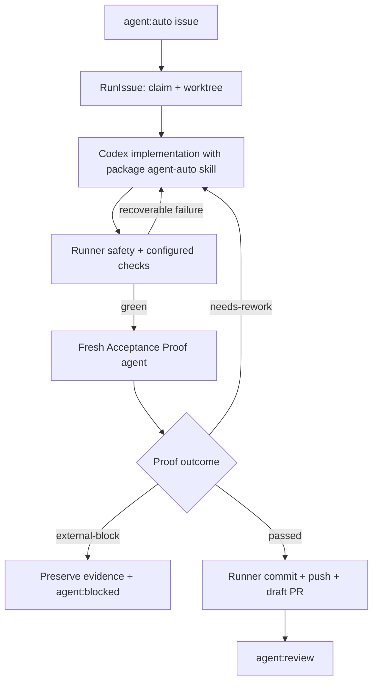

## 1. Executive Summary

- **Goal:** Rewrite `codex-orchestrator` as a small `agent:auto` runner that gives Codex maximum responsibility for solving an issue, while the package keeps only the safety-critical boundaries: issue ownership, isolated workspace, deterministic checks, Acceptance Proof, durable recovery, and draft-PR publication.
- **Approved Scope:** One standalone GitHub Issue flow; package-owned implementation and Acceptance Proof skills; non-visual/browser/Android/iOS proof; bounded autonomous rework; one-time minimal project setup plus setup/status/doctor/direct-run/daemon commands; durable state; runner-owned commit/push/draft PR/labels/comments; the still-relevant live-smoke scenarios; and the existing local self-improvement flow as a local consumer, not a package skill.
- **Out of Scope:** `agent:plan-auto`, child issues, issue trees, wave scheduling, integration branches, a generic skill graph, runner-managed reviewer topology, native-subagent suppression, app-server transport, bridge-fenced config migration, consumer-side `postinstall` setup, automatic config migration, automatic merge, package publication, compatibility with old config/state formats, and multi-host execution of one GitHub repository.
- **Chosen Direction:** Build v2 in a new `codex/v2-agent-auto` branch and separate worktree from tag `v0.1.51`. Keep current commit `0c876cb` and the current local self-improvement workspace untouched as reference evidence. Implement a new final runtime, use old code and smoke scenarios only as behavioral oracles, switch the package entrypoint after the new vertical path works, and delete the superseded runtime before release.
- **Why This Approach:** The last package-owned runtime change added roughly 14,800 lines across 154 files, including a skill graph, reviewer scheduler, state journal, app-server supervisor, separate auth home, and migration fence. The requested product needs only one implementation agent and one independent proof agent. Letting Codex own reasoning and optional native delegation removes most orchestration machinery without weakening the publication or Acceptance Proof boundaries.

## 2. Evidence And Design

- **Confirmed:** `agent:auto` already has a complete external lifecycle in `src/runner/scoped-auto-command.ts`; `src/runner/agent-attempt.ts` contains the useful same-worktree rework seam; `src/runner/acceptance-proof.ts`, `acceptance-proof-loop.ts`, and `browser-proof-contract.ts` contain the strongest existing proof invariants; Android and iOS proof commands contain working device/runtime discovery ideas; ADR 0001 keeps external publication runner-owned; ADR 0002 requires criterion-to-artifact proof and forbids proof-phase product edits.
- **Confirmed:** The current package-owned runtime ships 59 files under `runtime-skills/` and introduces generic graph/reviewer machinery that is unnecessary when only `agent:auto` remains. Its untracked plan also mixes `review_outcome: Blocked`, `review_verdict: Needs Work`, and `status: approved`, demonstrating that the new control plane is not yet a reliable source of truth.
- **Confirmed:** Current live smoke has 25 scenarios. Six are plan-auto/tree-specific (`plan-auto`, `run-plan-auto`, `plan-auto-blocking`, `tree-child-quality-rework`, `plan-auto-tree-recovery`, and parent-oriented `risk-routing`); the remaining scoped, recovery, package, safety, and proof scenarios contain reusable behavior, although several assertions must be deleted or rewritten for v2.
- **Confirmed:** The self-improvement runner is intentionally local-only. Its durable value is the flow `preflight -> discover/reuse one fingerprinted agent:auto issue -> targeted run -> live smoke after success -> evidence review`, not its current 841-line implementation or direct prompt files.
- **Confirmed:** Local Codex CLI `0.144.4` supports `codex exec`, `--output-schema`, config overrides, and `--output-last-message`. Existing repository evidence has already verified `skills.include_instructions=false`, so the runner can hide the automatic local-skill catalog while explicitly directing the agent to an exact package skill path.
- **Assumptions:** GitHub Issues remain the queue and draft PRs remain the terminal human handoff. V2 supports one host per GitHub repository and enforces one process across every local clone/worktree on that host through a host-global owner lock keyed by `owner/repo`; execution is serial. Cross-host operation is explicitly unsupported and `doctor` reports it as such. Codex authentication remains user-owned and may be read/used by root and native-child tool shells; their isolated `HOME` and scrubbed environment still exclude runner/GitHub/npm/SSH/cloud credentials.
- **Open Decisions:** None. On 2026-07-16 the user approved the `runIssue(...)` ownership model and the deep `AcceptanceProof` Interface with stable `proofId`, frozen criteria, and an opaque checked-change value. Later the same day the user explicitly accepted shared Codex-auth exposure to root/native-child tool shells and waived independent review of that risk revision.
- **Accepted Risks — Shared Auth And Host Reads:** Root and native-child tool shells run under the same OS identity as the Codex parent and may read/use the user's Codex auth plus any local file readable by that macOS user. The user explicitly accepted both risks on 2026-07-16. This does not authorize printing/copying credential bytes, exposing auth/secret paths in reports, enabling tool network, inheriting GitHub/npm/SSH/cloud credentials, executing production commands, or performing runner-owned publication. The canary records shared auth/host readability while proving external credentials and production effects remain unavailable.
- **Simplest Viable Path:** Ship a small tracked `internal-skills/` directory directly in the npm tarball. `npm install` or update replaces package-owned code, schemas, tooling, and skills without a consumer `postinstall` hook or orchestrator-induced mutation of project policy, setup-owned files, runtime state, copied assets, or GitHub state beyond normal npm-managed changes. One explicit, minimal, idempotent `setup` creates only repository-owned policy and runtime ignore entries; compatible package updates never require rerunning it. `CodexProcess` invokes ordinary `codex exec --ignore-user-config`, suppresses automatic skill instructions with `skills.include_instructions=false`, points the static prompt at one exact immutable attempt snapshot of the package `SKILL.md`, and applies the snapshotted generated output schema. It uses a package-owned isolated tool `HOME`, an explicit shell environment allowlist, no inherited Git credential helper/SSH agent/npm/cloud auth, no plugins/apps/MCPs, and tool network disabled by default. A target may opt into tool network only after the same credential scrub; it never grants authenticated external-write tools. Slice 1 includes canaries for `gh auth`, Git push credentials, npm identity/publish, SSH auth, accepted host-file readability, credential/path output leakage, and production commands; failure of any non-accepted containment condition blocks the ordinary-exec design before issue claim. No import pipeline, copied target skills, skill manifest graph, app-server process, package-specific login flow, or skill-runtime migration is required.
- **Reuse Strategy:** Port behavior, not implementations, from `scoped-auto-command.ts` (runner-owned handoff), `agent-attempt.ts` and `rework-policy.ts` (same-worktree continuation and typed outcomes), `acceptance-proof.ts` and ADR 0002 (criterion/evidence semantics), `browser-proof-contract.ts` (UI Evidence Contract), Android/iOS proof commands (runtime ownership and artifact collection), `local-state.ts`/terminal outcome code (atomic durable intent), and the relevant live-smoke scenarios. Do not port `plan-auto-command.ts`, issue-tree modules, `package-skill-graph.ts`, `skill-runtime-state-journal.ts`, app-server supervision/auth, bridge migration, or imported general-purpose skill corpus.
- **Ownership Changes:** Codex owns task decomposition, repository exploration, implementation strategy, use of native subagents, TDD/review judgment, command selection, proof-mode classification, proof navigation, and recoverable problem solving. Proof classification is intentionally model judgment, as approved by the user, but the runner freezes criterion IDs, enforces any explicit issue proof target, requires per-criterion surface classification, and rejects internally inconsistent or incomplete non-visual decisions. The runner owns host/repository authorization, worktree/branch creation, process capability containment, configured checks, secret/denied-path enforcement, proof report validation, proof-phase diff validation, mobile device/runtime leases, attempt bounds, durable state, commit/push/draft PR, and control/terminal labels/comments.
- **New Runtime Concepts:** Two deep application Modules and one deep operational Module are new. `RunIssue` owns one issue lifecycle plus publication intent/reconciliation policy; `AcceptanceProof` owns proof classification, execution, proof-internal recovery, artifact custody, validation, and rework output; `Setup` owns first setup, idempotent repeat setup, explicit label preparation, and fresh cutover. Infrastructure remains concrete: GitHub/Git Adapters, one supervised Codex process helper, browser/mobile runtime Adapters, durable filesystem helpers, and one atomic run store. Every Seam is justified by a true external dependency plus production and test Adapters; no provider registry or one-implementation Adapter hierarchy is introduced.
- **Component Flow:**



- **Material Constraints:** Proof may need generated build/runtime writes, so the plan does not claim a filesystem guarantee that `codex exec` cannot touch the worktree. The proof skill forbids product edits; the runner captures HEAD, index, tracked, untracked, and content state before and after proof and rejects every non-proof-owned source change. Build outputs go to the proof directory, temporary copy, Android build dir, or iOS DerivedData path when the platform supports it. The implementation agent may edit only the issue worktree and receives no usable GitHub/npm/SSH/cloud publication credentials. A host-global repository lock prevents daemon/direct-run or clone-vs-clone concurrency on the supported host. The runner revalidates `agent:auto`/ownership immediately before agent start and every publication effect. Live smoke remains explicit because it mutates a real scratch GitHub repository.

### 2.1 Deep Module Ownership

`RunIssue`, `AcceptanceProof`, and `Setup` are deep Modules with one Interface each. Their ownership is exclusive:

| Module | Interface leverage | Implementation locality | Must not own |
| --- | --- | --- | --- |
| `RunIssue` | One call executes or resumes an authorized issue lifecycle and returns one exhaustive terminal outcome. | Eligibility, lifecycle transition validity, cycle ownership, configured-check ordering, rework routing, publication intents, remote observation/reconciliation, and terminal handoff. | Filesystem durability mechanics, proof platform plumbing, setup/cutover policy, or CLI formatting. |
| `AcceptanceProof` | One idempotent call proves one checked change across non-visual/browser/Android/iOS and returns one typed semantic or operational outcome plus an opaque proof receipt. | Adaptive Proof Agent supervision, semantic surface classification, proof-internal recovery keyed by `proofId`, leases/capabilities, Proof Report repair/validation, Proof Artifact custody/redaction, sanitized handoff receipt, and forbidden proof-diff detection. | Issue lifecycle transitions, implementation rework, GitHub publication, raw artifact-path disclosure, or caller-selected platform routing. |
| `Setup` | One operational intent configures, inspects, diagnoses, prepares labels for, or freshly cuts over one target and returns one typed outcome. | Canonical target resolution, fencing, config classification, byte-stable no-op behavior, deterministic ignore entries, config-last commit, backup manifest, fresh-cutover authority switch, explicit label reconciliation, and read-only status/doctor diagnostics. | Issue execution, run-record initialization, package skill installation, automatic migration, or CLI presentation. |

The atomic run store is deliberately not an application Module. It is a persistence Adapter that provides schema validation, read, generation compare-and-swap mutation, atomic replace/fsync, and lock-safe durability for data supplied by its caller. It has no lifecycle-transition, retry, publication, remote-observation, or reconciliation policy. Only `RunIssue` receives the typed run-record write capability and initializes the run record lazily on first execution. `AcceptanceProof` receives a separate proof-only record capability keyed by `proofId`; its schema contains no lifecycle state, cycle/repair counters, or publication intents. Both capabilities may share the same atomic filesystem mechanics underneath, but neither `AcceptanceProof` nor `Setup` can mutate a run record.

Dependencies are accepted when each Module is composed, not exposed on every call. GitHub, Git workspace, Codex process, browser runtime, mobile lease, artifact filesystem, lock, and atomic-store implementations are Adapters at real external Seams; in-process criterion evaluation, transition legality, schema generation, and redaction policy remain private Implementation. There is no generic provider/factory/registry layer. The deletion test is explicit: deleting any of the three Modules would spread its owned rules across CLI, daemon, platform commands, or persistence callers, while deleting a pass-through helper must concentrate rather than duplicate complexity.

### 2.2 Public Interfaces

```ts
runIssue({ targetRoot, issueNumber }): Promise<
  | { status: 'review-ready'; pullRequestUrl: string; evidencePath: string }
  | { status: 'not-eligible'; reason: string; evidencePath: string }
  | {
      status: 'blocked';
      kind: 'external' | 'safety' | 'exhausted';
      resumable: boolean;
      evidencePath: string;
    }
  | { status: 'transport-failed'; resumable: boolean; evidencePath: string }
  | { status: 'cancelled'; evidencePath: string }
  | { status: 'internal-error'; evidencePath: string }
>

proveChange({
  proofId,
  issue,
  frozenCriteria,
  checkedChange,
}: {
  proofId: string;
  issue: IssueSnapshot;
  frozenCriteria: FrozenCriterion[];
  checkedChange: CheckedChange;
}): Promise<
  | { status: 'passed'; receipt: ProofReceipt }
  | { status: 'needs-rework'; findings: string[]; receipt: ProofReceipt }
  | { status: 'external-block'; blocker: ExternalBlocker; receipt: ProofReceipt }
  | { status: 'transport-failed'; resumable: boolean; receipt: ProofReceipt }
  | { status: 'cancelled'; receipt: ProofReceipt }
  | { status: 'internal-error'; receipt: ProofReceipt }
>
```

These are stable internal Module Interfaces, not new npm exports. A dependency-neutral package-private `CheckedChangeContract` owns the nominal brand and hidden payload. The composition root creates one capability pair: a RunIssue-only builder mints `CheckedChange` after configured checks, and an AcceptanceProof-only reader verifies and opens it; neither Module imports the other's Implementation, and raw structural objects cannot satisfy the nominal type. The hidden value carries immutable base/head/diff identity, changed-file list, check evidence, worktree identity, and check-policy fingerprint without exposing platform capabilities, leases, artifact paths, repository proof policy, schema-repair hooks, or Adapter selection to the caller. Before any proof side effect, `AcceptanceProof` durably binds `proofId` to canonical repository, run ID, issue number, cycle, frozen-criteria digest, issue-snapshot digest, `CheckedChange` digest, package/schema version, and check-policy fingerprint. Repeating the same call with the identical binding resumes proof-internal state and artifacts; any mismatch fails closed before lease acquisition or Codex launch. At proof entry and before accepting pass, current HEAD, index/tree, tracked and untracked content, worktree identity, and check-policy fingerprint must still equal `CheckedChange`. `proofId` is stable for one run/cycle and changes after implementation rework or package/schema change. `RunIssue` does not inspect whether a lease, report repair, or Adaptive Proof Agent attempt already occurred.

`ProofReceipt` is a typed, storage-independent handoff containing only a sanitized summary, stable publishable-evidence references plus hashes, and an opaque local-evidence ID for audit correlation. Raw report paths, local-only artifact paths/content, leases, platform routing, and repair history stay inside `AcceptanceProof`; `RunIssue` never parses proof storage to decide publishability. `AcceptanceProof` retains exactly three semantic decisions: `passed`, `needs-rework`, and `external-block`. Its closed operational-failure union is `transport-failed`, `cancelled`, and `internal-error`; no untyped rejection or free-form error classification crosses the Module Interface. `RunIssue` alone maps those failures to lifecycle state, counters, CLI JSON, and exit code.

Tests exercise these Interfaces and observable external effects. They must not reach into coordinator steps, transition helpers, persistence internals, prompt rendering, platform routing, or skill-file parsing details. `run --json` exposes the same exhaustive `status` union in a versioned envelope. The mapping is total and non-overlapping:

| `runIssue.status` | CLI exit |
| --- | --- |
| `review-ready` | `0` |
| `blocked` (`external`, `safety`, or `exhausted`) | `20` |
| `not-eligible` | `21` |
| `transport-failed` or `internal-error` | `70` |
| `cancelled` | `130` |

Daemon and self-improvement consume that JSON, never stdout regexes.

### 2.3 Installation, Setup, And Upgrade Contract

`Setup` is one deep operational Module. Its Interface accepts the parsed setup intent and returns the deterministic outcome below; the CLI only parses flags, renders diagnostics, and maps the outcome to an exit code. Canonical-repository resolution, locking, dry-run planning, local writes, fresh-cutover transaction, and optional GitHub label reconciliation stay inside `Setup`. Helpers may encapsulate filesystem or GitHub mechanics, but no helper may own setup ordering or policy, and tests target the `Setup` Interface rather than its transaction steps.

```ts
interface Setup {
  execute({ targetRoot, operation, dryRun, repository }: SetupIntent): Promise<
  | { status: 'created' | 'unchanged' | 'labels-prepared' | 'fresh-reset' }
  | { status: 'planned'; actions: SetupAction[] }
  | {
      status: 'inspected';
      disposition: 'ok' | 'blocked';
      diagnostics: SetupDiagnostic[];
    }
  | {
      status: 'labels-partial';
      created: string[];
      missing: string[];
      cause: SetupFailure;
    }
  | {
      status:
        | 'legacy-detected'
        | 'blocked-active'
        | 'repository-mismatch'
        | 'unsupported-schema';
      reason: string;
    }
  | { status: 'transport-failed' | 'io-failed'; detail: SetupFailure }
  >;
}
```

`SetupIntent.operation` is exactly `configure | prepare-labels | fresh | doctor | status`; `repository` is an optional complete owner/name pair, never a partial override. `SetupAction`, `SetupDiagnostic`, and `SetupFailure` are typed data safe for deterministic CLI rendering, not exception-text routing. `doctor` and `status` operations are read-only; command handlers cannot make target/config/Legacy/label decisions.

Ownership is deliberately split so package upgrades are automatic without making project policy implicit:

| Asset | Owner | First install | Compatible package update |
| --- | --- | --- | --- |
| Runtime code, generated schemas, package tooling, and `internal-skills/` | npm package | Installed by npm | Replaced automatically by npm |
| `.codex-orchestrator/config.json` | Target repository | Created once by explicit `setup` | Preserved byte-for-byte |
| Managed runtime entries in `.gitignore` | Target repository | Added once by explicit `setup` when configured paths are inside the checkout | Preserved byte-for-byte |
| Run state, worktrees, and local proof artifacts | Local runtime | Created lazily by the first run | Preserved and resumed under the recorded package/skill-version rules |
| Missing GitHub labels | GitHub repository | Reported by default; created only by explicit `setup --prepare-labels` | Never created, renamed, or deleted by npm update |

Installing or updating the package has no consumer-side `postinstall` hook, does not scan target repositories, does not run `setup`, and does not itself write config, state, `.gitignore`, package scripts, prompts, skills, or GitHub state; normal npm-managed dependency, lockfile, and `node_modules` changes are outside this guarantee. The packed package is self-contained: replacing the npm version is sufficient to update package-owned skills and procedures. An ordinary update within the supported config schema therefore requires no setup or skill activation; `doctor` is the optional read-only compatibility check.

On a clean target, `setup --target <path>` infers owner/repository from `git remote origin` unless an explicit owner/repository pair is supplied, acquires the host-global lock for that canonical repository, writes the deterministic marked `.gitignore` block when required, and commits the minimal schema-v1 config last through temp-file rename plus parent-directory fsync. The config rename is the authoritative setup commit point: a crash before it leaves no configured V2 target and a repeat converges without duplicate ignore entries; a crash after it yields a valid configured target. Setup does not create an empty state file, edit `package.json`, copy package prompts/skills, authenticate Codex, start a process, or call GitHub mutations. Runtime state is initialized lazily by `run` or `daemon`.

If an exact-schema valid V2 config already exists, ordinary `setup` validates it and is a byte-stable no-op for config, state, `.gitignore`, and `package.json`; project policy changes are made by explicitly editing the committed config rather than by reapplying package defaults. The persisted canonical repository is authoritative. Any supplied owner/repository pair must be complete and match it exactly; a partial pair, origin drift, or a requested repository mismatch fails before local or GitHub writes. `setup --prepare-labels` always uses the persisted canonical repository, never an override-only destination.

`setup --prepare-labels` is the only setup mode that may mutate GitHub. After target/repository validation, read-only label pagination is allowed so dry-run can compute exact actions. On a clean target, config rename and parent-directory fsync must complete before the first GitHub mutation. Setup fully paginates labels, compares names using GitHub's label-name semantics, creates only missing configured V2 labels, and never updates color/description or renames/deletes existing V2 or Legacy labels. A concurrent already-exists response is reconciled by rereading; a partial creation failure returns `labels-partial` with typed `created`, `missing`, and `cause` data so the next explicit invocation converges. Every list/create/reread operation completes before the result is returned or the repository lock is released. `--dry-run` returns `planned` with the exact ordered local and GitHub actions after pagination while performing zero local or GitHub writes.

Legacy support is detect-only, not runtime compatibility. Legacy config/state is never loaded as V2 execution policy, converted, resumed, or rewritten in place. A narrowly scoped cutover detector may read only file presence, schema identifiers, canonical repository, state/workspace path, running-label name, and lock/lease/PID/host metadata required to report status and prove quiescence; unknown, custom, unreadable, foreign-host, or ambiguous metadata fails closed.

Ordinary `setup` fails closed when it finds Legacy or experimental state and prints the explicit `setup --fresh` command. `setup --fresh` is the only clean-cutover path. It holds the new host-global repository lock and the recognized Legacy exclusive fence continuously from the first quiescence check through backup-manifest and config fsync, and it blocks on a live V2/Legacy owner, PID/start-token ambiguity, an open Legacy running claim, or inability to read GitHub claim state. Before the authority switch it persists a fresh-cutover transaction manifest containing canonical repository, Legacy source fingerprints, destination roots, and intended V2 config hash. It copies Legacy config/state metadata into a timestamped fsynced backup without moving or deleting the original state, records every retained worktree path and local/remote branch ref, and points the new config at separate empty schema-specific V2 state/workspace roots. Those roots must not exist or must be empty; collision fails closed. The final config rename is the only authority switch: before it, the original Legacy config/state pair remains intact; after it, V2 can initialize only the separate lazy state root. There is no post-commit cleanup transaction. If retry finds the original Legacy config, it resumes the matching pre-commit manifest; if it finds a V2 config whose canonical repository and hash exactly match one unique manifest, it recognizes the already committed same transaction and returns `fresh-reset` without writes. A valid V2 config without that exact manifest still refuses `--fresh`; ambiguous or mismatched combinations fail closed. Retained Legacy worktrees/branches are foreign evidence: V2 cannot adopt, overwrite, clean, or reuse a colliding path/ref without a later explicit human decision. Unsupported or future config schema versions also fail closed; any future schema migration requires a separately designed explicit command and is never triggered by npm install/update.

Setup has a small deterministic exit contract over `SetupOutcome`: `created`, `unchanged`, `labels-prepared`, `fresh-reset`, `planned`, and `inspected(disposition: ok)` exit `0`; `legacy-detected`, `blocked-active`, `repository-mismatch`, `unsupported-schema`, `labels-partial`, and `inspected(disposition: blocked)` exit `20`; `io-failed` and `transport-failed` exit `70`. Diagnostics explain the disposition but do not determine it in CLI code. No outcome claims success before the config commit point or successful reconciliation of every requested label. Compiled CLI tests pin these outcomes, exit codes, and diagnostics using only `SetupOutcome`; setup does not introduce a second issue-execution result schema.

The final public CLI contains `setup`, `setup --prepare-labels`, `setup --fresh`, `doctor`, `status`, `run`, and `daemon`. It removes `auth login`, `setup --prepare-skill-runtime-v2`, and `setup --activate-skill-runtime-v2`. `setup`, `doctor`, and `status` are operational/configuration paths and do not call `runIssue`; `doctor` and `status` remain read-only. Direct `run`, daemon, live smoke, and self-improvement are the consumers of the single `runIssue` execution path.

### 2.4 Package-Owned Skill Contract

The final package contains only purpose-built skills required by the shipped runtime:

- `internal-skills/agent-auto/SKILL.md`: solve one issue end to end inside the prepared worktree; inspect the repository; choose an implementation strategy; use native Codex subagents when useful; apply TDD for behavior changes; run focused validation; repair failures; and return the typed implementation report. It prohibits runner-owned external actions.
- `internal-skills/acceptance-proof/SKILL.md`: independently inspect issue criteria and the actual diff, choose non-visual or visual proof, execute the proof, analyze production readiness, and return the typed Acceptance Proof report.
- `internal-skills/acceptance-proof/references/browser.md`, `android.md`, and `ios.md`: package-owned platform procedures. They use package-owned local tooling and do not depend on installed local skills/plugins. Android/iOS shell commands may operate only on the runner-pinned device/runtime lease; they never discover, start, replace, or terminate an unleased user-owned session.

`resolveInternalSkill(name)` resolves and reads the required files relative to the installed package, returns package version plus hashes, and fails before claim when a required package file is absent or the package changes during resolution. Before each attempt, those exact bytes and generated schema are built in a symlink-safe temporary sibling under that run/attempt's private host-runtime directory outside the target checkout, fully hash-verified, permission-hardened, and fsynced before a no-overwrite atomic rename to `snapshot`. Partial temporary trees are never executable; after a rename race or crash, an existing destination is reusable only after sealed-tree verification of the exact expected file set, no extra entries, every content hash, file/directory modes, expected runner ownership and containment, and no symlinks at any level. Any mismatch blocks before Codex starts. `codex exec` receives only snapshot paths. This is per-attempt immutability, not a shared content cache, target skill installation, or import pipeline. `npm pack` consumer tests prove the installed binary resolves these files and that the recorded hashes equal the bytes actually passed to Codex. A package upgrade replaces the installed files automatically but cannot alter an active attempt; an interrupted run that resumes under a different package version starts a new recorded cycle and snapshot in the existing worktree instead of pretending the old skill is still pinned. The local self-improvement discovery/review prompts remain local policy; only its implementation step delegates to packaged `agent-auto`, so no third package workflow is introduced.

Each agent report has one TypeScript contract owner. That owner generates the `codex exec --output-schema` JSON file and the compact schema excerpt embedded in the package skill; startup and package tests assert generated-schema and runtime-validator parity. Skill prose does not independently redefine fields.

### 2.5 Acceptance Proof Contract

Acceptance Proof runs after configured checks for every issue; there is no regex gate deciding whether proof “applies.” Before implementation `RunIssue` freezes ordered criterion IDs from explicit issue acceptance criteria; when none are explicit it creates one stable fallback criterion from the issue title/body and records that derivation. After checks pass, `RunIssue` creates the opaque `CheckedChange` and invokes `AcceptanceProof` with a stable `proofId`. Inside the Module, `AcceptanceProof` expands that value with composed repository policy, artifact storage, and currently available capabilities, then gives a fresh Adaptive Proof Agent the immutable IDs, issue, base/diff identity, changed-file list, full diff artifact, and check results. The Adaptive Proof Agent owns semantic proof classification:

- `mode: non-visual` for code/API/CLI/worker/docs behavior that can be demonstrated through commands, outputs, static inspection, or generated artifacts.
- `mode: visual` with one or more `targets: browser | android | ios` when user-visible layout, navigation, copy, responsive behavior, or platform behavior is part of the change.

The report contains `status`, `decision`, criterion records, checks, artifacts, residual risks, and either rework findings or an external blocker. Each criterion repeats its immutable ID and declares a non-empty unique `surfaces: Array<non-visual | browser | android | ios>`; duplicate, missing, unknown, or rewritten IDs/surfaces fail validation. Any browser/android/ios surface requires its matching visual target, and every criterion/surface pair requires linked evidence. Explicit issue targets are lower bounds. Classification beyond those structural checks remains the independent proof agent's judgment by approved product design; the runner does not reintroduce path/text regex routing. Every passed criterion/surface pair must have high-confidence linked evidence. `AcceptanceProof` validates the bound identity, current checked-change freshness, schema, artifact existence, path ownership, freshness relative to proof start, criterion coverage, forbidden proof diff, and target-specific UI evidence before returning its semantic or operational outcome to `RunIssue`.

Browser proof is valid only when it records the exact user workflow and state, relevant desktop/mobile viewports, screenshots plus DOM/state evidence, console and network diagnostics, and explicit layout and copy review. A screenshot of the first reachable page, an unrelated route, or an unanalysed screenshot cannot pass.

Android/iOS proof must identify the exact app/build target and runner-issued lease, preserve user-owned runtime sessions, launch or attach safely, execute the relevant workflow, and collect screenshot, UI hierarchy, and platform logs. The proof must analyze layout, clipping/overflow, interaction state, copy, and criterion coverage. `AcceptanceProof` obtains a lease through the runner-owned mobile-lease Adapter and pins `ANDROID_SERIAL` or Simulator UDID before starting the Adaptive Proof Agent; a package procedure or shell fallback can control only that identity. The `RunIssue` caller never discovers or passes the device identity. If no safe lease can be issued, proof returns a verified external blocker. This preserves ADR 0002 and the useful current UI-tree/logcat/simulator evidence without arbitrary device takeover.

Proof artifacts have two classes. Publishable evidence is limited to size-capped PNG screenshots and a sanitized JSON/Markdown summary after path validation, hashing, redaction, and secret scanning. Raw DOM, UI dumps, console/logcat/simulator logs, and network metadata remain local-only durable evidence; collectors omit cookies, authorization headers, request/response bodies, query secrets, and unrelated user data. Only publishable artifacts may enter the branch or PR body. Any redaction/scan failure blocks publication while preserving the local artifact path.

### 2.6 Autonomy And Blocking

The runner consumes structured outcomes rather than matching free-form error text:

- `needs-rework`: always returns exact check/proof findings to the implementation agent in the same worktree.
- `external-block`: accepted only with the missing credential/tool/service/product decision, safe alternatives attempted, and evidence that the agent cannot proceed locally.
- `safety-block`: runner-observed denied path, secret access, destructive/production action, publication violation, or irreconcilable workspace ownership.

Malformed reports receive one schema-guided repair turn. Failed checks and Acceptance Proof findings consume ordinary implementation attempts. Default total implementation/proof cycles remain bounded at five for cost and runaway protection, but no recoverable class is sent to the user merely because a hand-written heuristic did not recognize it. The agent receives the actual command output and prior evidence, may choose a different approach, and continues until passed, a verified external/safety boundary, or the cycle limit is exhausted. Exhaustion preserves the worktree and full evidence instead of discarding progress.

Schema repair has its own maximum of one turn and does not consume an implementation cycle. A transport start failure consumes no implementation cycle; one clean transport retry is allowed only after the supervised process is quiescent and the worktree baseline is unchanged. A package-version change on resume starts the next implementation cycle and records both skill versions. Cancellation and repeated transport death are typed terminal outcomes, not generic agent blockers.

### 2.7 Capability And Process Contract

`CodexProcess` is a concrete supervised process, not a transport framework. For implementation and proof it:

1. invokes `codex exec --ignore-user-config` with automatic skills disabled, the exact immutable attempt-snapshot skill/schema paths, explicit sandbox/approval flags, and package-owned timeout/idle-timeout;
2. lets the Codex parent plus root/native-child tool shells use the same user-owned Codex auth, while tool subprocesses otherwise receive a separate allowlisted environment, isolated `HOME`, and explicit empty tombstones for GitHub/Git/SSH/npm/cloud credential variables; `GH_CONFIG_DIR`, npm config/cache auth, Git credential helpers, SSH agent/config, cloud credentials, and target `.env` files are absent;
3. disables plugins, apps, MCP servers, and automatic local skills; package-owned browser/mobile shell procedures are the fallback-independent proof path;
4. defaults tool network to off; an explicit target opt-in may enable unauthenticated tool network after credential scrub, but cannot add external-write credentials or tools;
5. creates a process group, persists PID/PGID and pre-turn HEAD/index/status/content baseline before waiting, bounds captured output, and classifies spawn failure, exit, timeout, idle-timeout, cancellation, and protocol/report failure separately; and
6. on interruption terminates the process group, awaits child/descendant exit, stream closure, and report flush, then rechecks baseline before any retry, lock release, or terminal transition.

Containment canaries are a hard Slice 1 gate. The ordinary `codex exec` direction is valid only when root and native-child probes record the accepted shared Codex-auth and host-file readability without printing credential/path material, while neither can authenticate with `gh`, obtain Git push credentials, use SSH agent identity, run authenticated npm/cloud actions, or execute configured production/deploy commands. This is a capability contract for external authority plus explicitly accepted local-read risks, not reliance on skill prose or the post-run completion report.

### 2.8 State, Ownership, And Publication Contract

The clean-break config has `{ schema: "codex-orchestrator.agent-auto", version: 1 }` and only these policy groups: GitHub repository/labels; branch/workspace/state paths; poll interval and `maxCycles`; Codex command/timeouts/tool-network opt-in; configured checks; proof artifact paths; and denied secret/destructive/production paths. It contains no workflows, phase profiles, visual globs, skill graph, reviewer topology, or plan-auto labels. Run state uses `{ schema: "codex-orchestrator.agent-auto-state", version: 1 }` with one `RunIssue`-owned record per issue: run/issue identity, canonical repository, base SHA, branch/worktree, lifecycle state, cycle and repair counters, package/skill hashes, process identity/baseline, check/proof receipt, current side-effect intent, and timestamps. Proof state uses a separate proof-only schema keyed by bound `proofId` and contains proof attempts, lease/artifact custody, report repair/validation, and terminal `ProofReceipt`; it cannot represent or mutate lifecycle state, counters, or publication intents.

Legacy or current experimental config/state without those exact schema IDs is never loaded as V2 runtime policy, rewritten in place, converted, resumed, or guessed. The detect-only reader and continuously held V2/Legacy setup fences are exactly the narrow contract in Section 2.3; any live owner/claim, foreign-host marker, unsupported inspection, or ambiguous metadata blocks archival. Only confirmed quiescence permits the manifest-backed metadata backup and config-last commit without deleting issue worktrees; V2 state is created lazily by the first run, and retained Legacy paths/refs remain foreign. `status` and `doctor` can report Legacy presence read-only. This clean break replaces the current bridge/config-v2 execution-routing section; it does not implement compatibility migration.

Durable lifecycle states are `claimed -> implementing -> checking -> proving -> publishing -> review-ready`, with `reworking` returning to `implementing`; terminal states map one-to-one to the Interface: `not-eligible`, `blocked` with `external | safety | exhausted`, `transport-failed`, `cancelled`, and `internal-error`. `RunIssue` alone decides whether a transition is legal and what intent must precede it; every accepted transition is atomically persisted before the next owner acts. The atomic run store rejects malformed schema, stale generation, and unsafe filesystem state, but does not choose the next lifecycle state.

Control-plane claim writes are distinct from gated publication writes. Before claim label/comment mutation `RunIssue` supplies a claim intent to the atomic store and reconciles current issue labels plus deterministic run marker. Before each post-proof effect `RunIssue` supplies one intent, performs the fenced effect through the relevant Adapter, observes remote/local state, and decides the reconciled transition:

- commit intent pins parent SHA, expected tree SHA, and deterministic message; resume accepts the existing commit only when all three match, otherwise creates exactly one runner-owned commit or fails closed on unexplained HEAD/index divergence;
- push intent pins branch and exact local SHA; an absent remote branch permits one lease-protected push, the matching SHA is already complete, and every unexpected remote SHA fails closed without force push;
- PR intent pins owner/repo, head, base, issue, and deterministic marker; resume searches by head plus marker before create;
- handoff comment intent uses `codex-orchestrator:run:<runId>:handoff` and updates/reuses that marker instead of appending duplicates; and
- terminal label intent pins the complete expected label set and reconciles it after PR/comment success.

The host-global owner lock is stored outside the checkout under the orchestrator home and keyed by canonical `owner/repo`, so daemon-vs-direct and clone-vs-clone on the supported host cannot race. PID/host/start-token evidence governs stale recovery. The runner re-fetches issue authorization after lock acquisition, immediately before Codex starts, and before publication. Cross-host execution of the same repository is unsupported rather than weakly coordinated.

## 3. Execution And Proof

- **Impacted Areas:** New minimal CLI and config under `src/`; package `internal-skills/` and JSON schemas; GitHub/worktree/process/state infrastructure; Acceptance Proof and platform proof helpers; focused tests under `test/`; the existing live-smoke script/checklist; README/deep-dive/ADRs; and the ignored local self-improvement runner after the package path is stable.
- **Slices:**
  1. **Rewrite boundary and first RED:** Create the separate worktree/branch from `v0.1.51`; add failing public Interface and package-tarball tests for exact package skill resolution and immutable attempt snapshots, generated-schema parity, local skill-catalog/plugin suppression, authority-containment canaries, the clean config/state schema rejection path, no orchestrator-induced consumer mutation during package install/update beyond normal npm-managed changes, and absence of `agent:plan-auto` plus removed auth/skill-runtime commands from the public CLI/config/labels. Do not claim an issue until every containment canary is green.
  2. **Single issue tracer bullet:** Implement the smallest fake-backed `runIssue` path from one eligible `agent:auto` issue through lazy run-record initialization, claim, worktree, package implementation skill, runner check, creation of an opaque `CheckedChange`, non-visual `proveChange` with a deterministic cycle `proofId`, runner commit, one draft PR, and `agent:review` handoff with atomic evidence.
  3. **Autonomous repair and recovery:** Keep lifecycle transition legality, cycle/retry ownership, publication intent creation, remote observation, and reconciliation inside `RunIssue`; keep the atomic run store limited to schema validation, generation CAS, and durable read/write mechanics. Add same-worktree check/proof rework, one separately counted malformed-report repair, one unchanged-baseline transport retry, complete typed outcomes/CLI JSON, five-cycle exhaustion, process-group quiescence, host-global repository ownership, crash resume, package-update-safe attempt snapshots, the exact publication-intent transaction, and duplicate push/PR/comment/label prevention. Keep one supported host and serial issue execution.
  4. **Browser production-readiness proof:** Port the UI Evidence invariants and prove an actual changed fixture workflow through browser launch, navigation, responsive viewports, screenshot/DOM/console/network artifacts, layout/copy analysis, criterion mapping, freshness, artifact redaction/publication classification, and negative cases for irrelevant, stale, secret-bearing, or screenshot-only evidence.
  5. **Android proof:** Add the package-owned Android procedure and minimal runtime lease helper; the runner discovers and pins the device before proof. Prove a real fixture app workflow with exact `ANDROID_SERIAL`, UI tree, screenshot, redacted logcat, layout/copy analysis, safe live-session ownership, stale-lease recovery, and an actionable external-tooling blocker. No unleased fallback exists.
  6. **iOS proof:** Add the package-owned iOS procedure and the same lease owner for Simulator; the runner pins Simulator UDID/app identity before proof. Prove a real fixture app workflow with accessibility/UI evidence, screenshot, redacted simulator logs, layout/copy analysis, safe live-session ownership, stale-lease recovery, and an actionable external-tooling blocker. No unleased fallback exists.
  7. **Operational shell:** Implement the Section 2.3 `Setup` Module through its single typed Interface: minimal atomic first setup, byte-stable repeat setup, explicit idempotent `--prepare-labels`, detect-only Legacy reporting, quiescence-gated `--fresh`, and read-only `doctor`/`status`. Keep run-record initialization exclusively in `RunIssue`. Keep the CLI as a thin parse/render/exit-code Adapter and keep those operational commands outside `runIssue`; route only direct `run` and serial `daemon` through the same `runIssue` Interface and versioned CLI JSON, with host-global repository ownership and resumable state inspection but no second issue-execution path.
  8. **Relevant live smoke:** Port scenario intent through an explicit matrix. Keep `baseline`, `package-install`, `discovery-matrix`, `real-codex`, `remote-base-branch`, `scoped-runner-commit`, `run-scoped`, `incomplete-progress-rework`, `report-repair`, and `safety-negative`. Adapt `commit-policy` to prove that an agent-created HEAD/commit is rejected and only the runner creates the deterministic publication commit; do not retain `allowAgentLocalCommits`. Adapt `loop-policy` to bounded rework/durable outcomes while deleting Fresh-Context Review, policy-suggestion, and parent assertions; adapt `diagnostics` to the clean config/state/owner/CLI JSON contract while deleting phase-profile assertions; adapt browser and all Acceptance Proof scenarios to the generated v2 schema and evidence policy; adapt `quality-gates` to configured checks, containment, safety, and proof while deleting runner-enforced TDD/cleanup/code-review evidence. Delete the six plan-auto/tree/risk scenarios entirely. Preserve portable `core-release`, `extended-policy`, `proof-matrix`, and `full` profiles over those remaining contracts; add a separate non-skippable `mobile-proof` profile required when Android/iOS proof code changes.
  9. **Self-improvement flow:** Point the local runner at the new CLI JSON and packaged `agent-auto` implementation path while preserving its local discovery/review prompts, remote fingerprints, one issue per daily run, exact `agent:auto` authorization, targeted implementation, live smoke only after `review-ready`, evidence review, global lock/idempotency, and phase summaries. Remove stdout-regex outcome parsing. Keep it local/optional; do not make self-improvement another package skill or scheduler.
  10. **Cutover and deletion:** Switch the package entrypoint to v2, delete old plan-auto/tree/prompt-routing/graph/app-server/migration code and obsolete tests/config/docs, run package-consumer and live gates, then perform cleanup review and final code review. The published tarball must contain one runtime path only.
- **Per-Slice Test/Proof:** Slices 1-3 test Module behavior only through the `RunIssue` and `AcceptanceProof` Interfaces with fake external Adapters composed once; separate atomic-store Adapter tests cover durability/CAS without lifecycle policy. No Module test passes platform callbacks or reaches coordinator, transition, prompt, or persistence internals. The matrix includes real containment canaries, generated-schema parity, clean Legacy rejection, process-group orphan/cancellation tests, a daemon-vs-direct/clone-vs-clone host race, lifecycle/publication tests through `RunIssue`, proof capability tests showing proof writes cannot mutate lifecycle/counters/publication, nominal-type/import tests rejecting raw `CheckedChange` objects or extra `proveChange` parameters, exact same-binding crash recovery, cross-run/cross-issue `proofId` collision, same ID with each changed digest/version/policy input, worktree/config mutation after checks, new `proofId` after implementation rework or package/schema change, proof spawn failure, exhausted transport retry, cancellation, report/artifact persistence failure, unexpected internal failure, and a crash point before/after every remote effect. Every operational proof outcome is persisted with the correct counter before `runIssue` returns. Interface-shape tests reject raw report/artifact paths and platform fields from `ProofReceipt`. Slice 1 also installs one packed version into a clean consumer, records project config/state/`.gitignore` and package-script content, updates to a fixture package with changed internal-skill hashes, and proves that no target policy, setup-owned file, or package script changed beyond normal npm-managed dependency/lockfile/`node_modules` updates before explicit setup. Snapshot tests update the installed package between resolve/hash/spawn and during an active attempt, and cover temp-tree crash, injected fsync failure before rename, rename-before-return crash, partial/corrupt destination, extra file, mode/ownership drift, and symlink substitution before and after publication; active bytes remain fixed and a resumed cycle records the new version/hash. Slice 4 uses a real local web fixture and both publishable and local-only browser artifacts. Slices 5-6 require actual leased emulator/simulator evidence, not mocked screenshots, while unit tests cover stale lease, unavailable tool, user-owned session, and redaction branches behind the unchanged `AcceptanceProof` Interface. Slice 7 tests all setup/status/doctor semantics through `Setup.execute` and tests CLI parsing/rendering separately; command-handler tests prohibit target/config/Legacy/label decisions. Its matrix covers clean first setup and config-last crash points, byte-stable repeat setup, owner/origin mismatch, zero default GitHub writes, a clean-target `prepare-labels --dry-run` with full label pagination and zero writes, config durability before first label mutation, no result/lock release before deferred label reconciliation completes, fully paginated create-missing-only labels, already-exists and typed partial-create recovery, typed dry-run actions, mixed-diagnostic doctor/status cases with explicit `ok | blocked` exit mapping, removed commands, unsupported schema refusal, continuously fenced active-process/start race, GitHub claim-read failure, non-destructive manifest-backed Legacy archive, pre-existing empty V2 roots with convergent retry, nonempty V2 state/workspace root refusal before config rename with unchanged Legacy bytes, crashes after Legacy state copy/manifest fsync/config rename/parent-directory fsync and before result delivery, retained-worktree/ref collision, unrelated valid-V2 `--fresh` refusal, and matching-manifest committed retry with zero additional writes. Every fresh-cutover crash point leaves exactly one executable config/state authority and converges on retry without post-commit cleanup. Internal transaction-step tests are removed when the corresponding Interface test proves the behavior. Slice 8 packages the tarball and uses the scratch GitHub repository; live smoke is not run without explicit authorization. Slice 9 uses the existing local self-improvement test harness plus one deliberate daily run after v2 review-ready behavior is proven. Slice 10 requires the full unit/integration suite, package install/update, selected live profiles, `git diff --check`, cleanup review, and final code review.
- **Contract Test Ledger:**

| Invariant | Risk It Prevents | First Test / Proof | Status |
| --- | --- | --- | --- |
| Only `agent:auto` authorizes work; no plan-auto CLI/config/label/tree path exists. | The rewrite silently retains the second orchestration product. | Public CLI/config snapshot test | planned |
| The installed package resolves exact package skills, suppresses local skills/plugins, and validates reports from one generated schema authority. | Local same-name skills alter behavior, npm updates do not update workflows, or schema copies drift. | Packed-consumer invocation and schema-parity tests | planned |
| Each attempt executes an atomically published private snapshot of the exact package skill/schema bytes recorded in evidence. | An npm update, crash, symlink, or partial snapshot changes active instructions or makes recorded hashes differ from executed bytes. | Resolve/update/spawn race, snapshot crash/corruption, and active-attempt package-update tests | planned |
| npm install/update causes no orchestrator-induced mutation of project policy, setup-owned files, runtime state, copied assets, or GitHub state beyond normal npm-managed changes; explicit setup creates minimal project policy once, preserves valid config byte-for-byte, and keeps GitHub writes behind `--prepare-labels`. | Package upgrades overwrite repository policy, copy runtime assets, or unexpectedly mutate GitHub. | Packed install/update ownership test plus compiled setup idempotency/label tests | planned |
| Agent tool processes may use shared Codex auth and read user-readable host files, but have no usable runner/GitHub/npm/SSH/cloud credentials, cannot perform production actions, and cannot emit credential/path material. | Accepted local-read exposure silently expands into publication authority or secret exfiltration. | Real root/native-child containment canary matrix | planned |
| `RunIssue` alone holds the typed run-record write capability and decides lifecycle transitions, retry/cycle ownership, publication intents, and remote reconciliation; `AcceptanceProof` has only a proof-record capability and the atomic mechanics only validate and persist caller-supplied generations. | Hidden policy or cross-capability writes create multiple lifecycle owners and make crash behavior impossible to reason about. | `RunIssue` transition/publication matrix, proof-capability isolation test, and policy-free store CAS tests | planned |
| Control-plane claim writes are reconciled separately; commit/push/PR/handoff writes occur only after checks and proof pass. | Agent output publishes unverified work or crash recovery duplicates remote effects. | `runIssue` tracer bullet plus publication crash matrix | planned |
| `AcceptanceProof` accepts only `proofId`, issue, frozen criteria, and nominal opaque `CheckedChange`; exact binding/freshness is fail-closed, all platform routing, leases, raw artifact paths, recovery, and report repair remain internal, and only a sanitized `ProofReceipt` crosses back. | A shallow coordinator leaks platform/storage plumbing to `RunIssue`, while a collision, stale token, or crash reuses unrelated proof evidence. | Nominal/import and Interface-shape tests plus binding-mismatch, same-`proofId` recovery, and new-cycle tests | planned |
| Frozen criterion IDs and explicit issue targets constrain a fresh proof agent's criteria/diff-based classification without path/text regexes. | UI work silently omits visual evidence or criteria are rewritten during proof. | `AcceptanceProof` criterion/surface contract tests | planned |
| Visual pass requires workflow, viewport/leased device, fresh screenshot plus DOM/UI hierarchy/local logs, layout/copy analysis, criterion mapping, redaction, and safe publishable artifacts. | First-page, stale, unleased, or secret-bearing artifacts masquerade as production-ready proof. | Browser/Android/iOS positive and negative fixture proofs | planned |
| Recoverable check/proof/report failures return to the agent in the same worktree. | The runner asks the user to solve ordinary agent-fixable failures. | Rework loop Interface tests | planned |
| Every terminal, exhaustion, transport, cancellation, and repair outcome has one durable state, counter rule, CLI JSON result, and exit code. | Unknown errors either loop forever, block too early, or are parsed from prose. | Outcome/state transition table tests | planned |
| No retry or lock release occurs before Codex process-group and output quiescence. | Orphan descendants mutate a supposedly settled worktree. | Timeout/cancel/orphan process tests | planned |
| Exact clean config/state schema IDs reject Legacy and experimental state as runtime input; detect-only inspection cannot interpret execution policy, and continuously fenced `--fresh` archives only after proven local/remote quiescence. | Old runtime authority is silently resumed under v2 or an active Legacy process is overwritten through a check/archive race. | setup/status/doctor detect-only, lock-race, claim-read, manifest-recovery, and fresh-cutover matrix | planned |
| `Setup.execute` owns configure/prepare-labels/fresh/doctor/status target resolution, fencing, ordering, config-last commit, matching-manifest cutover recovery, label reconciliation, and typed actions/diagnostics; CLI owns only parsing, rendering, and exit mapping. | Setup policy fragments across command handlers and transaction helpers, making idempotency, partial failure, and crash recovery diverge. | `Setup` Interface/deferred-effect matrix plus thin CLI mapping tests | planned |
| Relevant packaged live smoke and the local self-improvement daily flow use the same `runIssue`/CLI JSON path and contain no deleted runtime assertions. | Test/automation paths drift from the shipped product or force removed features back in. | Scenario-to-invariant matrix, packed smoke, local runner tests | planned |

- **Exit Gates:** Every behavior slice begins with a failing test at a public Interface and ends with focused green proof. No final cutover until non-visual and browser tracer bullets pass through the packed CLI. Android/iOS adapters cannot be declared complete from unit tests alone. Final release candidate requires `npm run typecheck`, full tests, a package consumer install/update proving no orchestrator-induced project/setup/runtime/copied-asset/GitHub mutation beyond normal npm-managed changes, the setup/cutover matrix, `git diff --check`, relevant live-smoke profiles with deliberate authorization, cleanup review, final code review, and a tarball inspection proving no old runtime or plan-auto surface remains.
- **Coordination:** Implementation remains one root coding task. Codex may use native subagents internally, but the package does not schedule or persist their topology. Browser, Android, and iOS slices may be developed independently only after the `AcceptanceProof` Interface and generated report contract are green; each extends private platform Implementation/Adapters and may not add platform parameters to `proveChange` or change the shared schema without root coordination. Live-smoke and self-improvement adaptation start only after the CLI contract settles. The downstream implementation spec must preserve these 10 vertical slices and expand slices 3, 7, and 8 into deterministic RED/GREEN checkpoints with explicit inputs, file ownership, persisted artifacts, and exit gates; this is execution detail, not permission to redesign the approved Modules or Interfaces.

## 4. Handoff And Review

- **approved_scope:** Implement the agent:auto-only v2 runtime, package-owned skills, adaptive Acceptance Proof, relevant live smoke, and local self-improvement adaptation exactly as described.
- **do_not_touch:** Do not rewrite or delete current commit `0c876cb`, the untracked 2026-07-15 plan, or `.codex-orchestrator/local/self-improvement/` from the current worktree. Do not push, publish, run live smoke, mutate the scratch repository, or create a release without separate explicit authorization.
- **architecture_rules:** Three deep Modules own policy: `RunIssue` owns lifecycle, the only run-record write capability, and publication reconciliation; `AcceptanceProof` owns all proof modes, proof-only state, artifact custody, sanitized `ProofReceipt`, and proof-internal recovery; `Setup.execute` owns configure/prepare-labels/fresh/doctor/status policy while CLI only parses, renders, and maps exits. One `runIssue` path serves direct, daemon, smoke, and self-improvement execution; operational commands stay outside issue execution. `proveChange` accepts only stable bound `proofId`, issue, frozen criteria, and nominal opaque `CheckedChange`; platform and storage plumbing stay private. Shared atomic persistence mechanics cannot decide transitions, retries, publication, or reconciliation. One generated contract owner exists per agent report; package-owned assets update automatically while committed project policy remains byte-stable; each active attempt executes atomically published private snapshot bytes matching its recorded hashes; host-global single-repository ownership; shared Codex auth plus strict non-Codex credential containment before claim; runner-owned control/publication effects with durable intents; no free-form error-text routing; no generic graph/provider/reviewer framework; no compatibility runtime in the final tarball; no abstraction without a present second implementation or hard external Seam.
- **rejected_paths:** Incrementally completing the current package skill graph; preserving plan-auto behind a flag; importing the entire personal skill corpus; installing or copying skills into target repositories; consumer `postinstall` mutation; setup-time `package.json` edits; disabling native Codex subagents; app-server transport solely for skill selection; separate package auth/home; bridge migration; automatic config migration; path/text heuristics as final proof decision; screenshot-count proof; automatic merge.
- **required_docs:** Update project `AGENTS.md`, `CONTEXT.md`, `docs/agents/execution-routing.md`, README, and `docs/deep-dive.md` so only v2 is authoritative. Document the install/setup/update ownership table, the first-install and ordinary-update commands, explicit label preparation, and the one-time Legacy `--fresh` cutover; remove package-auth, skill preparation/activation, copied-prompt, and automatic migration instructions. Revise ADR 0001 to remove Fresh-Context Review/old loop implications while retaining runner-owned publication; revise ADR 0002 to the generated proof contract, runner-leased mobile workflow, artifact policy, and approved agent-owned semantic classification; update the live-smoke checklist with the scenario-to-invariant matrix; document that self-improvement remains local and optional.
- **preconditions:** User-approved `RunIssue`, `AcceptanceProof`, and `Setup` ownership and stable internal Interfaces; user-accepted shared Codex-auth and user-readable host-file exposure to root/native-child tool shells; clean separate worktree from `v0.1.51`; Slice 1 containment canaries proving ordinary `codex exec` can use shared Codex auth without exposing runner publication credentials to tools or emitting credential/path material; GitHub CLI auth only in the runner process for live integration; browser runtime for browser proof; Android/iOS toolchains and a safe runner-leased device/simulator for their real proof slices.
- **validation_gates:** Per-slice RED/GREEN; public Interface tests; packed-package skill resolution; full changed-set safety/checks; proof artifact contract; actual browser/Android/iOS evidence; state/idempotency tests; compiled CLI tests; package install; relevant authorized live smoke; self-improvement local tests; cleanup and final review.
- **blocking_assumptions:** The architecture and Interface choice is approved. Live GitHub and mobile runtime validation require separate explicit execution authorization and available environments, but do not block local implementation slices.
- **Review Summary:** 19 passes total: 6 full and 13 affected-lens closure across 6 independent sessions. The final two full reviews covered Architecture/Depth/KISS and Failure/Contracts/Recovery; three focused closure passes verified `V2-DEPTH-015A..D` and `V2-FCR-016..019` with no open findings.
- **Defect Ledger:** All prior IDs remain verified. `V2-DEPTH-015A..D` and `V2-FCR-016..019` are closed by the capability-separated state model, nominal checked-change contract, sanitized proof receipt, closed operational outcomes, exact proof binding/freshness, matching-manifest fresh-cutover recovery, and exhaustive `Setup.execute` outcomes.

| ID | Protected invariant and repair | Full-review sources | Status |
| --- | --- | --- | --- |
| `V2-AUTH-001` | Agent tools may use the explicitly accepted shared Codex auth but cannot use runner publication credentials or configured secret/destructive/production capabilities; define the exact exec environment and require real root/native-child containment canaries before claim. | `NEW-ARCH-01`, `NEW-CONTRACTS-01`, user risk acceptance 2026-07-16 | verified |
| `V2-API-002` | Stable internal Interfaces and one exhaustive mapping table represent every input, terminal state, retry counter, CLI JSON status, and exit code without overlap. | `NEW-ARCH-02`, `NEW-FAILURE-01` | verified |
| `V2-SCHEMA-003` | One TypeScript contract owner generates each packaged output schema; skill prose cannot redefine it. | `NEW-ARCH-03` | verified |
| `V2-PUB-004` | Claim/control and commit/push/PR/comment/label effects have separate persisted intents, exact reconciliation, no force push, and fail-closed remote divergence. | `NEW-FAILURE-02` | verified |
| `V2-OWNER-005` | One host-global owner controls every clone of an `owner/repo`; cross-host operation is explicitly unsupported. `RunIssue` is additionally the sole lifecycle-transition and publication-reconciliation owner; store policy is excluded by `V2-DEPTH-015`. | `NEW-FAILURE-03`, `V2-DEPTH-015A` | verified |
| `V2-PROOF-006` | Frozen criterion IDs, non-empty unique `surfaces[]`, criterion/surface evidence, and explicit target lower bounds constrain independent agent classification without restoring regex routing. The narrow Interface and stable recovery identity are covered by `V2-DEPTH-015`. | `NEW-CONTRACTS-02`, `V2-DEPTH-015B`, `V2-DEPTH-015D`, `V2-FCR-016`, `V2-FCR-017` | verified |
| `V2-MOBILE-007` | Android/iOS proof controls only a runner-pinned lease and preserves user-owned sessions. | `NEW-CONTRACTS-03` | verified |
| `V2-EVIDENCE-008` | Raw proof evidence stays local; only size-capped, redacted, scanned screenshots/summaries are publishable. | `NEW-CONTRACTS-04` | verified |
| `V2-PROCESS-009` | No retry, state transition, or lock release precedes process-group, stream, report, and baseline quiescence. | `NEW-FAILURE-04` | verified |
| `V2-CUTOVER-010` | Legacy is detect-only; continuously held V2/Legacy fences, remote-claim checks, copy-only manifest backup, separate V2 roots, and a config-only authority switch make fresh cutover non-destructive and crash-convergent. | `NEW-EXEC-01`, `NEW-CONTRACTS-05`, `setup-architecture:V2-CUTOVER-010`, `setup-failure:NEW-FAILURE-01`, `setup-failure:NEW-CONTRACTS-01`, `setup-failure:NEW-CONTRACTS-03`, `V2-FCR-018` | verified |
| `V2-DOCS-011` | Every repository authority is revised in the cutover, including AGENTS, execution routing, CONTEXT, and both ADRs. | `NEW-EXEC-02` | verified |
| `V2-SMOKE-012` | Scenario-level keep/adapt/delete rules remove Fresh-Context Review, phase-profile, agent-local-commit, runner review-evidence, and plan/tree contracts. | `NEW-EXEC-03` | verified |
| `V2-SETUP-013` | npm updates change package-owned assets without orchestrator-induced project mutations; explicit setup is minimal, repo-bound, config-last, byte-stable on repeat, outside `runIssue`, and keeps GitHub writes behind idempotent `--prepare-labels`. Deep-Module and thin-CLI ownership are covered by `V2-DEPTH-015`. | `setup-architecture:NEW-ARCH-01`, `setup-architecture:NEW-EXEC-02`, `setup-failure:NEW-CONTRACTS-02`, `setup-failure:NEW-FAILURE-02`, `V2-DEPTH-015C`, `V2-FCR-018`, `V2-FCR-019` | verified |
| `V2-SNAPSHOT-014` | Every Codex attempt executes a private atomically published sealed snapshot whose exact files, hashes, modes, ownership, containment, and symlink-free shape match durable evidence despite npm updates or crashes. | `setup-failure:NEW-FAILURE-03` | verified |
| `V2-DEPTH-015` | `RunIssue`, `AcceptanceProof`, and `Setup` have exclusive, deep ownership; nominal `CheckedChange`, bound `proofId`, sanitized `ProofReceipt`, capability-separated run/proof records, and typed `Setup.execute` keep platform, storage, persistence policy, and command decisions behind Module Interfaces. | `V2-DEPTH-015A..D`, `V2-FCR-016..019` | verified |
